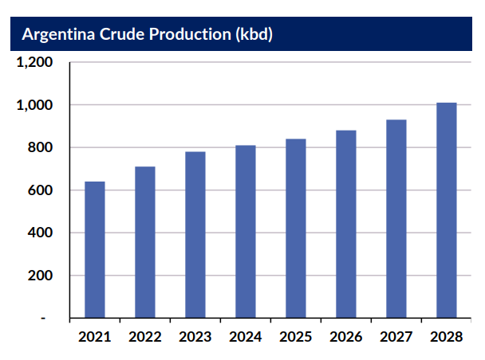

# Gibson Tanker Market Report

**Date:** July 20, 2023  
**Publisher:** Breakwave Advisors | **Category:** Market Insights  
**Original URL:** [https://www.breakwaveadvisors.com/insights/2023/7/20/gibson-tanker-market-report](https://www.breakwaveadvisors.com/insights/2023/7/20/gibson-tanker-market-report)  

---

## Vaca Muerta Vive

The explosive growth in Americas crude production has repeatedly focused on prospects in the United States, Guyana, Brazil and Canada. In the US, developments in the shale sector have been closely monitored, with regular data and the involvement of public companies allowing for closer scrutiny of developments. In Guyana, Brazil and Canada, longer term E&P projects and the use of FPSOs or major pipeline developments allow for easier analysis of future production volumes. However, with much less international focus and much of the production growth dependent on unconventional sources (i.e. shale), Argentina has failed to attract as much international attention. However, that may now be changing.

Argentina’s primary shale region, the Vaca Muerta in Patagonia saw drilling activity resume in 2021 after a brief pause in 2020 and has seen steady increases in exploration activity since then. As such, domestic production is forecast to reach 780kbd this year, up from around 500kbd prior to the pandemic. Further gains are expected, with 1mbd in sight by 2028. However, given the price sensitivity of shale production, total output may depend on oil market dynamics over the next 5 years.

> **Figure 1: Data Source:gibson Shipbrokers**  
> *Data source:Gibson Shipbrokers*  
> **Interactive Data & Source:** [Gibsons Co](https://www.gibsons.co.uk/market-reports) | [Local Asset](file:///C:/Users/Dell/Github/Shipping/corpus/03-breakwave/insights/2023/assets/2023-07-20_gibson-tanker-market-report_img_screenshot2023-07-20160101_48a8715fe073.png)

In terms of crude trade, Argentina rarely imports seaborne crude, meaning that expanded production will have little impact here. However, as capacity expands, it is likely that most of the incremental barrels will be exported. Currently, most of the country’s crude exports head out of Puerto Rosales on Panamaxes or Caletta Cordova on Suezmaxes. However, state owned oil company YPF is currently in the early stages of a $1.2 billion project to export up to 380kbd on VLCCs and Suezmaxes from the Atlantic Coast. The project is still in its infancy and could be altered or delayed; yet, it is certainly one to watch. More recently, an export route via Chile to the Pacific has opened. The 110kbd Trans-Andean pipeline, which ceased operations in the early 2000’s has recently been renovated, offering an export route for Argentinian production to the Bio Bio refinery (ENAP) at San Vicente in Chile. The pipeline also opens up the possibility to export crude from San Vicente on Aframaxes and Suezmaxes; however, volumes will be constrained by demand from ENAP and could compete with seaborne imports into San Vicente.

Ultimately, whilst Argentina is unlikely to become a leading crude exporter any time soon, production is growing, whilst refining capacity and domestic demand is not, increasing the availability of crude available for export. If YFP is able to successfully develop its new export project on the Atlantic Coast, then VLCCs and Suezmaxes will find a new source of demand, otherwise much of the exports will be constrained to an ageing Panamax fleet.

---

**Tags:** Shipping, Tankers, Argentina  
