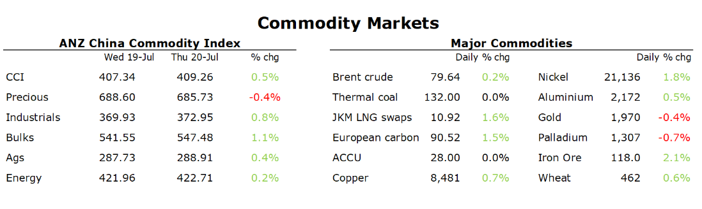

# Markets buoyed by proposed support measures in China

**Date:** July 21, 2023  
**Publisher:** Breakwave Advisors | **Category:** Market Insights  
**Original URL:** [https://www.breakwaveadvisors.com/insights/2023/7/21/markets-buoyed-by-proposed-support-measures-in-china](https://www.breakwaveadvisors.com/insights/2023/7/21/markets-buoyed-by-proposed-support-measures-in-china)  

---

***By***[***Daniel Hynes***](https://www.linkedin.com/in/dahynes/)

Sentiment was boosted by reports China is set to announced measures to support its economy. This helped offset a risk-off tone across broader markets amid a disappointing earnings season.

> **Figure 1: Data Source:commodities Wrap**  
> *Data source:Commodities Wrap*  
> [Local Asset](file:///C:/Users/Dell/Github/Shipping/corpus/03-breakwave/insights/2023/assets/2023-07-21_markets-buoyed-by-proposed-support-measures-in-china_img_screenshot2023-07-21124543_c40872314e25.png)

**Copper**led the base metals sector higher after China said it would introduce measure to support economic growth. The Ministry of Industry and Information said it was drafting plans to boost development in 10 key industries, including steel and auto. This follows a pledge by the Chinese Communist Party to improve conditions for private companies. This will add to strong support for some base metals[emanating from clean energy technologies](../pdfs/2023-07-21_markets-buoyed-by-proposed-support-measures-in-china_commodity-call-clean-energy-powering_632058957263.pdf). Demand has now reached critical volumes in copper and nickel, with its market hitting 22% and 27% respectively in 2022. More importantly, growth over the next three years is expected to see these levels significantly rise. So much so that even below-average growth from traditional sectors such as construction and manufacturing won’t stop total demand from recording strong growth rates.

The proposed support measures also boosted sentiment in the**iron ore**market. Reports suggest Chinese authorities are considering easing home buying restrictions in the nation’s biggest cities. This includes allowing people who have a mortgage record but don’t own a property being exempt from higher down payments and more restrictive borrowing limits. Futures on the Dalian Exchange rallied sharply on the news, while steel futures were also up strongly.

**Crude oil**inched higher as a more positive fundamental picture helped offset weaker sentiment from broader markets. Evidence of supply cuts from Saudi Arabia and Russia have been the trigger for the rebound in prices this month. Russia’s crude shipments fell to a six-month low in the four weeks to 16 July. Russia said it plans to reduce its Q3 export plans by 2.1mt, or 500kb/d. Shop tracking data shows Saudi Arabia shipped at least 400kb/d less in the first half of July compared with the previous month’s average. This is additional to the 1.6mb/d cut that the OPEC+ alliance agreed to earlier this year. That tightness in supply is already showing up in inventories. EIA data showed US stockpiles of crude oil fell 708kbbl last week.

**European gas**advanced amid concerns of further supply disruptions and stronger demand. The market has been on edge as tensions escalate between Russia and Ukraine. Moscow’s attacks on Ukrainian agriculture storage facilities have raised the risk of tit-for-tat responses that could impact gas supplies. In addition, more seasonal maintenance works are scheduled in Norway next month. This comes as the region continues to experience strong electricity demand due to extreme weather conditions. Electricity consumption in Spain and Italy has jumped sharply to its highest level since 2017. Outages in Australia helped push North Asian LNG prices higher. Chevron plans to shut train 3 at Gorgon this month, while Shell’s Prelude is running at about half capacity.

---

**Tags:** Commodities, Markets, Economy  
