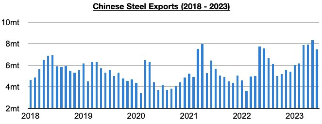

# Chinese Steel Export Peak Thesis So Far Validated

**Date:** July 24, 2023  
**Publisher:** Breakwave Advisors | **Category:** Market Insights  
**Original URL:** [https://www.breakwaveadvisors.com/insights/2023/7/24/chinese-steel-export-peak-thesis-so-far-validated](https://www.breakwaveadvisors.com/insights/2023/7/24/chinese-steel-export-peak-thesis-so-far-validated)  

---

*By*[*Jeffrey Landsberg*](https://www.linkedin.com/in/jeffrey-landsberg-70ab957/)

Back in our June 12th Weekly Dry Bulk Report, we opined for the first time this year that China’s steel exports had very likely peaked. At that time, May’s data had just been released and that showed exports totaled a very robust 8.4 million tons (which marked the most exported since September 2016). While sentiment at the time was that exports would continue to rise — even Baosteel was publicly predicting a continue climb in China’s steel exports — it appeared likely to us that exports would actually begin to fall due to a firming in global steel output outside of China coinciding with a decline in China’s steel output.

June’s data released last week has so far validated our prediction, as China’s steel exports fell last month for the first time all year.

> **Figure 1: Chart (2)**  
> [Local Asset](file:///C:/Users/Dell/Github/Shipping/corpus/03-breakwave/insights/2023/assets/2023-07-24_chinese-steel-export-peak-thesis-so-far-validated_img_chart28229_72a79c6e920a.jpg)

Exports totaled 7.5 million tons in June, which was down month-on-month by 900,000 tons (-11%) and year-on-year by 100,000 tons (-1%). Previously, China's steel exports had risen every month this year.

Going forward, we continue to believe that May’s volume will remain a peak. Lower volume will continue to most negatively affect handymax / handysize rates (as these are the ships used most often to haul steel), but we also stress that lower volume is finally helping to support steel prices. As we have highlighted in our work, for months there had been great excess in the global steel market. Steel prices when we gave our prediction last month were down year-on-year by 20% (at that time, each of the last eight weeks saw prices down year-on-year by at least 20%, and prior to those last eight weeks there had not been anytime this year that steel prices were down year-on-year by 20% or more). Now, though, steel prices are now finally up on a year-on-year basis again.
