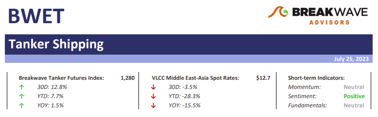
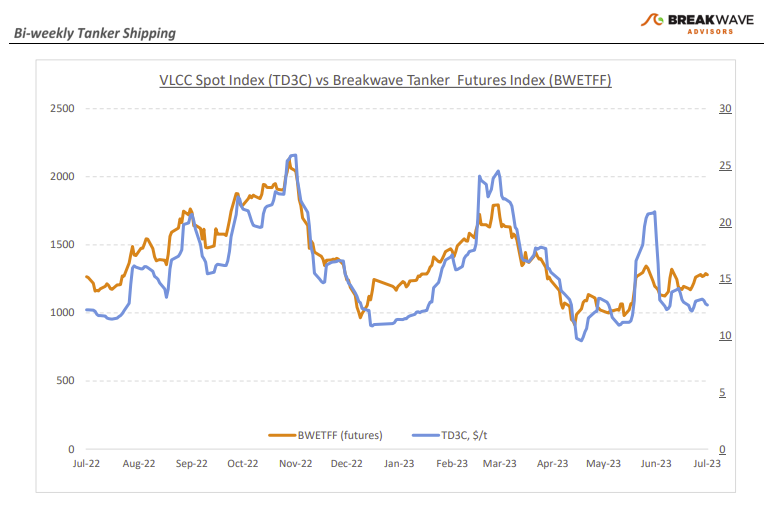
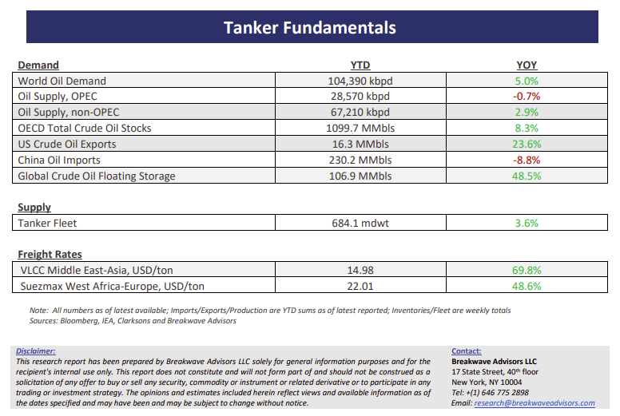

# Breakwave Bi-Weekly Tanker Report - July 25, 2023

**Date:** July 25, 2023  
**Publisher:** Breakwave Advisors | **Category:** Market Insights  
**Original URL:** [https://www.breakwaveadvisors.com/insights/2023/7/tanker-report-july-25-2023-2p4fh](https://www.breakwaveadvisors.com/insights/2023/7/tanker-report-july-25-2023-2p4fh)  

---

> **Figure 1: Tankerreporttop**  
> [Local Asset](file:///C:/Users/Dell/Github/Shipping/corpus/03-breakwave/insights/2023/assets/2023-07-25_tanker-report-july-25-2023-2p4fh_img_tankerreporttop_e3dc43025d60.png)

**• VLCC spot rates stabilize as slow summer activity takes a toll**– The past fortnight has provided little new information on the direction of spot VLCC rates. In the Middle East, the market appears quiet, while the prevailing sentiment suggests that stems are now covered for early August, a month that is traditionally considered one of relatively low volumes. However, there is some hope for improvement in the Atlantic market, as several cargoes have appeared in West Africa and Brazil, indicating the possibility of further rate increases in that part of the world. The positive sentiment has been further supported by high Chinese crude oil imports: In June, Chinese crude oil imports reached the second-highest monthly level since records began, increasing by a remarkable 45% year-on-year, according to official customs data. It is noteworthy that the first-half rise in Chinese crude oil imports stemmed from the leading role of the Russian oil market, as China imported 2.13 million barrels per day of oil from Russia, ahead of 1.88 million barrels per day from Saudi Arabia, making Russia the top crude oil supplier to China so far this year. Looking into the fourth quarter, market participants are optimistic that expectations for a sequential increase in oil demand will also lead to higher spot VLCC rates as the year progresses. Yet, one should not forget the relatively sizable production cuts implemented by the two main oil exporters, Saudi Arabia and Russia, and the fact that the headwinds for the crude oil tanker market remain significant, at least once compared to last year’s favorable market levels.

**• Oil prices seem to have found a floor, demand growth to shape the near-term direction**– The everchanging narrative in the oil markets seem to shift towards a tighter balance once again, as oil demand remains elevated while production cuts linger from the major oil producers. As the market begins to focus on the higher demand levels of the fourth quarter, one has to wonder whether the negative sentiment that has dominated oil markets is about to change. Recently, prices have been quite supportive, and although a major rally remains elusive, it seems that absent a significant deterioration in macro fundamentals, oil prices have found a temporary floor. Oil exports should accelerate as we exit the summer months, providing important support for crude tankers that have been subject to the seasonal third quarter weakness. Although European manufacturing remains in contraction, thus hurting oil demand, Asian demand, and more specifically China, might be past its trough, and with recently announced government stimulus policies, fourth quarter demand might reach very high, if not record high, levels.

**• Tanker cycle driven by tight supply, recovering demand**– The tanker market is recovering from a long period of staggered rates as the growth in new vessel supply shrinks while oil demand is recovering in line with the global economy. A historically low orderbook combined with favorable demand fundamentals should continue to support increased spot rate volatility, which combined with the ongoing geopolitical turmoil, should support freight rates in the medium term.

> **Figure 2: Tankerreportchart**  
> [Local Asset](file:///C:/Users/Dell/Github/Shipping/corpus/03-breakwave/insights/2023/assets/2023-07-25_tanker-report-july-25-2023-2p4fh_img_tankerreportchart_68d3ec89987e.png)

> **Figure 3: Tankerreportbottom**  
> [Local Asset](file:///C:/Users/Dell/Github/Shipping/corpus/03-breakwave/insights/2023/assets/2023-07-25_tanker-report-july-25-2023-2p4fh_img_tankerreportbottom_ddece78e4b2f.png)
