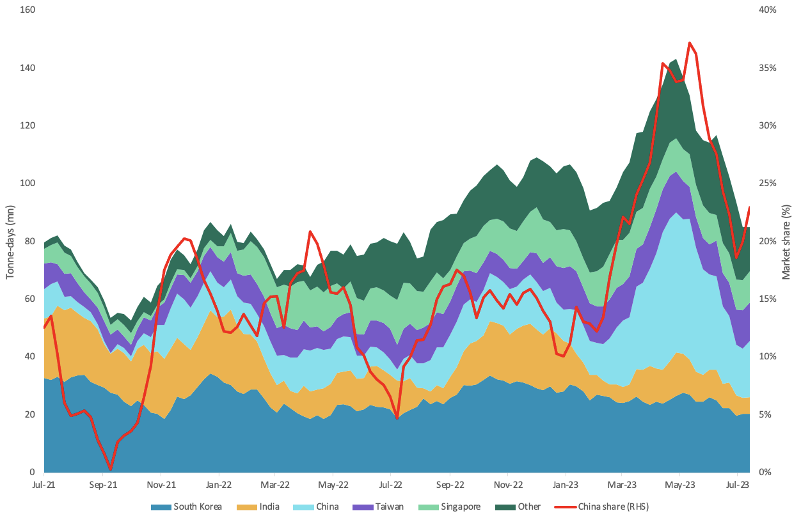
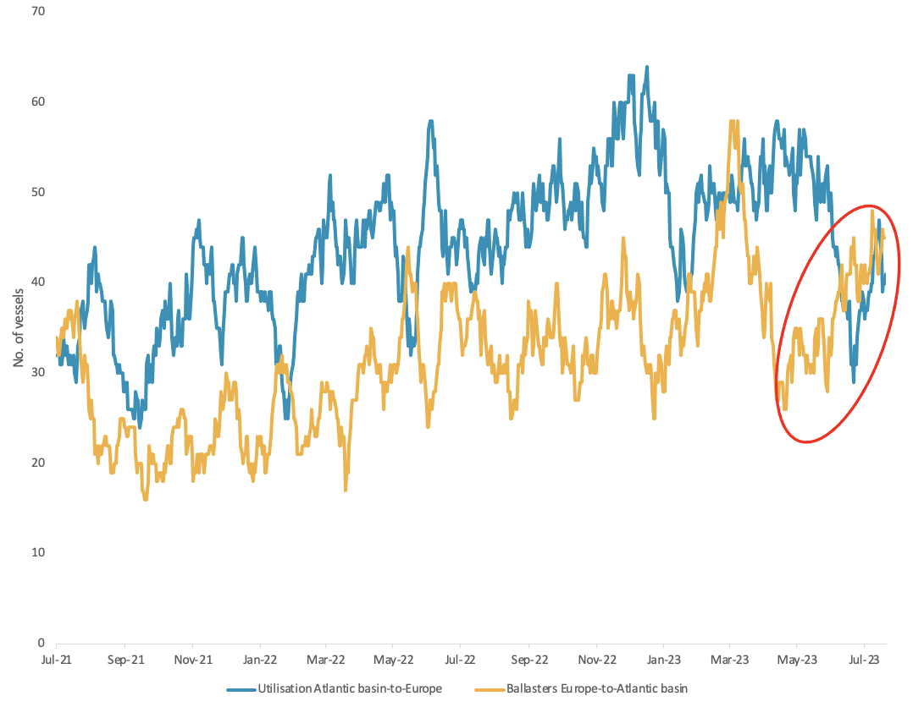

# Vortexa Freight Weekly

**Date:** July 27, 2023  
**Publisher:** Breakwave Advisors | **Category:** Market Insights  
**Original URL:** [https://www.breakwaveadvisors.com/insights/2023/7/27/86qr33x97hgpq1a4lkyusnm6b861ni](https://www.breakwaveadvisors.com/insights/2023/7/27/86qr33x97hgpq1a4lkyusnm6b861ni)  

---

*By*[*Dylan Simpson*](https://www.linkedin.com/search/results/all/?fetchDeterministicClustersOnly=false&heroEntityKey=urn%3Ali%3Afsd_profile%3AACoAACDtdn0BzHNR8syu_G8WxL-JXL-9PRT5AP4&keywords=dylan%20simpson&origin=RICH_QUERY_SUGGESTION&position=0&searchId=55ecee69-a408-47b2-8686-68f172e21af1&sid=mVl)

### Analysis / East of Suez / Dirty

## Us Gulf Vlccs Turn Towards China

> **Figure 1: VLCC Tonne-Days Ex-Us Gulf Vs**  
> *VLCC tonne-days ex-US Gulf vs. market share towards China (RHS)*  
> **Interactive Data & Source:** [Vortexa](https://www.vortexa.com//oil-gas-data-traders-analysts-data-scientists?gclid=Cj0KCQjw8_qRBhCXARIsAE2AtRZKOvMnbilZ_6_91d7huSFFy71pWLrnPwGwOHVzXsmsG-1a1mZnQw8aAt89EALw_wcB&hsa_acc=1782073842&hsa_ad=548425387665&hsa_cam=14746637662&hsa_grp=125038601902&hsa_kw=&hsa_mt=&hsa_net=adwords&hsa_src=g&hsa_tgt=dsa-1431852288425&hsa_ver=3&utm_campaign=%5BCD%5D%20-%20DSA%20-%20EMEA&utm_medium=cpc&utm_medium=ppc&utm_source=google&utm_source=adwords&utm_term=) | [Local Asset](file:///C:/Users/Dell/Github/Shipping/corpus/03-breakwave/insights/2023/assets/2023-07-27_86qr33x97hgpq1a4lkyusnm6b861ni_img_unnamed-2023-07-27t131242959_09a1f6a0bb7a.png)

- As OPEC cuts materialise, crude tonne-miles towards China have been on a downward trajectory, decreasing almost 20% since May. This is mostly affecting the VLCC tanker segment, which has seen freight rates hovering near their lowest levels for 2023.
- This is prompting refiners in North East Asia to increase procurement of Atlantic basin crude, particularly cheaper WTI out of the US Gulf. This is reflected in increased VLCC tonne-day share heading towards China despite an overall downwards trend.
- While China’s onshore crude inventories have reached an almost 3-year high, storage capacity has also increased. Additionally, VLCC rates from US Gulf-to-China (TD22) have shown a slight uptick, while others remain flat. Lastly, VLCCs discharging in China are increasingly ballasting towards the Atlantic basin. These factors indicate support for Atlantic basin VLCC tonne-miles while OPEC cuts persist from Middle Eastern nations.

### Analysis / West of Suez / Dirty

## Suezmaxes Supported in Atlantic Basin

> **Figure 2: Suezmax Utilisation Atlantic Basin-to-Europe Vs**  
> *Suezmax utilisation Atlantic basin-to-Europe vs Europe-to-Atlantic basin ballasters*  
> **Interactive Data & Source:** [Vortexa](https://www.vortexa.com//oil-gas-data-traders-analysts-data-scientists?gclid=Cj0KCQjw8_qRBhCXARIsAE2AtRZKOvMnbilZ_6_91d7huSFFy71pWLrnPwGwOHVzXsmsG-1a1mZnQw8aAt89EALw_wcB&hsa_acc=1782073842&hsa_ad=548425387665&hsa_cam=14746637662&hsa_grp=125038601902&hsa_kw=&hsa_mt=&hsa_net=adwords&hsa_src=g&hsa_tgt=dsa-1431852288425&hsa_ver=3&utm_campaign=%5BCD%5D%20-%20DSA%20-%20EMEA&utm_medium=cpc&utm_medium=ppc&utm_source=google&utm_source=adwords&utm_term=) | [Local Asset](file:///C:/Users/Dell/Github/Shipping/corpus/03-breakwave/insights/2023/assets/2023-07-27_86qr33x97hgpq1a4lkyusnm6b861ni_img_unnamed-2023-07-27t131439869_2335e36615fe.png)

- Suezmax tonne-days have maintained high levels despite recent shifts in demand for the tanker class.
- Most of the support on the demand side stems from a recent pick up in tonne-days towards Europe from the Atlantic basin, particularly the US Gulf. At the same time, Suezmax demand towards Asia has dropped, keeping overall tonne-days flat.
- On the tanker supply side, ballast Suezmaxes are signalling Atlantic basin destinations after discharging in Europe, suggesting a continuation of long distances in the transatlantic crude trade. Additionally, with VLCCs out of the US Gulf turning towards Asia, Suezmax tankers may be increasingly required to satisfy transatlantic crude flows, supporting demand for the vessel class.

Data Source:[Vortexa](https://www.vortexa.com//oil-gas-data-traders-analysts-data-scientists?gclid=Cj0KCQjw8_qRBhCXARIsAE2AtRZKOvMnbilZ_6_91d7huSFFy71pWLrnPwGwOHVzXsmsG-1a1mZnQw8aAt89EALw_wcB&hsa_acc=1782073842&hsa_ad=548425387665&hsa_cam=14746637662&hsa_grp=125038601902&hsa_kw=&hsa_mt=&hsa_net=adwords&hsa_src=g&hsa_tgt=dsa-1431852288425&hsa_ver=3&utm_campaign=%5BCD%5D%20-%20DSA%20-%20EMEA&utm_medium=cpc&utm_medium=ppc&utm_source=google&utm_source=adwords&utm_term=)
