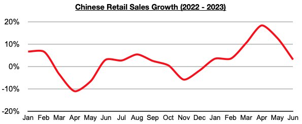

# China's Consumption Remains Stronger than Consumption in Many Other Nations

**Date:** July 28, 2023  
**Publisher:** Breakwave Advisors | **Category:** Market Insights  
**Original URL:** [https://www.breakwaveadvisors.com/insights/2023/7/28/chinas-consumption-remains-stronger-than-consumption-in-many-other-nations](https://www.breakwaveadvisors.com/insights/2023/7/28/chinas-consumption-remains-stronger-than-consumption-in-many-other-nations)  

---

*By*[*Jeffrey Landsberg*](https://www.linkedin.com/in/jeffrey-landsberg-70ab957/)

China’s June retail sales data has recently been released and has shown year-on-year growth of 3.1%. This has once again come in lower than many expectations and has been disappointing to many pundits. However, unlike in various other nations, including in the United States, China’s retail sales growth continues to far exceed inflation.

Among the specific categories that Commodore monitors, though, of note is last month it was again only China's clothing sales that grew on a year-on-year basis. Sales of various home goods remain in contraction due to the ongoing contraction in home sales in China. Chinese housing sales, furniture sales, home appliance sales, and clothing sales are discussed in greater detail in Commodore's most recent Weekly China Report and Weekly Dry Bulk Report.

> **Figure 1: Chart (1)**  
> [Local Asset](file:///C:/Users/Dell/Github/Shipping/corpus/03-breakwave/insights/2023/assets/2023-07-28_chinas-consumption-remains-stronger-than-consumption-in-many-other-nations_img_chart28129_9f48234a3535.jpg)

Remaining very significant to us is that, overall, Chinese consumers continue to buy more goods than they did a year ago. In comparison, consumers in the United States and various other nations continue to purchase less goods than they did a year ago. Retail sales growth in the United States, in particular, has come in less than inflation during seven of the last eight months. Previously, the last time that such an utterly weak only-in-a-recession development occurred in the United States was back in 2009. Another sign of recession in the United States is that manufacturing production contracted on a year-on-year basis again last month. US manufacturing production has now contracted on a year-on-year basis during each of the last four months.
