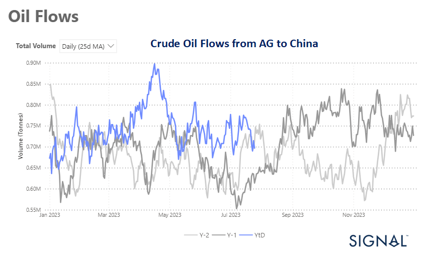
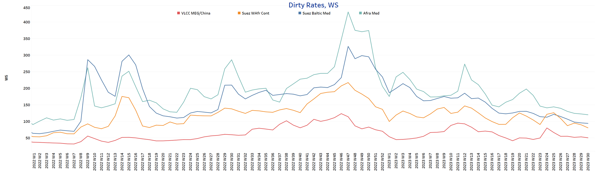
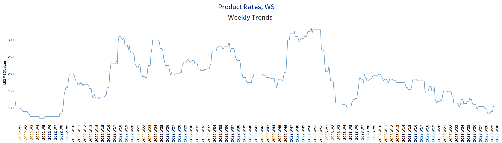
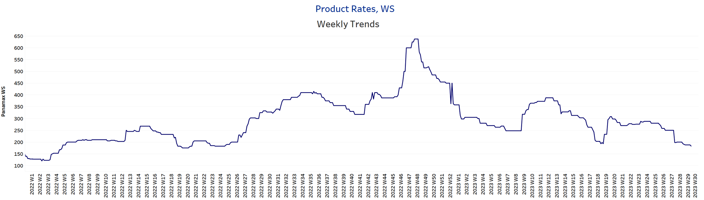
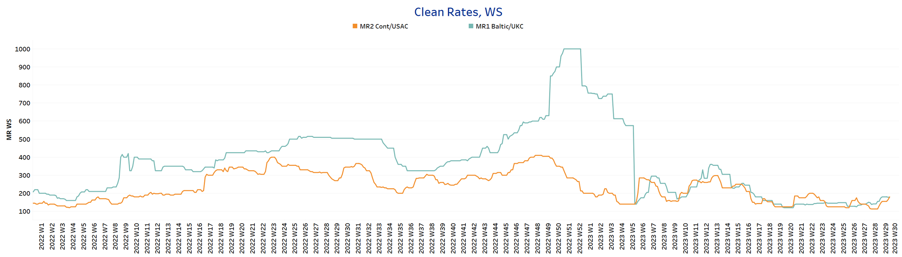
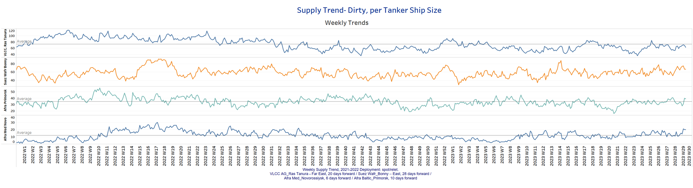
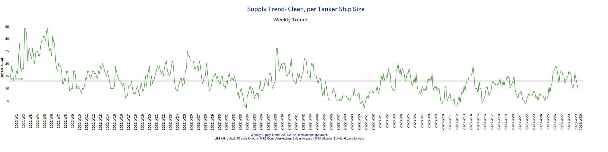
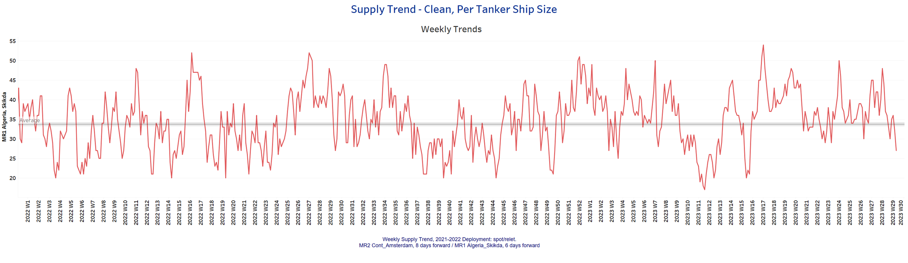
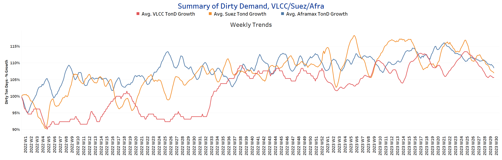
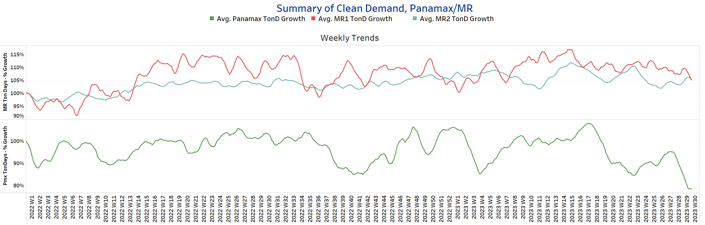

# Signal Tanker Weekly Report

**Date:** July 28, 2023  
**Publisher:** Breakwave Advisors | **Category:** Market Insights  
**Original URL:** [https://www.breakwaveadvisors.com/insights/2023/7/28/signal-tanker-weekly-report](https://www.breakwaveadvisors.com/insights/2023/7/28/signal-tanker-weekly-report)  

---

## Chart of the Week: Crude Oil Flows From AG to China

*Crude oil flows from AG to China have been fluctuating at a lower level since the last peak in mid-April*

> **Figure 1: Market Chart 1**  
> **Interactive Data & Source:** [Signal Ocean Platform](https://go.signalocean.com/e/983831/tanker-dynamic-oilflows/2p728j/335787498?h=pttO_--n2uquJt_LWFQJYjAsbbnDcan2P6z-RxUh-GA) | [Local Asset](file:///C:/Users/Dell/Github/Shipping/corpus/03-breakwave/insights/2023/assets/2023-07-28_signal-tanker-weekly-report_img_unnamed-2023-07-28t110003530_1e38334b3035.png)

Data Source:[Signal Ocean Platform](https://go.signalocean.com/e/983831/tanker-dynamic-oilflows/2p728j/335787498?h=pttO_--n2uquJt_LWFQJYjAsbbnDcan2P6z-RxUh-GA)

In the last days of July, the outlook for crude oil freight rates showed signs of weakness as the growth of demand in tonne days continued to decline. Additionally, the daily 25-day moving average of crude oil flows from Arabian Gulf countries to China has been consistently decreasing since its peak in mid-April. During July, the volume of oil flows reached levels even lower than those recorded in the previous year.

The downward trend in the daily 25-day moving average of crude oil flows from the Arabian Gulf to China highlights a reduction in oil trade between these regions, potentially reflecting changes in oil supply sources or a shift in China's energy import strategy. The combination of these factors points to a challenging period for the crude oil shipping industry. As demand continues to weaken and oil flows to China decrease, freight rates may face further pressure.

As for oil demand growth, there is optimism about stronger growth, which is fueling sentiment for a rebound in prices. Goldman Sachs has made a bullish projection for the oil market, foreseeing an unprecedented surge in demand that will create a substantial deficit.
According to the investment bank's forecasts, the demand for oil is expected to reach an all-time high, leaving a significant gap between supply and demand. Currently hovering slightly above $80 per barrel, the bank predicts that Brent crude will experience a further uptick, soaring to $86 per barrel as the year draws to a close. This optimistic outlook indicates a potential price rally in the oil markets, which could have significant implications for various industries and economies worldwide.

For more information on this week's trends, see the analysis sections below:

Freight Market, Supply and Demand

## Section 1/ Freightmarket Rates (WS)

> **Figure 2: ‘Dirty’ WS​​​​ VLCC - Suezmax - Aframax Weaker**  
> **Interactive Data & Source:** [Signal Ocean Platform](https://www.thesignalgroup.com/signal-ocean-platform) | [Local Asset](file:///C:/Users/Dell/Github/Shipping/corpus/03-breakwave/insights/2023/assets/2023-07-28_signal-tanker-weekly-report_img_unnamed-2023-07-28t110131980_7772b7de90e5.png)

The last week of July was quiet, with crude oil tanker freight rates weakening as the VLCC MEG -China route struggles to maintain firmer momentum for the summer season.

- VLCC MEG-China freight rates fell to 50.5 WS, down 2 points from the previous week, while rates have yet to fall below the 50 mark.
- Suezmax freight rates for shipments from West Africa to continental Europe fell to 80.5WS, down 15 points from two weeks ago. In the Suez-Baltic-Med route, rates were 94WS, 27 points lower than five weeks ago.
- Aframax Med freight rates fell to WS120, down 40% from the peak nine weeks ago.

> **Figure 3: ‘Product’ Wslr Firmer**  
> **Interactive Data & Source:** [Signal Ocean Platform](https://www.thesignalgroup.com/signal-ocean-platform) | [Local Asset](file:///C:/Users/Dell/Github/Shipping/corpus/03-breakwave/insights/2023/assets/2023-07-28_signal-tanker-weekly-report_img_unnamed-2023-07-28t110242009_d705da398326.png)

- LR2 AG freight rates rose to levels above WS100 this week, which is 20 points higher than two weeks ago, with signs of stronger momentum near the end of the month.

> **Figure 4: PANAMAX (Sentiment: Weaker)**  
> **Interactive Data & Source:** [Signal Ocean Platform](https://www.thesignalgroup.com/signal-ocean-platform) | [Local Asset](file:///C:/Users/Dell/Github/Shipping/corpus/03-breakwave/insights/2023/assets/2023-07-28_signal-tanker-weekly-report_img_unnamed-2023-07-28t110709330_6b0a9cf3d33f.png)

- Panamax Carib-to-USG rates fell to WS180, down 15 points from two weeks ago.

> **Figure 5: ‘Clean’mr Firmer**  
> **Interactive Data & Source:** [Signal Ocean Platform](https://www.thesignalgroup.com/signal-ocean-platform) | [Local Asset](file:///C:/Users/Dell/Github/Shipping/corpus/03-breakwave/insights/2023/assets/2023-07-28_signal-tanker-weekly-report_img_unnamed-2023-07-28t120430662_e35a63254e5a.png)

- MR1 rates for the Baltic continent were at 180WS, 25 points higher than the previous week, and it seems that the firmer dynamics towards the end of July are confirmed.

- MR2 rates for shipments from the continent to the U.S. surprisingly rose to WS180, up nearly 60% from two weeks ago.

## Section 2/ Supplysupply Trend Lines for Key Load Areas

> **Figure 6: Dirty (#Vessels) - Mixed**  
> **Interactive Data & Source:** [Signal Ocean Platform](https://www.thesignalgroup.com/signal-ocean-platform) | [Local Asset](file:///C:/Users/Dell/Github/Shipping/corpus/03-breakwave/insights/2023/assets/2023-07-28_signal-tanker-weekly-report_img_unnamed-2023-07-28t120553055_0e485904c645.png)

Crude oil tanker supply showed a mixed picture with a downward trend in the last week of July, with signs of decline in the VLCC and Suezmax segments, while the increase in the Aframax segment seems to be continuing.

- VLCC Ras Tanura: The current count is about 63 ships, which is 10 less than the average for the year, and there is a tendency for the number to drop further toward the end of the month.
- Suezmax Wafr: The current count is about 67 ships, which is 7 more than at the beginning of last week and with strong volatility throughout the month.
- Aframax Primorsk: The current ship count has now risen to 39 ships, 11 more than the previous week, and it remains to be seen if the continued increase will be confirmed in early August.
- Aframax Med Novo: The number of ships is now 20, following the pattern of an increase of the previous days and 9 more than the annual average.

> **Figure 7: ’Clean’lr2 (#Vessels) - Decreasing**  
> **Interactive Data & Source:** [Signal Ocean Platform](https://www.thesignalgroup.com/signal-ocean-platform) | [Local Asset](file:///C:/Users/Dell/Github/Shipping/corpus/03-breakwave/insights/2023/assets/2023-07-28_signal-tanker-weekly-report_img_unnamed-2023-07-28t120639193_e922bc9544db.png)

> **Figure 8: MR1 (#Vessels) - Decreasing**  
> **Interactive Data & Source:** [Signal Ocean Platform](https://www.thesignalgroup.com/signal-ocean-platform) | [Local Asset](file:///C:/Users/Dell/Github/Shipping/corpus/03-breakwave/insights/2023/assets/2023-07-28_signal-tanker-weekly-report_img_unnamed-2023-07-28t120710697_702be425d5bb.png)

- Clean LR2 AG Jubail: The current number of ships is currently 10, which is 6 less than the previous week and 3 less than the average for the year.

- Clean MR1 Algeria Skikda: The current ship count is now down to 27 ships, which is about 10 ships less than the previous week and 7 ships less than the average for the year.

## Section 3/ Demandsummary of Tanker Demand per Ship Size & Segment

> **Figure 9: ​​‘Dirty’tonne Days Decreasing**  
> **Interactive Data & Source:** [Signal Ocean Platform](https://www.thesignalgroup.com/signal-ocean-platform) | [Local Asset](file:///C:/Users/Dell/Github/Shipping/corpus/03-breakwave/insights/2023/assets/2023-07-28_signal-tanker-weekly-report_img_unnamed-2023-07-28t120818902_fe2d5ed16f27.png)

Dirty tonne days: In the last week of July, the downward revision of the percentage increase in demand (tonnage days) continues in all size classes of oil tankers. It remains uncertain how demand will evolve in early August, with hopes for Chinese crude oil demand growth lifting today’s sentiment.

> **Figure 10: ‘Clean’tonne Days Panamax / MR Decreasing**  
> **Interactive Data & Source:** [Signal Ocean Platform](https://www.thesignalgroup.com/signal-ocean-platform) | [Local Asset](file:///C:/Users/Dell/Github/Shipping/corpus/03-breakwave/insights/2023/assets/2023-07-28_signal-tanker-weekly-report_img_unnamed-2023-07-28t120903137_39a2e52296f2.png)

- Panamax tonne days: In the last week of July, the significant downward correction continues, reaching a low not seen since the beginning of last year.

- Clean MR tonne days: The first upward trend in tonne-miles continued in July for the MR2 size compared to the previous week, after a weak picture in the previous days, while a downward trend was again observed for the MR1 size.

Data Source:[Signal Ocean Platform](https://www.thesignalgroup.com/signal-ocean-platform)
