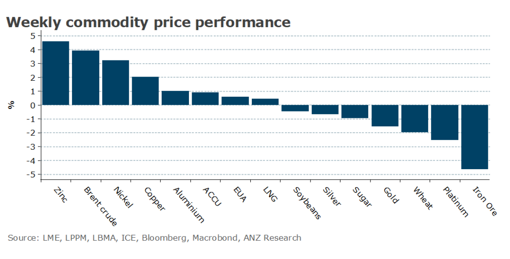

# Positive economic data boosts sentiment

**Date:** July 31, 2023  
**Publisher:** Breakwave Advisors | **Category:** Market Insights  
**Original URL:** [https://www.breakwaveadvisors.com/insights/2023/7/31/positive-economic-data-boosts-sentiment](https://www.breakwaveadvisors.com/insights/2023/7/31/positive-economic-data-boosts-sentiment)  

---

***By***[***Daniel Hynes***](https://www.linkedin.com/in/dahynes/)

Sentiment was buoyed last week by better-than-expected economic data which improved the outlook for demand and the emergence of supply side issues.

> **Figure 1: Data Source:commodities Wrap**  
> *Data source:Commodities Wrap*  
> [Local Asset](file:///C:/Users/Dell/Github/Shipping/corpus/03-breakwave/insights/2023/assets/2023-07-31_positive-economic-data-boosts-sentiment_img_screenshot2023-07-31114649_cfe5fea7e00d.png)

**Copper**led the**industrial metals**higher last week as Beijing ramped up efforts to support economic growth in China. Earlier in the week the market was buoyed by a statement from the Communist Party’s 24-member Politburo that called for actively expanding domestic demand and resolving debt risks. On Friday, Minister for Housing and Urban Development, Ni Hong, called for homebuyers who had paid off previous mortgages to be considered first-time buyers. Any support for the property sector will be seen as positive for demand for copper and iron ore. Even so, India is ready to step into the breach. Its demand for commodities is slated to grow rapidly. Our estimates suggest[India could cover roughly half of the shortfall in Chinese demand](../pdfs/2023-07-31_positive-economic-data-boosts-sentiment_can-india-pick-up-china-s-commodity-_10fbb6187bcc.pdf)over coming years. Supply woes in the copper market re-emerged. Codelco, the world’s largest producer, lowered its annual production guidance because of operational issues. This comes after Q2 2023 production fell 17% y/y.

**Gold**reversed losses from earlier in the week after signs of slowing inflation eased concerns of further rate hikes. The employment cost index rose at its slowest pace since 2001, while the Fed’s inflation gauge posted its smallest increase in two years.

Tightening supply added to the improved economic backdrop to push**crude oil**prices higher. Evidence of cuts to exports from Russia and Saudi Arabia has boosted sentiment in the market. In the week to 23 July, seaborne flows from Russia slumped to their lowest in seven months. Russian Energy Minister, Nikolai Shulginov, said that the country intends to reduce exports again in August. The supply cuts are leading to a drawdown in inventories, with US commercial stockpiles falling to their lowest level since May. This comes amid a broad pick-up in risk appetite across markets due to a combination of additional stimulus measures in China and robust economic data in the US.

**European gas**ended the week lower amid sluggish demand and high levels of inventories. Gas consumption remains well below historical averages after last year’s energy shortages. This has been driven by weak industrial activity, with Q2 output remaining stagnant in Germany. The recent heatwave across the continent that has led to a surge in electricity could also abate in coming weeks, with lower temperatures forecast for southern Europe. The delay of spot cargo sales helped support**North Asia LNG**prices. However, South Korea is the latest country to raise concerns that Australia’s climate policies could pose a risk to new gas projects.

This failed to provide support for Australian carbon credit units, which were relatively unchanged. Lower energy prices helped drag European carbon prices lower. EUAs ended the week down 3%, even as the August halving of auction supply looms.

---

**Tags:** Commodities, Oil, Ironore  
