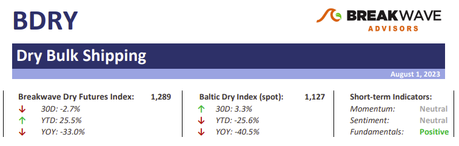
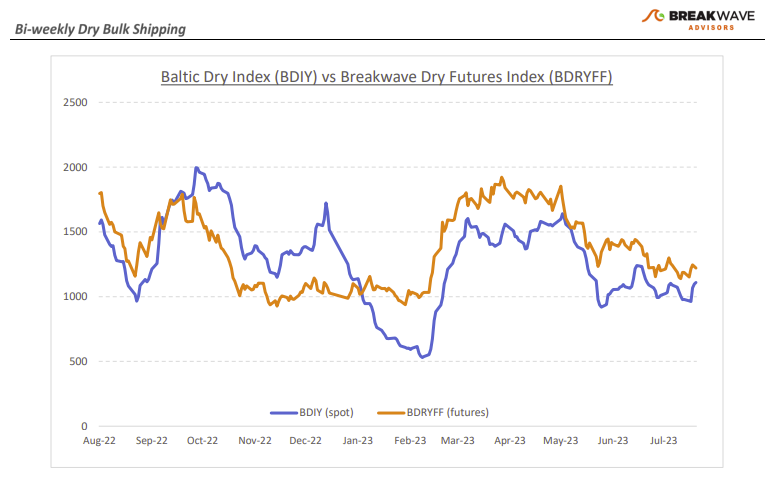
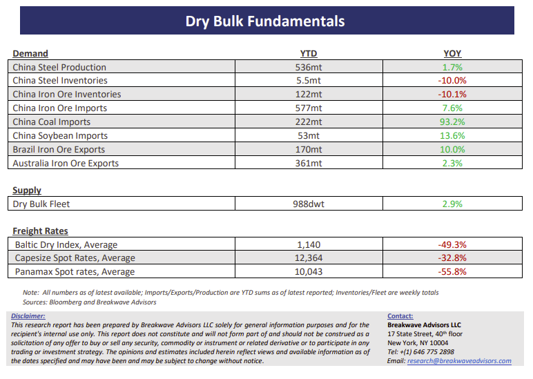

# Breakwave Bi-Weekly Dry Bulk Report - August 1, 2023

**Date:** August 01, 2023  
**Publisher:** Breakwave Advisors | **Category:** Market Insights  
**Original URL:** [https://www.breakwaveadvisors.com/insights/2023/7/11/bi-weekly-dry-report-aug-1-2023-maecp](https://www.breakwaveadvisors.com/insights/2023/7/11/bi-weekly-dry-report-aug-1-2023-maecp)  

---

> **Figure 1: Dbreporttop**  
> [Local Asset](file:///C:/Users/Dell/Github/Shipping/corpus/03-breakwave/insights/2023/assets/2023-08-01_bi-weekly-dry-report-aug-1-2023-maecp_img_dbreporttop_48380ab92b37.png)

**• The Atlantic Capesize market awakens, while weather in the Pacific could soon become a positive catalyst**– In the absence of any major macro developments, the dry bulk market has recently been affected by the normal supply-demand imbalances natural to the shipping sector, where supply of ships sometimes becomes scarce due to scheduling issues. The Atlantic Capesize market is currently subject to such an imbalance, and as a result, rates in that part of the world have recently moved higher, at least versus other areas. Although overall spot rates remain well below recent years, it is encouraging to see some volatility following a month of stagnant rates. A possible typhoon aiming at China could also disrupt the otherwise recent efficient operations of iron ore shipping from Western Australia to China route, potentially causing spot rates there to also move higher. Is the above enough for a more substantial move higher for spot Capesize rates? Probably not, but moving the overall level of spot rates gradually higher is a necessary first step towards a more meaningful rally towards the fourth quarter. The positive Capesize sentiment has also had an impact on the sub-Cape segments, with Panamax spot rates turning higher during a period when historically rates tend to weaken. The above developments are constructive and should be seen in the context of a post-Covid world where commodity flows are back to normal, demand growth is relatively slow, and shipping operations lack any disruption or inefficiencies that have been the norm in the last several years.

**• July Poliburo meeting provides little clues on new stimulus**– The much-anticipated July Poliburo meeting did not result in any new, immediate action from China’s senior leadership in respect to the recent economic slowdown. Although “targeted” remains the main element of any stimulus act, there is little appetite for something larger and more meaningful, especially as it relates to real estate. As a result, there are not a lot of new measures introduced that could translate to a rush to purchase raw materials linked to construction. Consecutively, iron ore prices had a muted reaction as did most industrial metals. Dry bulk shipping demand rests on purchasers’ eagerness to buy raw materials in anticipation of an upcoming increase in demand, and as a result, the absence of any urgency coming from China’s macro developments means little new appetite for bulk materials. Seasonally, dry bulk shipping should pick in the second half of the year, but this is part of the normal cycle rather than any secular change in China’s demand for commodities.

**• Dry bulk focus shifts back to fundamentals**– Following a period of high uncertainty and significant disruptions across the commodity spectrum, the gradual normalization of trade is shifting the market’s attention back to the traditional demand and supply dynamics that have shaped dry bulk profitability for decades. As effective fleet supply growth for the next few years looks marginal, demand will be the main determinant of spot freight rates with China returning back to the driver’s seat as the dominant force of bulk imports and thus shipping demand.

> **Figure 2: Dbreportchart**  
> [Local Asset](file:///C:/Users/Dell/Github/Shipping/corpus/03-breakwave/insights/2023/assets/2023-08-01_bi-weekly-dry-report-aug-1-2023-maecp_img_dbreportchart_2652aaa35514.png)

> **Figure 3: Dbreportbottom**  
> [Local Asset](file:///C:/Users/Dell/Github/Shipping/corpus/03-breakwave/insights/2023/assets/2023-08-01_bi-weekly-dry-report-aug-1-2023-maecp_img_dbreportbottom_68d0f5fd1116.png)
