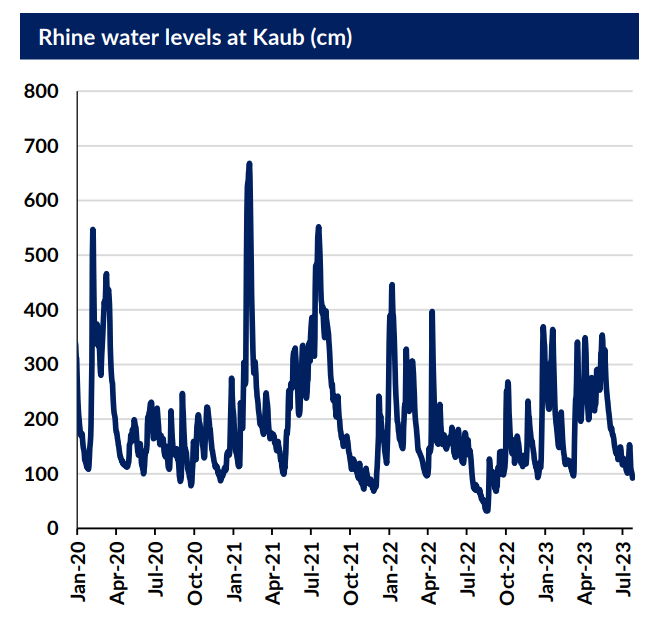

# Gibson Tanker Market Report

**Date:** August 02, 2023  
**Publisher:** Breakwave Advisors | **Category:** Market Insights  
**Original URL:** [https://www.breakwaveadvisors.com/insights/2023/7/31/gibson-tanker-market-report-1](https://www.breakwaveadvisors.com/insights/2023/7/31/gibson-tanker-market-report-1)  

---

## Trouble in the Rhineland

In Europe, besides contending with an intense heatwave, lower rainfall has impacted inland waterway transport on the Rhine River. This serves as an important means of regional fuel distribution, given the lack of an extensive and well developed pipeline network. Instead it takes the form of barge transport carrying petroleum products from the ARA trading and storage hub to inland markets in countries such as Germany and Switzerland.

Low rainfall since mid May has put pressure on this network and low water levels at the Kaub choke point have resulted in draft restrictions and reduced the cargo quantity barges can carry. Although this is not unusual for the time of year and fresh rain is forecast, it has a knock on effect for regional product stocks and thus refining margins. With this in mind and the potential for greater variation in average seasonal rainfall patterns due to climate change, such disruption is likely to become more common.

> **Figure 1: Data Source:gibson Shipbrokers**  
> *Data source:Gibson Shipbrokers*  
> **Interactive Data & Source:** [Gibsons Co](https://www.gibsons.co.uk/market-reports) | [Local Asset](file:///C:/Users/Dell/Github/Shipping/corpus/03-breakwave/insights/2023/assets/2023-08-02_gibson-tanker-market-report-1_img_screenshot2023-07-31123651_0c08edb19eb3.png)

As of writing, the current water level at Kaub stands at 155cm following fresh rainfall but had stood at 92cm at the start of the week. Barges have been restricted to carry around 1,500mt of cargo versus a standard size of 2,500mt, which corresponds to a 40% reduction in barge carrying capacity. This in turn had led to congestion and waiting along the river and to load product in ARA.

Nevertheless, we have seen lower levels before such as in October 2018 where a mere 25cm was recorded. We also saw a notable drop last August to 32cm meaning levels could fall further this year which would begin to raise more concern. Fortunately, this does not seem to be on the horizon at present given the near term forecasts.

A buildup of ARA distillate stocks could be a bearish factor for TC14 as higher diesel supplies could lead to some weaker demand for US cargoes. Flows data shows that quantities shipped into ARA from the US have remained minimal so far this year. Instead, overall flows to North West Euripe (NWE) have been increasing but are discharging in other local, non-ARA ports such as Milford Haven, Grays and Southampton. Over the last three months, volumes have been edging up from 209kbd in May to a multiyear high of 258kbd in July. Further disruption could see more of these cargoes placed in other local ports if this trend continues.

Overall, unless Q3 and Q4 see prolonged lower precipitation in Northern Europe, there is unlikely to be a significant effect on the deep-sea clean tanker market. However, past data also shows this period has the greatest potential for dips in water levels and so the possibility of the kind of past disruption and effects on the ARA market remains for the time being a possibility. This case also highlights the vulnerabilities of having logistical bottlenecks and viable alternatives such as pipelines. The situation remains fluid and is worth keeping an eye on over the coming months given its potential to impact on the NWE market.
