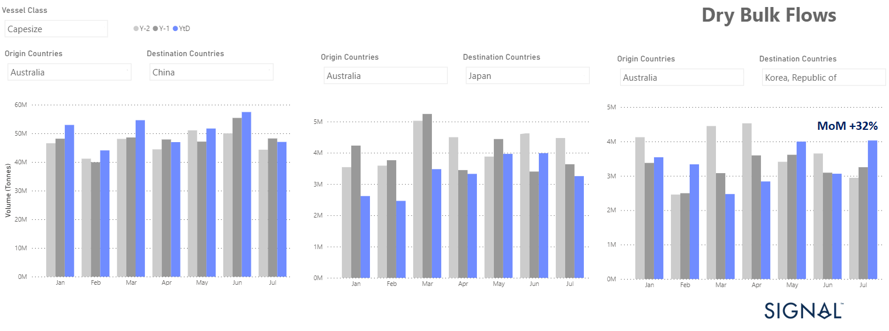
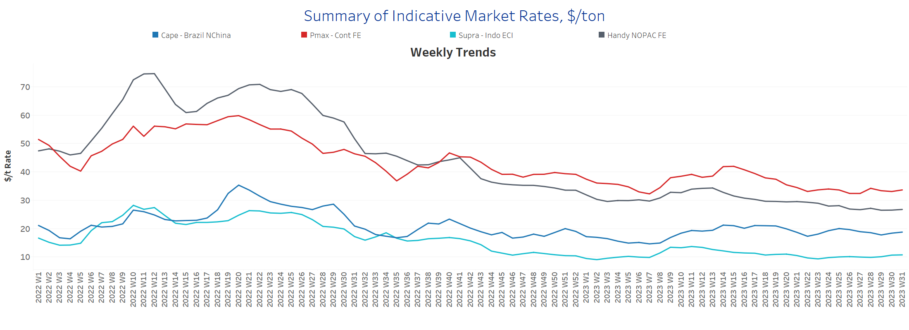
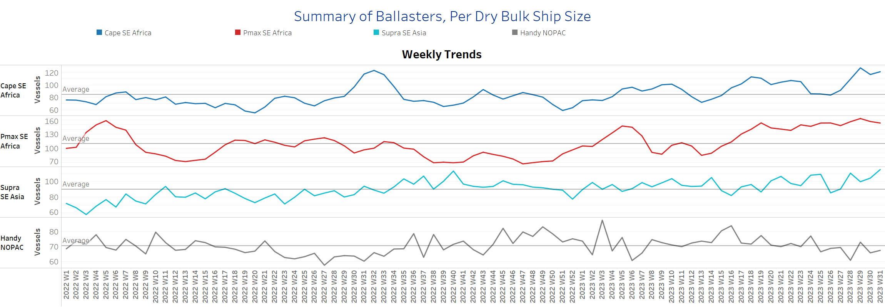
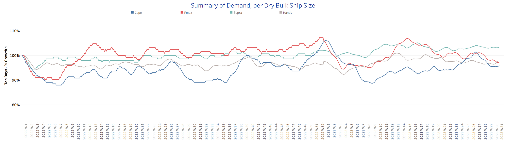
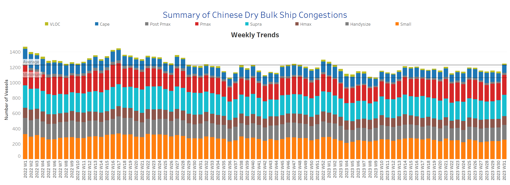

# Signal Dry Bulk Weekly Report

**Date:** August 03, 2023  
**Publisher:** Breakwave Advisors | **Category:** Market Insights  
**Original URL:** [https://www.breakwaveadvisors.com/insights/2023/8/3/signal-dry-bulk-weekly-report](https://www.breakwaveadvisors.com/insights/2023/8/3/signal-dry-bulk-weekly-report)  

---

Downward revision of Capesize iron ore flows from Australia to China and Japan in July

> **Figure 1: Chart of the Week: Capesize Iron Ore Australia to the Far East**  
> **Interactive Data & Source:** [Signal Ocean Platform](https://go.signalocean.com/e/983831/amic-drybulkflows-downloadable/2p7m4b/337189878?h=TN9QfFZNbPyaNAwe_i4TmDv6h3MN5mfUlZWEnkifNb0) | [Local Asset](file:///C:/Users/Dell/Github/Shipping/corpus/03-breakwave/insights/2023/assets/2023-08-03_signal-dry-bulk-weekly-report_img_unnamed-2023-08-03t105115418_6f44791aa9f3.png)

In early August, Atlantic Capesize freight rates posted significant increases on both a weekly and monthly basis, driving the Baltic C5TC (Timecharter Average $/d) to a weekly increase of 32%. Capesize route C8 (Transatlantic Round Gibraltar/Hamburg $/d) saw a 70% increase and the C7 route (Bolivar to Rotterdam $/mt) saw a 26% increase (WoW). Overall, the Baltic Dry Index ended yesterday up 16.5% (WoW), with Capesize and Panamax routes showing an upward trend, while downward pressure continued in the smaller ship size segments.

It is interesting to note that challenges remain in the iron ore market, as July ended with a downward revision in monthly volumes for Capesize iron ore flows from Australia to China and Japan; however, in the case of Japan, there was a notable increase. Specifically, the monthly volume of iron ore flows from Australia to China was about 47 million tonnes, while the volume to Japan was 3.3 million tonnes, down 18% from the previous month (see image above).

On the other hand, Capesize iron ore flows to Korea recorded significant growth, reaching around 4 million tonnes, representing a remarkable 32% month-on-month increase and a substantial 24% year-on-year. The ongoing challenges, there is a glimmer of hope as signs of mild optimism emerged towards the end of July, signalling an end to the previous downward spiral.

It remains to be seen whether the latest policy measures announced by the Chinese government at its Politburo meeting in the last week of July, aimed at boosting domestic demand and supporting private investment in underdeveloped areas, will have a significant impact on demand for steel and iron ore in the coming quarters.

For more information on this week's trends, see the analysis sections below:

Freight Market, Supply, Demand and Port Congestion

## Section 1/ Freight​​​

‘The Big Picture’ - Capesize and Panamax Bulkers and Smaller Ship Sizes
Market Rates ($/t) Firmer

> **Figure 2: Market Chart 2**  
> **Interactive Data & Source:** [Signal Ocean Platform](https://www.thesignalgroup.com/signal-ocean-platform) | [Local Asset](file:///C:/Users/Dell/Github/Shipping/corpus/03-breakwave/insights/2023/assets/2023-08-03_signal-dry-bulk-weekly-report_img_unnamed-2023-08-03t105215079_cdc32a9999e7.png)

August brought a surprising strengthening of the Capesize routes on the Atlantic, while the route from Brazil to North China has not yet fully recovered. For the other ship sizes, the downward spiral now seems to have stopped, and it remains to be seen whether August will bring firmer sentiment.

- Capesize vessel freight rates from Brazil to North China stood at levels around $18.7 per tonne, with the last low in week 22 when rates fell below $19 per tonne.
- Panamax vessel freight rates from the Continent to the Far East held above $30 per tonne since early in the last week of July, standing at levels firmer than five weeks ago.
- Supramax vessel freight rates on the Indo-ECI route, which had fallen below $10/tonne last week, have settled back above the $10/tonne mark; however, it remains to be seen whether this sentiment will continue over the next few days of August.
- Handysize freight rates for the NOPAC Far East route have been hovering around $26.5 per tonne since the end of the previous week.​​

## Section 2/ Supply ​​​

> **Figure 3: Supply Trend Lines for Key Load Areasballasters (# Vessels) Mixed**  
> **Interactive Data & Source:** [Signal Ocean Platform](https://www.thesignalgroup.com/signal-ocean-platform) | [Local Asset](file:///C:/Users/Dell/Github/Shipping/corpus/03-breakwave/insights/2023/assets/2023-08-03_signal-dry-bulk-weekly-report_img_unnamed-2023-08-03t105853095_f8b7be2a98d0.png)

As July came to a close, there were varying trends in the supply of dry bulkers. The number of ballasters increased significantly in the Capesize, Panamax, and Supramax segments. However, there was a decline in the Handysize segment.

- Capesize SE Africa: The number of ballasters is 115, well above the annual average of 83 and up 37% from the low in week 26.
- Panamax SE Africa: The number of ballasters now stands at 147, which is almost 47 above the average for the year, though there are signs of smoothing out when there were more than 160 last week.
- Supramax SE Asia: The current number of ballast ships has increased to 118, which is almost 14 more than a week ago and 39% more than five weeks ago.
- Handysize NOPAC: The number of ballast ships has surprisingly dropped to 63, 10 fewer than two weeks ago, and it remains to be seen whether the downward correction will continue in early August.​​​​​

## Section 3/ Demand

> **Figure 4: Summary of Dry Bulk Demand, per Ship Sizetonnedays Decreasing**  
> **Interactive Data & Source:** [Signal Ocean Platform](https://www.thesignalgroup.com/signal-ocean-platform) | [Local Asset](file:///C:/Users/Dell/Github/Shipping/corpus/03-breakwave/insights/2023/assets/2023-08-03_signal-dry-bulk-weekly-report_img_unnamed-2023-08-03t110159675_548827a905fd.png)

Downward pressure (in tonne days) growth continued in early August, while there are signs of recovery in the Capesize segment.

- Capesize: Demand growth found a firmer pace of growth following the lows recorded throughout July.
- Panamax: The trend is still downward, with no sign of significant growth since the last high in week 26.
- Supramax: Sentiment remained relatively unchanged in the final weeks of July, but growth is still stronger than in June.
- Handysize: Tonne-day growth appeared to follow an upward correction since the end of the previous week, though it remains uncertain whether growth is more stable than in earlier days of the summer season.​​​​

## Section 4/ Port Congestion ​​​​​

> **Figure 5: Dry Bulk Ships Congested at Chinese Portsno of Vessels Increasing**  
> **Interactive Data & Source:** [Signal Ocean Platform](https://www.thesignalgroup.com/signal-ocean-platform) | [Local Asset](file:///C:/Users/Dell/Github/Shipping/corpus/03-breakwave/insights/2023/assets/2023-08-03_signal-dry-bulk-weekly-report_img_unnamed-2023-08-03t110331367_ec5d50e0c597.png)

The upward revision in the number of vessel congestions continued from the previous week, with a notable increase in the Panamax and Supramax segments.

- Capesize: The current number of ship congestions stood at 100, which is 8 lower than a week ago.
- Panamax: The number is now 255, which is 29 more than the previous week, and the recent increase is in line with the trend from five weeks ago.
- Supramax: The number of vessel congestions increased to 266, which is 22 more than the previous week, and it seems to be the highest number since the end of week 19.
- Handysize: The number of congested ships has now exceeded 200, which is 23 more ships than at the end of the previous week, and it is one of the highest levels since the beginning of the second week of this year.

Data Source:[Signal Ocean Platform](https://www.thesignalgroup.com/signal-ocean-platform)
