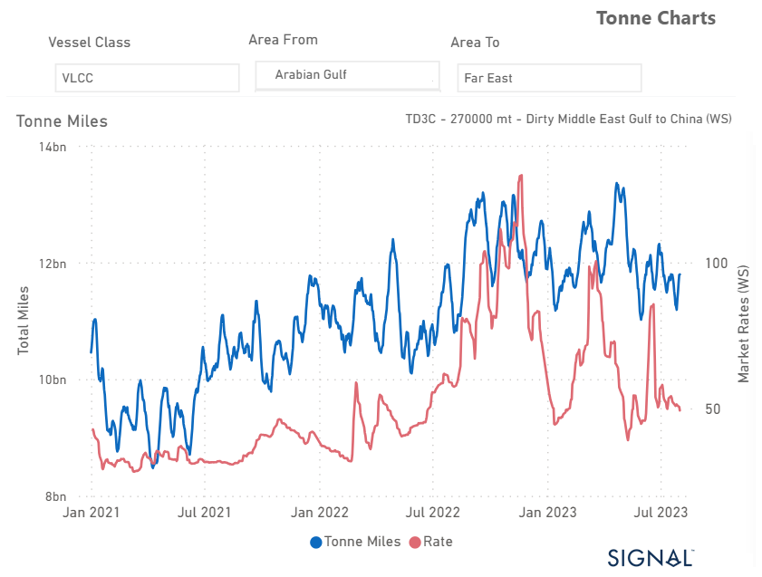
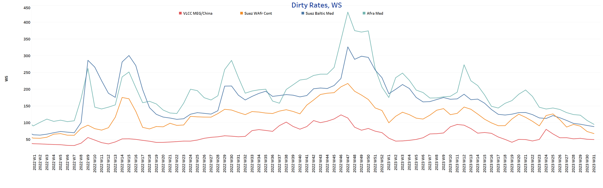
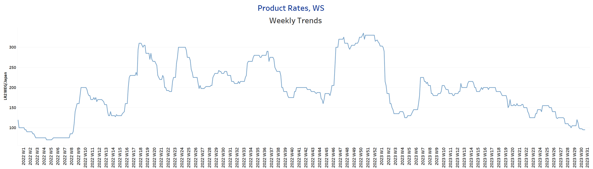
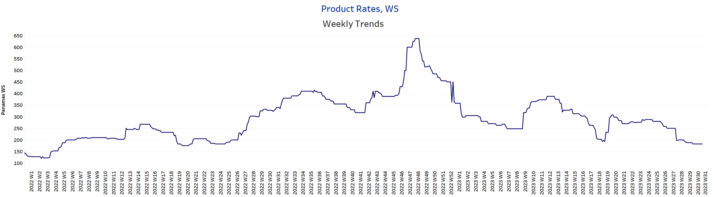
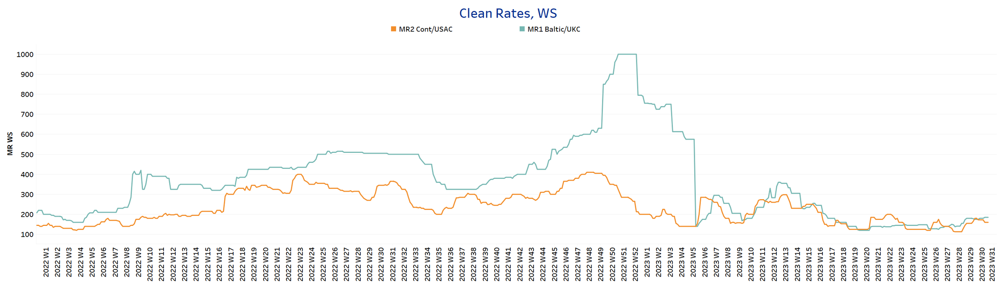
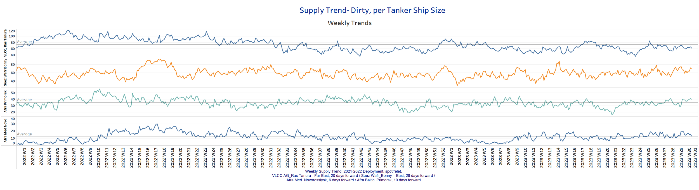
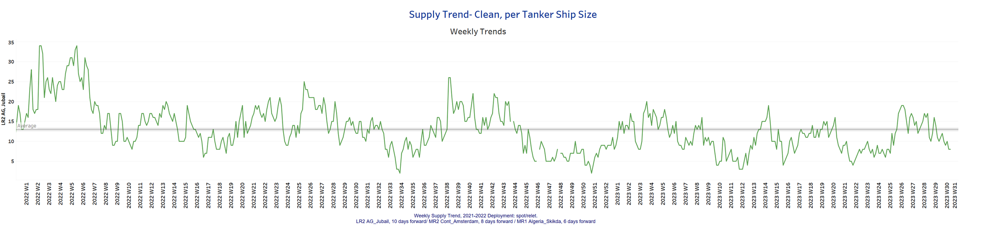
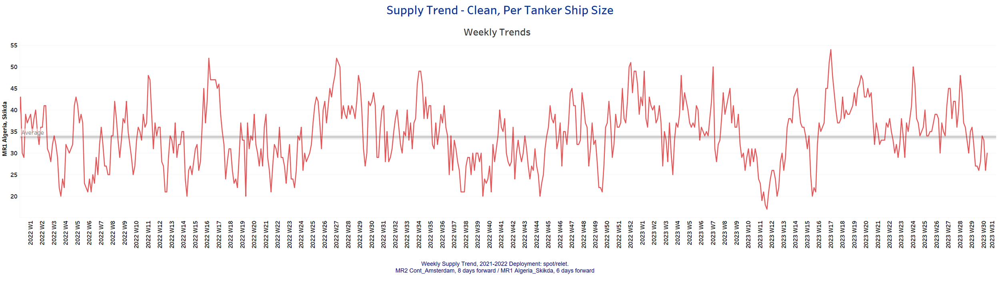
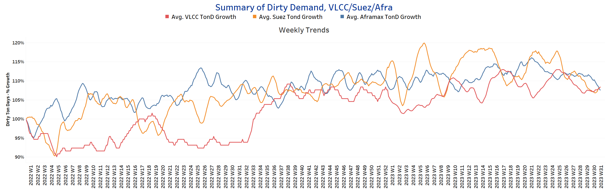
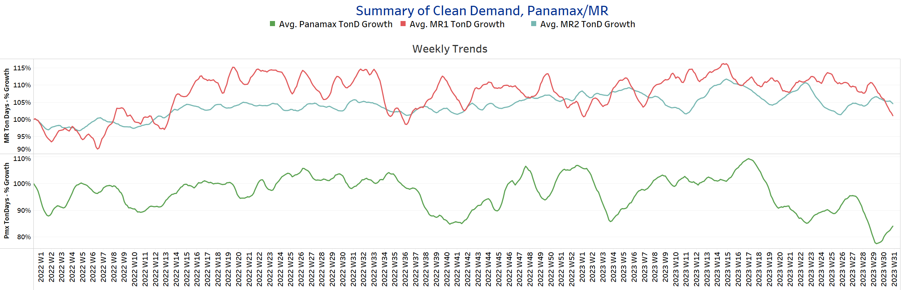

# Signal Tanker Weekly Report

**Date:** August 04, 2023  
**Publisher:** Breakwave Advisors | **Category:** Market Insights  
**Original URL:** [https://www.breakwaveadvisors.com/insights/2023/8/4/signal-tanker-weekly-report](https://www.breakwaveadvisors.com/insights/2023/8/4/signal-tanker-weekly-report)  

---

## Chart of the Week: VLCC Tonne Miles AG to the Far East

*VLCC tonne miles from AG to China have been fluctuating at a lower level since the last peak in late June*

> **Figure 1: Market Chart 1**  
> **Interactive Data & Source:** [Signal Ocean Platform](https://go.signalocean.com/e/983831/tanker-dynamic-oilflows/2p7sfm/337435593?h=159-7CfwdERWZbKkfBF9ecFB-bKCHc_XK6feRaWNHOM) | [Local Asset](file:///C:/Users/Dell/Github/Shipping/corpus/03-breakwave/insights/2023/assets/2023-08-04_signal-tanker-weekly-report_img_unnamed-2023-08-04t125223126_dfff118a4b44.png)

Data Source:[Signal Ocean Platform](https://go.signalocean.com/e/983831/tanker-dynamic-oilflows/2p7sfm/337435593?h=159-7CfwdERWZbKkfBF9ecFB-bKCHc_XK6feRaWNHOM)

In the first days of August, sentiment in the crude tanker market continues to be under pressure, and there are no signs of recovery yet, while on AG the growth of tonne-miles towards the Far East (see image above) is continuously revised downwards. After the last peak in rates from AG to China at the end of July, sentiment has deteriorated while weakness continues on the Aframax-Med route.
However, there is a glimmer of hope in the MR clean segment, as it shows promising signs of recovery. Despite this, the overall outlook for August crude tanker freight rates remains uncertain.

JP Morgan market estimates are raising concerns about a potential doubling of oil prices in the next two years. Currently, oil prices are at a nearly three-month high due to tightening global supply, as producers are implementing output cuts, and the United States, the world's largest fuel consumer, is witnessing strong demand.
To further bolster the market, analysts anticipate that Saudi Arabia might extend its voluntary oil output cut of 1 million barrels per day (bpd) for an additional month, including September. This move is expected to provide extra support during a virtual meeting with other major oil-producing nations scheduled for Friday.

The combination of reduced supply and robust demand is creating an atmosphere of uncertainty in the oil market, and investors and stakeholders are closely monitoring the situation. Any decision made during the forthcoming meeting could significantly impact the trajectory of oil prices in the coming months.

For more information on this week's trends, see the analysis sections below:

Freight Market, Supply and Demand

## Section 1/ Freightmarket Rates (WS)

> **Figure 2: ‘Dirty’ WS​​​​ VLCC - Suezmax - Aframax Weaker**  
> **Interactive Data & Source:** [Signal Ocean Platform](https://www.thesignalgroup.com/signal-ocean-platform) | [Local Asset](file:///C:/Users/Dell/Github/Shipping/corpus/03-breakwave/insights/2023/assets/2023-08-04_signal-tanker-weekly-report_img_unnamed-2023-08-04t125518736_d7c6fa1450e1.png)

The first days of August continued to be quiet, with crude oil tanker freight rates softening as the summer season appears to be bringing a slowdown in demand in the Far East, with the Aframax-Med route still subject to a significant downward correction.

- VLCC MEG-China freight rates fell below the 50 WS mark, down almost 1 point from the previous week, while rates fell for the first time since the end of week 23.
- Suezmax freight rates for shipments from West Africa to continental Europe fell to 67.5WS, down 6 points from a week ago. In the Suez-Baltic-Med route, rates were 88WS, 58 points lower than six weeks ago.
- Aframax Med freight rates fell to WS95, down 50% from the peak ten weeks ago.

> **Figure 3: ‘Product’ Wslr Weaker**  
> **Interactive Data & Source:** [Signal Ocean Platform](https://www.thesignalgroup.com/signal-ocean-platform) | [Local Asset](file:///C:/Users/Dell/Github/Shipping/corpus/03-breakwave/insights/2023/assets/2023-08-04_signal-tanker-weekly-report_img_unnamed-2023-08-04t125644264_7e4575c4985f.png)

- LR2 AG freight rates fell to WS95 this week, down 25 points from early last week, with signs of weaker momentum in the coming days of August.

> **Figure 4: Market Chart 4**  
> **Interactive Data & Source:** [Signal Ocean Platform](https://www.thesignalgroup.com/signal-ocean-platform) | [Local Asset](file:///C:/Users/Dell/Github/Shipping/corpus/03-breakwave/insights/2023/assets/2023-08-04_signal-tanker-weekly-report_img_unnamed-2023-08-04t125814135_ca8c0d42eba4.png)

- Panamax Carib-to-USG rates have been stable around WS180 since late last week with relatively flat dynamics in early August.

> **Figure 5: Market Chart 5**  
> **Interactive Data & Source:** [Signal Ocean Platform](https://www.thesignalgroup.com/signal-ocean-platform) | [Local Asset](file:///C:/Users/Dell/Github/Shipping/corpus/03-breakwave/insights/2023/assets/2023-08-04_signal-tanker-weekly-report_img_unnamed-2023-08-04t130325368_0be3a508097a.png)

- MR1 rates for the Baltic continent rose to 185WS, 5 points higher than two weeks ago, and the firmer momentum since late July continues.

- MR2 rates for shipments from the continent to the U.S. fell to WS160, down nearly 15 points from a week ago.

## Section 2/ Supplysupply Trend Lines for Key Load Areas

> **Figure 6: Dirty (#Vessels) - Mixed**  
> **Interactive Data & Source:** [Signal Ocean Platform](https://www.thesignalgroup.com/signal-ocean-platform) | [Local Asset](file:///C:/Users/Dell/Github/Shipping/corpus/03-breakwave/insights/2023/assets/2023-08-04_signal-tanker-weekly-report_img_unnamed-2023-08-04t130501145_81a0fb37e030.png)

Crude oil tanker supply showed a mixed picture at the beginning, with a downward trend in VLCC and an upward trend in Suezmax Wafr and Aframax Med.

- VLCC Ras Tanura: The current count is about 62 ships, which is 10 less than the average for the year, and there is still a tendency for the number to fall further in the coming days of August.
- Suezmax Wafr: The current count is 71 ships, which is 12 more than at the beginning of last week and with an upward trend for early August.
- Aframax Primorsk: The current ship count has now risen to 40 ships, 1 more than at the end of the previous week, and it looks like the steady increase will continue in early August.
- Aframax Med Novo: The number of ships now stands at 13, approaching the yearly average of 11, with a downward trend in the first week of August.

> **Figure 7: ’Clean’lr2 (#Vessels) - Decreasing**  
> **Interactive Data & Source:** [Signal Ocean Platform](https://www.thesignalgroup.com/signal-ocean-platform) | [Local Asset](file:///C:/Users/Dell/Github/Shipping/corpus/03-breakwave/insights/2023/assets/2023-08-04_signal-tanker-weekly-report_img_unnamed-2023-08-04t130637658_ae5317404b4e.png)

> **Figure 8: MR1 (#Vessels) - Decreasing**  
> **Interactive Data & Source:** [Signal Ocean Platform](https://www.thesignalgroup.com/signal-ocean-platform) | [Local Asset](file:///C:/Users/Dell/Github/Shipping/corpus/03-breakwave/insights/2023/assets/2023-08-04_signal-tanker-weekly-report_img_unnamed-2023-08-04t130819456_0ea6e351b8ec.png)

- Clean LR2 AG Jubail: The current number of ships is currently 8, which is 8 less than the peak in week 29.

- Clean MR1 Algeria Skikda: The current ship count is now 30 ships, which is about 18 ships less than the last peak during week 28, with a downward trend below the annual average over the last three weeks.

## Section 3/ Demandsummary of Tanker Demand per Ship Size & Segment

> **Figure 9: ​​‘Dirty’tonne Days Mixed**  
> **Interactive Data & Source:** [Signal Ocean Platform](https://www.thesignalgroup.com/signal-ocean-platform) | [Local Asset](file:///C:/Users/Dell/Github/Shipping/corpus/03-breakwave/insights/2023/assets/2023-08-04_signal-tanker-weekly-report_img_unnamed-2023-08-04t130953985_9a423f6a82c1.png)

- Dirty tonne days: In early August, the downward revision of the percentage increase in demand (tonnage days) for the VLCC segment seemed to have now reversed to an upward trajectory, whereas the decrease continues in the Suezmax and Aframax segments.

> **Figure 10: ‘Clean’tonne Days Panamax Increasing / MR Decreasing**  
> **Interactive Data & Source:** [Signal Ocean Platform](https://www.thesignalgroup.com/signal-ocean-platform) | [Local Asset](file:///C:/Users/Dell/Github/Shipping/corpus/03-breakwave/insights/2023/assets/2023-08-04_signal-tanker-weekly-report_img_unnamed-2023-08-04t131303095_2bb69db3b234.png)

- Panamax tonne days: The significant downward correction recorded in the last weeks of July has returned to a higher level in the first days of August and must be confirmed, as we have been experiencing a period of strong volatility since the end of week 19.

- Clean MR tonne days: The first upward trend in tonne-miles continued in early August for the MR2 size, while the weak picture of the previous July days persisted for the MR1 size.

Data Source:[Signal Ocean Platform](https://www.thesignalgroup.com/signal-ocean-platform)
