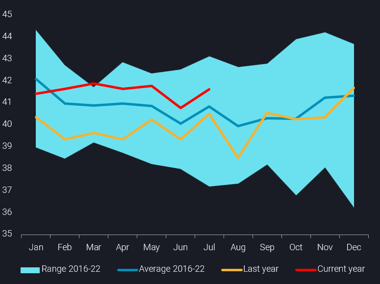
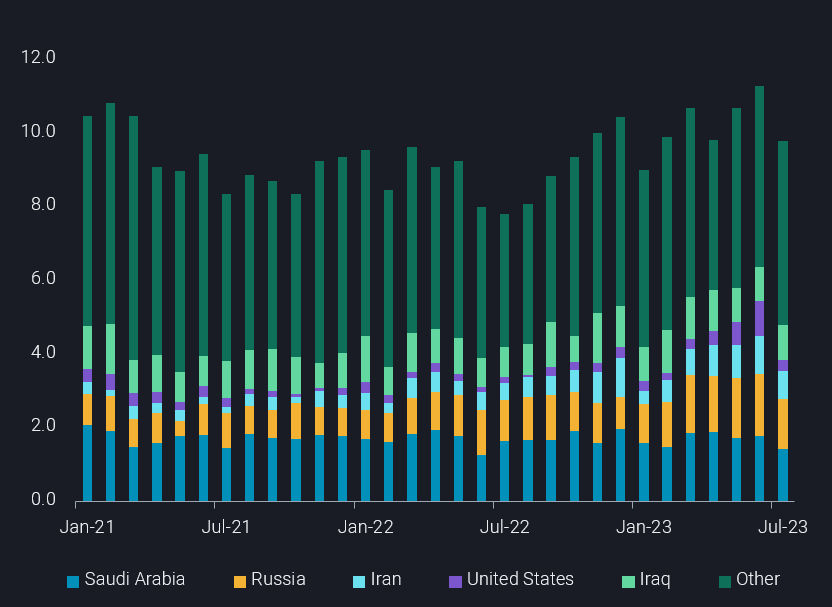
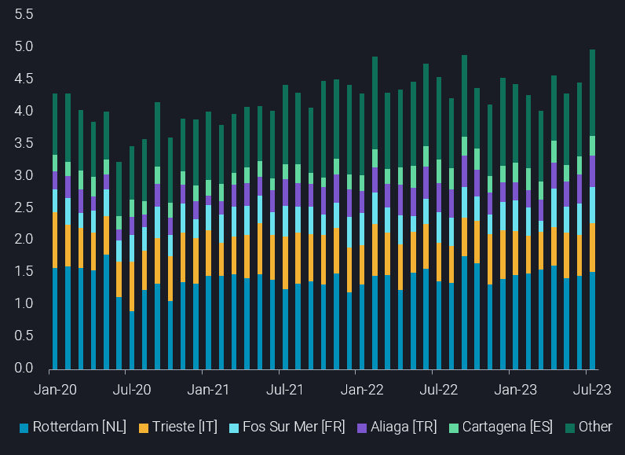

# Global crude imports recover in July despite China slump

**Date:** August 07, 2023  
**Publisher:** Breakwave Advisors | **Category:** Market Insights  
**Original URL:** [https://www.breakwaveadvisors.com/insights/2023/8/7/global-crude-imports-recover-in-july-despite-china-slump](https://www.breakwaveadvisors.com/insights/2023/8/7/global-crude-imports-recover-in-july-despite-china-slump)  

---

*By*[*Jay Maroo*](https://www.linkedin.com/search/results/all/?keywords=Jay%20Maroo&origin=GLOBAL_SEARCH_HEADER&sid=bq-)

Global crude/condensate imports recovered on a m-o-m basis in July, reinforcing the view that global crude supply and demand balances will tighten over the second half of this year, despite indications of weaker Chinese imports.

> **Figure 1: Global Chart**  
> **Interactive Data & Source:** [Analytics Vortexa](https://analytics.vortexa.com/?dateRange=2020-01-01T00%3A00%3A00.000Z__2023-07-31T23%3A59%3A59.999Z&filtersEnabled=%5B%22p%22%2C%22o%22%2C%22d%22%2C%22d_r%22%2C%22v%22%2C%22intra%22%2C%22sts_o%22%2C%22c_o%22%2C%22w%22%2C%22sts%22%2C%22v_a%22%2C%22v_o%22%2C%22c%22%5D&geoBreakdownOriginGlobal=region&metric=bpd&movementEvent=unloading_start&page=Flows&products=%5B%2254af755a090118dcf9b0724c9a4e9f14745c26165385ffa7f1445bc768f06f11%22%5D&tabId=eb992a9a-0e39-4efd-8ddc-ba782c68710d&timeSeriesProperty=destination_country&v=2) | [Local Asset](file:///C:/Users/Dell/Github/Shipping/corpus/03-breakwave/insights/2023/assets/2023-08-07_global-crude-imports-recover-in-july-despite-china-slump_img_global-chart_84e8d1124463.png)

Global seaborne imports rose m-o-m by almost 900kbd in July to reach 41.7mbd. However, the rise in July follows on from a 2023 low of 40.8mbd set in June. On a historical basis, global import levels are still yet to surpass pre-covid highs (see chart above).

The main highlight from July’s data is the weakness in Chinese imports. China imported almost 1.5mbd less crude in July than it did in June, with much of the drop coming from the US, Middle East (mostly Saudi Arabia and Iran), and Russia (see chart below). The decline from Saudi Arabia is somewhat expected, given voluntary production cuts, but to also see lower imports of discounted Iranian and Russian grades is less so. The drop in Chinese imports from the US however will likely recover in the coming weeks as relatively cheap light-sweet crude differentials have spurred spot purchases.

> **Figure 2: China Chart**  
> **Interactive Data & Source:** [Analytics Vortexa](https://analytics.vortexa.com/?dateRange=2020-01-01T00%3A00%3A00.000Z__2023-07-31T23%3A59%3A59.999Z&filtersEnabled=%5B%22p%22%2C%22o%22%2C%22d%22%2C%22d_r%22%2C%22v%22%2C%22intra%22%2C%22sts_o%22%2C%22c_o%22%2C%22w%22%2C%22sts%22%2C%22v_a%22%2C%22v_o%22%2C%22c%22%5D&geoBreakdownOriginGlobal=region&metric=bpd&movementEvent=unloading_start&page=Flows&products=%5B%2254af755a090118dcf9b0724c9a4e9f14745c26165385ffa7f1445bc768f06f11%22%5D&tabId=eb992a9a-0e39-4efd-8ddc-ba782c68710d&timeSeriesProperty=origin_country&timeSeriesSeasonalToggle=0&to=%5B%22934c47f36c16a58d68ef5e007e62a23f5f036ee3f3d1f5f85a48c572b90ad8b2%22%5D&v=2) | [Local Asset](file:///C:/Users/Dell/Github/Shipping/corpus/03-breakwave/insights/2023/assets/2023-08-07_global-crude-imports-recover-in-july-despite-china-slump_img_china-chart_a4d0be306b8c.png)

Unlike China, India’s imports remained almost unchanged at 4.5mbd in July but the nation continued to reduce intake of Middle Eastern grades (down 170kbd m-o-m) while increasing the amount of Russian crude (up 90kbd m-o-m).

Meanwhile, South Korea increased imports the most on m-o-m basis among the key countries, confirming that reported (Argus Media) maintenance at 850kbd Ulsan refinery is likely over. South Korea imported 2.8mbd in July, up by more than 600kbd from June, but almost all of that was attributable to arrivals at Ulsan – home to the country’s largest refinery.

Away from Asia, as European refinery maintenance in Europe draws to a close, key consumers across the region have upped crude intake. The sustained increase was driven by a range of ports across the region, rather than one specific country posting an outsize gain (see chart below).

> **Figure 3: Euro Chart**  
> **Interactive Data & Source:** [Analytics Vortexa](https://analytics.vortexa.com/?dateRange=2020-01-01T00%3A00%3A00.000Z__2023-07-31T23%3A59%3A59.999Z&destinationGlobalXFilter=%5B%2268faf65af1345067f11dc6723b8da32f00e304a6f33c000118fccd81947deb4e%22%2C%224b0de081f395d0e51d3dbf633dd059bbd0822baae35ee198360d1d2dcb6cbc66%22%2C%226c1eeb0c59ecda62e5b90f4eaa7687c5625b7bc49ab9fe522bf65d0358a9b7aa%22%2C%22b699a03bc8b0fe203dae88d52ad816bf8a56e0ba7b122c55f324d9ca7abed15a%22%2C%22c7baa1cfb2a11e7c2eca39b2df5950ecdc7e095621c0c4801c437e0eb7947016%22%2C%22313bfed7babd03c3951be77a8a930a575b78dd5c7eab38d122bf67b67e7d008e%22%2C%2201aeab2a2a62bcd8cf995d7cb262e50c0cd280be0fca7dcbd1e9bc6151b05157%22%2C%2229005fdc7273f96d4598adc2a8619b796875bd652b4c5a2b97b3283b92ca8dc8%22%2C%224952adc3c79f83c3560f65797ce9cf849fe3a9ad3fddc3cd7a0085aeaa3193a8%22%2C%223d06bf3df9f42a3530a2421ba3f829566405c52a87345d4f7bc01eb91ddfb01e%22%5D&filtersEnabled=%5B%22p%22%2C%22o%22%2C%22d%22%2C%22d_r%22%2C%22v%22%2C%22intra%22%2C%22sts_o%22%2C%22c_o%22%2C%22w%22%2C%22sts%22%2C%22v_a%22%2C%22v_o%22%2C%22c%22%5D&geoBreakdownDestinationGlobal=port&metric=bpd&movementEvent=unloading_start&page=Flows&products=%5B%2254af755a090118dcf9b0724c9a4e9f14745c26165385ffa7f1445bc768f06f11%22%5D&tabId=eb992a9a-0e39-4efd-8ddc-ba782c68710d&timeSeriesProperty=destination_port&to=%5B%22f39d455f5d38907394d6da3a91da4e391f9a34bd6a17e826d6042761067e88f4%22%5D&v=2) | [Local Asset](file:///C:/Users/Dell/Github/Shipping/corpus/03-breakwave/insights/2023/assets/2023-08-07_global-crude-imports-recover-in-july-despite-china-slump_img_euro-chart_3e08b840a5fa.png)

The top 10 European crude importing ports (across 2022) raised imports in July by a combined 500kbd, pushing the total to a record high of 5mbd. Almost all of the increase can be accounted for by a rise in imports from the US, underlining the latter’s key role in supplying oil to Europe in the absence of Russian Urals.

But given the latest news of Saudi Arabia’s 1mbd production cut being extended into September, competition for medium/heavy sour crude will likely intensify, and could narrow (or flip further) the historical premiums paid for light-sweet crudes such as WTI. This could in turn spur further opportunistic Asian buying from the US.

Data Source:[Vortexa](https://www.vortexa.com//oil-gas-data-traders-analysts-data-scientists?gclid=Cj0KCQjw8_qRBhCXARIsAE2AtRZKOvMnbilZ_6_91d7huSFFy71pWLrnPwGwOHVzXsmsG-1a1mZnQw8aAt89EALw_wcB&hsa_acc=1782073842&hsa_ad=548425387665&hsa_cam=14746637662&hsa_grp=125038601902&hsa_kw=&hsa_mt=&hsa_net=adwords&hsa_src=g&hsa_tgt=dsa-1431852288425&hsa_ver=3&utm_campaign=%5BCD%5D%20-%20DSA%20-%20EMEA&utm_medium=cpc&utm_medium=ppc&utm_source=google&utm_source=adwords&utm_term=)
