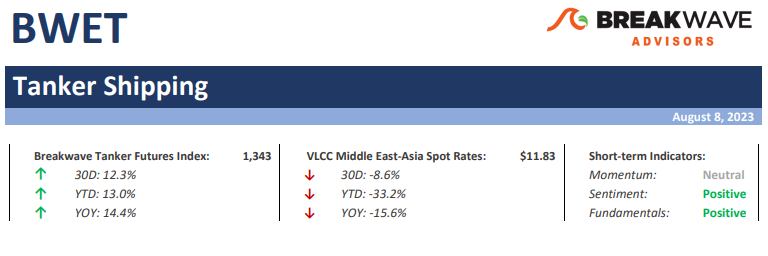
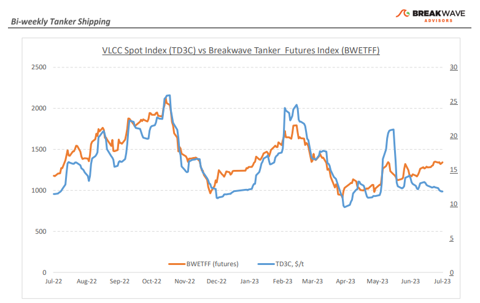
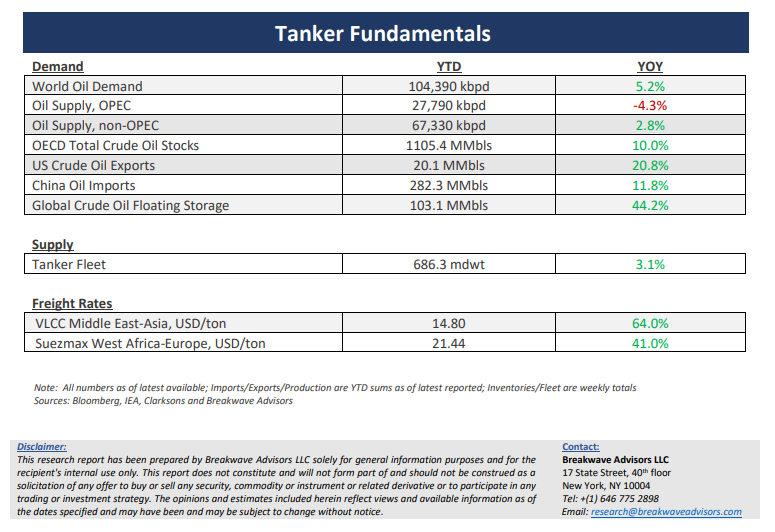

# Breakwave Bi-Weekly Tanker Report - August 8, 2023

**Date:** August 08, 2023  
**Publisher:** Breakwave Advisors | **Category:** Market Insights  
**Original URL:** [https://www.breakwaveadvisors.com/insights/2023/8/8/tanker-report-august-8-2023-slzrn](https://www.breakwaveadvisors.com/insights/2023/8/8/tanker-report-august-8-2023-slzrn)  

---

> **Figure 1: Tankerreporttop**  
> [Local Asset](file:///C:/Users/Dell/Github/Shipping/corpus/03-breakwave/insights/2023/assets/2023-08-08_tanker-report-august-8-2023-slzrn_img_tankerreporttop_b932a0ac044f.png)

**• A rather dull market for VLCCs, as spot rates gradually soften**– Summer traditionally has been a slow period for tanker shipping and this year so far proves to be no different. Spot voyage rates remain relatively unchanged, but higher bunker prices are placing some pressure on earnings with oil prices reaching multi-month highs. The Atlantic market, which has been a pilar of strength in the last few years, remain relatively strong vs the Middle East market where the recent production cuts by Saudi Arabia have reduced demand for spot vessels by a decent amount. In addition, the fact that oil prices have rallied quite a bit has also led some Russian focused players to reposition back to the Middle East and/or the Atlantic, as crude prices cross the ceiling price once again. As we move into September, we expect refining demand to gradually improve, although it is not until the fourth quarter that seasonally the market tends to pick up in terms of volume leading to stronger spot rates for the larger tankers. What remains quite striking for the crude tanker market is the resiliency in spot rates despite the significant reductions in crude oil export volumes for a third month in a row. As most analysts have already stressed, the tanker market remains on track for record low supply growth over the next several years, and the fact that the market balance is relatively tight might also be a testament of such a development which could potentially lead to much stronger rates once stronger global oil demand growth returns.

**• Oil prices post strong recovery as supply cuts begin to tighten the market balance**– Strong demand from Asia allowed Russia to overtake Saudi Arabia in supplying seaborne crude oil to China, as we estimated that imports from Saudi Arabia fell to 1.8 million bpd in July from 1.9 million bpd in June. Yet, export volumes have declined from both Russia and Saudi Arabia reflecting the already announced production cuts, pushing oil prices to multi-month high in the process. In July, China imported 10.29 million bpd, the weakest rate in three months, although still up 17% from the low base last year. Geopolitics remains a major factor when it comes to oil prices, but at the same time, the argument for a tighter market balance come winter is getting stronger by the day. After all, the world remains quite fragile when it comes to potential disruptions, despite a relatively calm period, with recent worrisome developments in the Ukraine war, while the possibility for an escalation in the situation in the Taiwan straits remaining real. The global economy is not at its best shape, but once again, oil prices have proven to be quite sensitive to risks especially when those involve the largest oil producer (Russia) and the largest oil importer (China) in the world.

**• Tanker cycle driven by tight supply, recovering demand**– The tanker market is recovering from a long period of staggered rates as the growth in new vessel supply shrinks while oil demand is recovering in line with the global economy. A historically low orderbook combined with favorable demand fundamentals should continue to support increased spot rate volatility, which combined with the ongoing geopolitical turmoil, should support freight rates in the medium term.

> **Figure 2: Tankerreportchart**  
> [Local Asset](file:///C:/Users/Dell/Github/Shipping/corpus/03-breakwave/insights/2023/assets/2023-08-08_tanker-report-august-8-2023-slzrn_img_tankerreportchart_235f77e78334.png)

> **Figure 3: Tankerreportbottom**  
> [Local Asset](file:///C:/Users/Dell/Github/Shipping/corpus/03-breakwave/insights/2023/assets/2023-08-08_tanker-report-august-8-2023-slzrn_img_tankerreportbottom_78f07e11c571.png)
