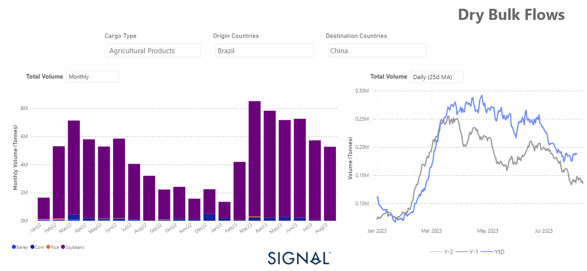
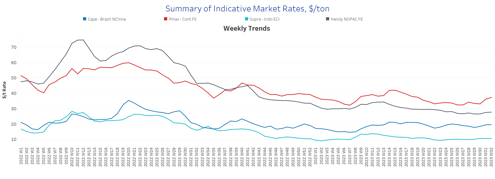
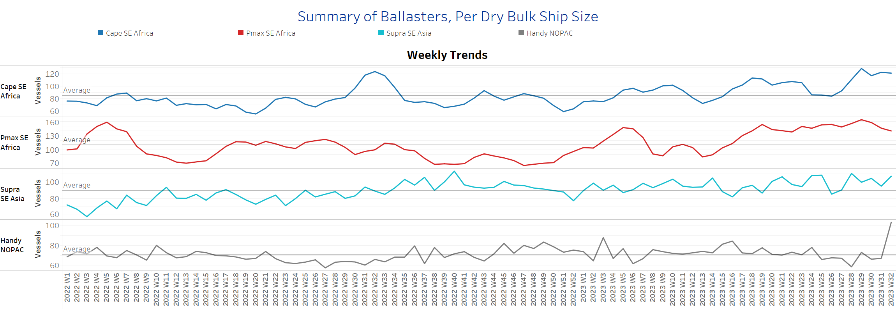
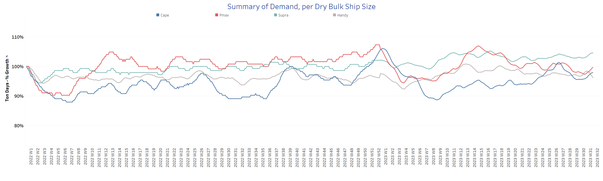
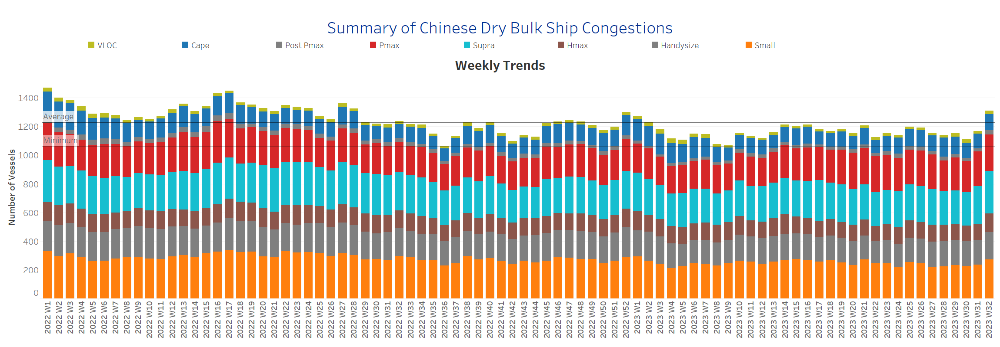

# Signal Dry Bulk Weekly Report

**Date:** August 09, 2023  
**Publisher:** Breakwave Advisors | **Category:** Market Insights  
**Original URL:** [https://www.breakwaveadvisors.com/insights/2023/8/9/signal-dry-bulk-weekly-report](https://www.breakwaveadvisors.com/insights/2023/8/9/signal-dry-bulk-weekly-report)  

---

## Chart of the Week: Grain Flows From Brazil to China

Upward revision of grain flows from Brazil to China throughout this year

> **Figure 1: Market Chart 1**  
> **Interactive Data & Source:** [Signal Ocean Platform](https://www.thesignalgroup.com/signal-ocean-platform) | [Local Asset](file:///C:/Users/Dell/Github/Shipping/corpus/03-breakwave/insights/2023/assets/2023-08-09_signal-dry-bulk-weekly-report_img_unnamed-2023-08-09t133435997_ba5077e2c49c.png)

As the second week of August commenced, the momentum in the freight market exhibited greater resilience, particularly marked by substantial gains in the larger vessel size segments. Concurrently, persistent geopolitical challenges continued to exert a downward influence on the smaller vessel size categories. Notably, the rising count of ballast ships sent escalating signals, raising apprehensions about the sustainability of the upward trajectory of freight rates as the summer season progresses.

In the grain market, meanwhile, commodity prices have risen again. This increase is due to Russia's withdrawal from a grain agreement and India's imposition of restrictions on certain rice exports. In recent months, China has significantly increased its monthly grain imports from Brazil compared with the corresponding months last year. In addition, the prevailing uncertainty surrounding Ukraine's grain exports has led to an increase in purchase volumes since the end of the first quarter (see chart above). ​​​The 25-day moving average of grain purchases from Brazil to China has been increasing in recent months and has been above last year's volumes. This trend is expected to continue, given the uncertainty surrounding a grain agreement between Russia and Ukraine.

For more information on this week's trends, see the analysis sections below:

Freight Market, Supply, Demand and Port Congestion

> **Figure 2: Section 1/ Freight**  
> **Interactive Data & Source:** [Signal Ocean Platform](https://www.thesignalgroup.com/signal-ocean-platform) | [Local Asset](file:///C:/Users/Dell/Github/Shipping/corpus/03-breakwave/insights/2023/assets/2023-08-09_signal-dry-bulk-weekly-report_img_unnamed-2023-08-09t133938389_9a87c961c1e6.png)

The beginning of the second week in August saw an increase in rate development for larger vessels, while smaller vessel categories still faced challenges in rebalancing their rates to exceed those of the previous days in July.

- Capesize vessel freight rates from Brazil to North China hovered around $19.6/tonne, up nearly $3/tonne from three weeks ago, with the last low coming in week 22 when rates fell below $19/tonne.
- Panamax vessel freight rates from the Continent to the Far East held at $28 per tonne, firmer than two weeks ago. However, rates are still well below the last peak in week 13, when rates topped $30/tonne.
- Supramax vessel freight rates on the Indo-ECI route remained relatively flat at above the $10/tonne mark; with no yet signs of an upward trend for August.
- Handysize freight rates for the NOPAC Far East route have been hovering around $28 per tonne at the start of the week, with signs of an upward incline compared to the days of early July.

## Section 2/ Supply​

Supply Trend Lines for Key Load Areas | Ballasters (# vessels) Increasing

> **Figure 3: Market Chart 3**  
> **Interactive Data & Source:** [Signal Ocean Platform](https://www.thesignalgroup.com/signal-ocean-platform) | [Local Asset](file:///C:/Users/Dell/Github/Shipping/corpus/03-breakwave/insights/2023/assets/2023-08-09_signal-dry-bulk-weekly-report_img_unnamed-2023-08-09t134118541_e8427c09b8b5.png)

The count of ballasters has consistently remained notably elevated compared to the preceding weeks, and this upward trajectory has become even more pronounced within the Handysize segment during the second week of August.

- Capesize SE Africa: The number of ballasters is 123, well above the annual average of 83 for the last six consecutive weeks and 46% from the low in week 26.
- Panamax SE Africa: The number of ballasters now stands at 142, which is almost 30 above the average for the year, however, with signs of decrease compared to the last peak of around 160 at week 29.
- Supramax SE Asia: The current number of ballast ships stood at 106, which is almost 8 more than a week ago and 25% more than six weeks ago.
- Handysize NOPAC: The number of ballast ships has surprisingly increased to 104, up nearly 50% from the annual average, amid signs of a downward correction in early August.

## Section 3/ Demand

Summary of Dry Bulk Demand, per Ship Size | TonneDays Increasing

> **Figure 4: Market Chart 4**  
> **Interactive Data & Source:** [Signal Ocean Platform](https://www.thesignalgroup.com/signal-ocean-platform) | [Local Asset](file:///C:/Users/Dell/Github/Shipping/corpus/03-breakwave/insights/2023/assets/2023-08-09_signal-dry-bulk-weekly-report_img_unnamed-2023-08-09t155835300_ac1f4c69b657.png)

An upward surge in tonne-day growth became evident during the second week of August, primarily driven by robust performances in the Capesize, Panamax, and Supramax vessel segments.

- Capesize: The demand for Capesize vessels experienced a noteworthy acceleration in growth, gaining momentum from the latter part of the first week of August. Notably, the corrective trend observed in the preceding weeks appears to have dissipated, further strengthening the positive trajectory.
- Panamax: For the first time since the conclusion of week 27, there has been a noticeable reversal in the trend towards an upward trajectory. However, the forthcoming days in August will determine the extent of volatility in this trend.
- Supramax: A more robust upward momentum in tonne-day growth has surfaced since the conclusion of the initial week of August. This surge is notably intertwined with geopolitical uncertainties and bottlenecks affecting grain exports through the Black Sea, which, in turn, triggered an upsurge in Asian demand for greater monthly purchase volumes.
- Handysize: Contrary to earlier estimations of an upward correction, tonne-day growth initiated a downward incline at the onset of the second week of August.​​

## Section 4/ Port Congestion ​​​​​

Dry bulk ships congested at Chinese ports | No of Vessels Increasing

> **Figure 5: Market Chart 5**  
> **Interactive Data & Source:** [Signal Ocean Platform](https://www.thesignalgroup.com/signal-ocean-platform) | [Local Asset](file:///C:/Users/Dell/Github/Shipping/corpus/03-breakwave/insights/2023/assets/2023-08-09_signal-dry-bulk-weekly-report_img_unnamed-2023-08-09t134306691_15be77a0e8e2.png)

The upward revision in the number of vessel congestions continued for a second consecutive week, with a notable increase in the Supramax, Panamax and Handysize segments.

- Capesize: The current number of vessel congestion has been around 100 for three weeks, and there is no sign of an upward trend yet.
- Panamax: The number now stands at 245, which is 3 more than the previous week, and the recent increase is in line with the upward trend recorded in the first week of August.
- Supramax: The number of vessel congestions increased to 290, which is 20 more than the previous week, and it seems to be the highest number since a similar peak at the end of week 17.
- Handysize: The number of congested ships at the beginning of the second week of August was just over 190, which is 15 ships more than at the end of the previous week, and it is the highest number this year.

Data Source:[Signal Ocean Platform](https://www.thesignalgroup.com/signal-ocean-platform)
