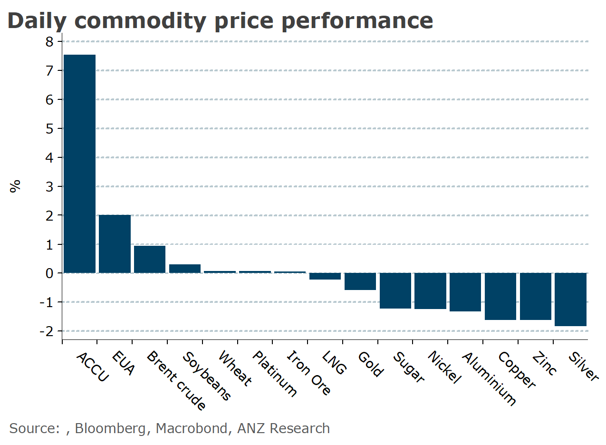

# Weak economic data in China weighs on sentiment

**Date:** August 09, 2023  
**Publisher:** Breakwave Advisors | **Category:** Market Insights  
**Original URL:** [https://www.breakwaveadvisors.com/insights/2023/8/9/weak-economic-data-in-china-weighs-on-sentiment](https://www.breakwaveadvisors.com/insights/2023/8/9/weak-economic-data-in-china-weighs-on-sentiment)  

---

*By*[*Daniel Hynes*](https://www.linkedin.com/in/dahynes/)

Weak economic data in China weighed on sentiment across commodity markets. This was exacerbated by a stronger USD.

> **Figure 1: 1691532005917**  
> [Local Asset](file:///C:/Users/Dell/Github/Shipping/corpus/03-breakwave/insights/2023/assets/2023-08-09_weak-economic-data-in-china-weighs-on-sentiment_img_1691532005917_d46a0e6b3493.png)

**Copper**fell after worse than expected trade data from China raised further concerns over the recovery of its economy. Customs data showed exports fell 15% y/y, driven by restrictions on high tech products including semiconductors. This was worse than market consensus, triggering a risk off tone across financial markets. However, there were some positive signs that things are stabilising.[Imports of commodity imports for July were robust](../pdfs/2023-08-09_weak-economic-data-in-china-weighs-on-sentiment_china-commodity-trade-data-july-2023_898182d14c9b.pdf). While primary copper imports were down 2.7% y/y, that was driven by strong domestic production. Strong underlying demand was highlighted by a 3.2% y/y rise in copper. This comes as copper stockpiles fall sharply. Stockpiles, as reported by the Shanghai Futures Exchange, dropped 15% last week and remain sharply below the seasonal average. Exports of aluminium fell nearly 25% y/y amid disruptions to domestic output.

The spectre of further monetary tightening by the Fed also weighed on sentiment.**Gold**edged lower for a second day after Federal Reserve Governor Michelle Bowman said that the central bank may need to raise rates further to restore price stability. This comes ahead of US consumer price index later this week. A further moderation could take the pressure off the Fed to keep hiking rates.

**Iron ore**futures were also weaker on the back of the weak trade data. This was despite imports of the steel making raw material holding up, with July imports up 2.5% y/y to 93.48mt. However, concerns over the property sector re-emerged. Unfavourable steel mills’ margins and renewed pressure on the steel industry to curb production are boding ill for iron ore demand. News emerged that major developer Country Garden is struggling to meet its debt payments.

Energy markets bucked the trend to end the session higher. Ongoing supply side issues across those markets have kept demand strong. China’s crude oil imports remained resilient, though levelled-off from record highs in June. However, it was concerns over further disruptions to supply that pushed**crude oil**prices higher. Ukrainian President Volodymyr Zelensky said his country would retaliate if Russia continued to block its ports. This comes following drone attacks, which have hit a Russian oil tanker and naval vessel, highlighting the threat to key trade routes for the industry. However, the gains were limited after the EIA lowered its forecast for US consumption. The country will use 4% less fuel jet fuel in Q3 than its prior forecast as the US air travel boon losses steam.

**LNG**and**coal**prices edged higher amid strong demand in China. Imports have benefitted from subdued hydro-power generation and strong electricity demand. Ongoing supply jitters helped push**European gas**higher.

Data source:[Commodities Wrap](https://www.linkedin.com/newsletters/commodities-wrap-6692196755876012032/?fbclid=IwAR3kiXJqZdxmp9ZcRwBNI7FsBySI-XSC0pfPur1qzjt7OZp7PTE59Tsl1QI)
