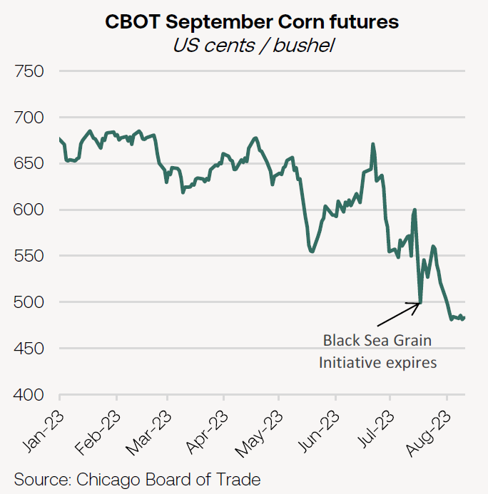
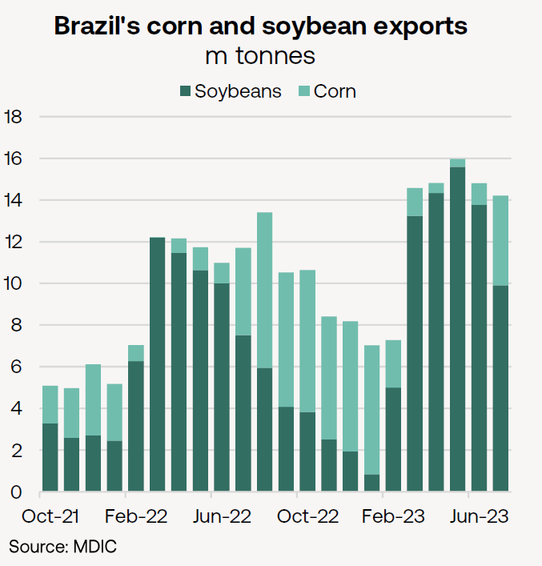
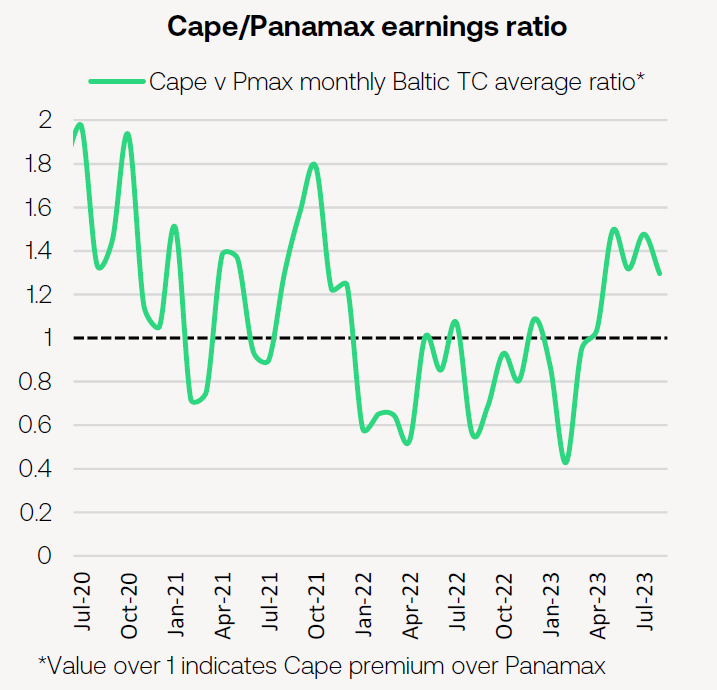
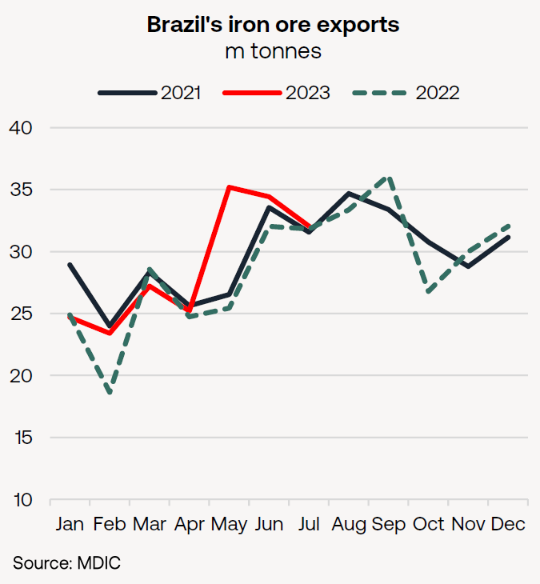

# Brazil: Dry Bulk Export Driver

**Date:** August 13, 2023  
**Publisher:** Breakwave Advisors | **Category:** Market Insights  
**Original URL:** [https://www.breakwaveadvisors.com/insights/2023/8/12/brazil-dry-bulk-export-driver](https://www.breakwaveadvisors.com/insights/2023/8/12/brazil-dry-bulk-export-driver)  

---

- *Having failed to breach 14m tonnes/month in 2022, Brazil’s soybean and corn exports in July surpassed this level for a fifth successive month, supporting Panamax/Kamsarmaxes.*

- *Long-haul Brazil to China corn trade to further benefit Panamaxes/Kamsarmaxes, following last year’s trade agreement,*

- *Iron ore exports from Brazil are already running 15.3m tonnes higher YoY in first seven months of the year, government data confirm.*

**Brazil continues to be the focal point for world grain trades**in the Q3, as soybean exports wind down and corn cargoes appear in greater numbers.

Even a monthly drop of almost 4m tonnes to 10.0m tonnes failed to prevent soybean exports from recording a fifth consecutive yearly gain in July.

Despite the loss of Ukrainian corn shipments from Chornomorsk, Odesa and Yuzhny with the end of the Black Sea Grain Initiative, September corn futures on the Chicago Board of Trade fell by 13.7% between 24 July and 9 August.

> **Figure 1: 241**  
> [Local Asset](file:///C:/Users/Dell/Github/Shipping/corpus/03-breakwave/insights/2023/assets/2023-08-13_brazil-dry-bulk-export-driver_img_241_27c14a3c96c6.png)

This demonstrated weak international demand for US corn in the face of what the International Grains Council (IGC) described as “**sizeable and competitively priced” corn supply from Brazil**.

The latest projections for corn exports from the IGC (dated 20 July) for the year ending June 2024 are an annual all-time high of 50.0m tonnes (+1.4m tonnes YoY, if realised), narrowly ahead of chief competitor, the US.

IGC this week noted that, with 64% of the harvest completed, Brazil’s reported corn yields have so far exceeded initial expectations.

As the chart below shows, Brazil’s corn exports in 2022 offset the seasonal loss of Soybean cargoes from August-December. This suggest Brazil’s grain export terminals will be similarly active through the current quarter as they were in Q2 2023.

> **Figure 2: 242**  
> [Local Asset](file:///C:/Users/Dell/Github/Shipping/corpus/03-breakwave/insights/2023/assets/2023-08-13_brazil-dry-bulk-export-driver_img_242_6c9670bc4d84.png)

**Panamax/Kamsarmax**tonnage is the main vessel size employed on**Brazil’s corn trades, particularly on longhaul trades into East Asia**.

According to AXS vessel tracking, Panamaxes shipped 88% of Corn volumes to the Far East and Southeast Asia in 2022, compared to 53% of volumes to the rest of the world.

Official trade data show that of the 18.0m tonnes of corn exported from Brazil in Q3 2022, some 4.6m tonnes were shipped to Europe, 3.5m tonnes went to the Middle East, another 3.1m tonnes went to East Asia, with 2.0 Mt on shorthaul voyages to Colombia and Mexico.

This quarter may include a greater proportion of longhaul shipments from Brazil to East Asia, with China importing 2.5m tonnes of Brazilian corn since the two countries struck a trade agreement in late 2022. Recent flooding in north-eastern China, a key growing region for corn, may result in further import demand if crops are damaged.

Vessel tracking data suggests that 34% of corn volumes loaded at Brazil in July and the first week of August have been destined for China.

> **Figure 3: 243**  
> [Local Asset](file:///C:/Users/Dell/Github/Shipping/corpus/03-breakwave/insights/2023/assets/2023-08-13_brazil-dry-bulk-export-driver_img_243_811ed8eddb8d.png)

As the chart above shows, Capesizes have consistently traded at a premium to Panamaxes in recent months, a stark difference to much of 2022 when Panamax rates largely outperformed the Capes.

One of the drivers behind this has been the return of iron ore trade growth on key Capesize routes, including from Brazil.

Following a poor year for weather in 2022, drier conditions in Q2 allowed miners to ramp up production and exports. The latest official trade data shows Brazil exported 191m tonnes of iron ore in the first seven months of 2023, an increase of 15.3m tonnes on the same period last year.

While it is true that this year’s export volumes represent a return to year-on-year growth, however, the chart overleaf highlights that**2023 also marks a return to the actual volumes from 2021**. Indeed, the two-year increase is a less impressive 2.9m tonnes.

> **Figure 4: 244**  
> [Local Asset](file:///C:/Users/Dell/Github/Shipping/corpus/03-breakwave/insights/2023/assets/2023-08-13_brazil-dry-bulk-export-driver_img_244_82be876550d6.png)

### Braemar Research

---

**Tags:** Drybulk, Shipping, Brazil  
