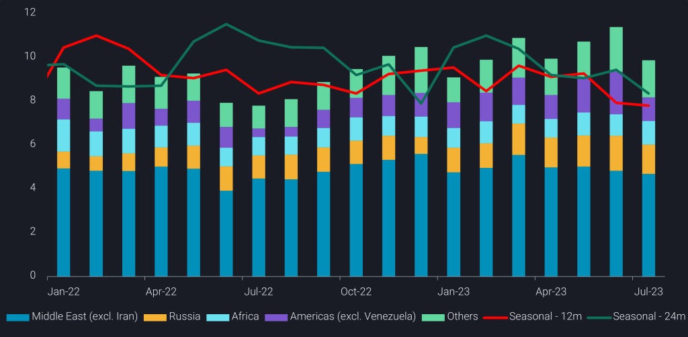
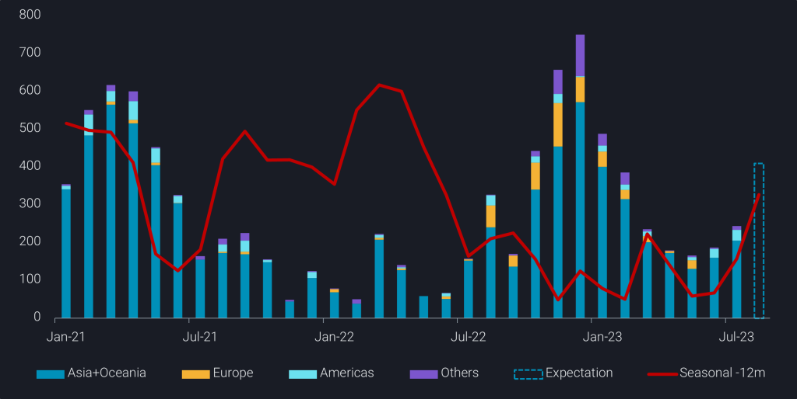

# China crude imports wane amid high stock levels

**Date:** August 14, 2023  
**Publisher:** Breakwave Advisors | **Category:** Market Insights  
**Original URL:** [https://www.breakwaveadvisors.com/insights/2023/8/13/china-crude-imports-wane-amid-high-stock-levels](https://www.breakwaveadvisors.com/insights/2023/8/13/china-crude-imports-wane-amid-high-stock-levels)  

---

**China’s crude imports registered a massive m-o-m decline in July, as top refiners were sensitive to recent price hikes on the back of record stockpiles.**

***By***[***Emma Li***](https://www.linkedin.com/in/emma-li-73003443/)

China’s seaborne crude imports slumped below 10mbd in July, down 13% m-o-m from June’s 3-year highs. But imports have been higher compared to the same period in the past two years, as fuel demand has recovered from pandemic restrictions.

The m-o-m decline was led by lower imports from the big-3 crude exporters, namely the US, Saudi Arabia and Russia, with the latter two cutting exports amid reduced production targets and/or higher domestic demand. Imports from African countries edged up, however, as refiners sourced replacement supplies from Angola and Congo, which are not involved in recent OPEC voluntary production cuts.

Meanwhile,[China’s onshore crude stocks](https://analytics.vortexa.com/?dateRange=2020-01-01T00%3A00%3A00.000Z__2023-07-30T23%3A59%3A59.999Z&frequency=month&hiddenSeries=%5B%22a63890260e29d859390fd1a23c690181afd4bd152943a04c00cd6a5ecf3f7d1e%22%2C%22781cacc7033f877caa4b4106d096b74afe006a96391bf5a56a4f55b849359a42%22%2C%22b5fafce6e20de2dc307fb7e0b89978ee91a49a7b6ec6f5461daf2633f3c56674%22%5D&onshoreInventoriesLocations=%5B%22b5fafce6e20de2dc307fb7e0b89978ee91a49a7b6ec6f5461daf2633f3c56674%22%2C%220fddbfd0d90bad306a92fcb483a19276f101a5f7f0783363f9f2a9d40c10558d%22%5D&page=OnShoreCrudeInventories&selectedRegion=%5B%22b5fafce6e20de2dc307fb7e0b89978ee91a49a7b6ec6f5461daf2633f3c56674%22%5D&tabId=0cd16ff6-30e9-4ff7-a5c6-915250d00cc2&tankCrude=%5B%22confirmed%22%2C%22probable%22%5D)climbed at an average rate of over 1.1mbd for three straight months since late April and registered a new record at 1.02bb at end July, as crude imports rose, refinery throughputs were seasonally low during spring turnaround, and the recovery in domestic demand, particularly from manufacturing, fell behind expectations in the past four months. The somewhat unplanned stock build allows Chinese refiners to slow down crude purchases in the weeks ahead as prices go up.

> **Figure 1: 241**  
> **Interactive Data & Source:** [Analytics Vortexa](https://analytics.vortexa.com/?dateRange=2022-01-01T00%3A00%3A00.000Z__2023-07-31T23%3A59%3A59.999Z&metric=bpd&movementEvent=unloading_start&page=Flows&products=%5B%2254af755a090118dcf9b0724c9a4e9f14745c26165385ffa7f1445bc768f06f11%22%5D&tabId=322effd9-f0d3-418e-b741-d06c2b79b85a&timeSeriesProperty=origin_region&to=%5B%22b5fafce6e20de2dc307fb7e0b89978ee91a49a7b6ec6f5461daf2633f3c56674%22%5D&v=2) | [Local Asset](file:///C:/Users/Dell/Github/Shipping/corpus/03-breakwave/insights/2023/assets/2023-08-14_china-crude-imports-wane-amid-high-stock-levels_img_241_36c77122f452.png)

With lower Russian crude supplies, Chinese teapot refiners that largely boosted Russian grades imports since Q2 last year, are expected to lean towards the deeply discounted[Iranian barrels](https://analytics.vortexa.com/?dateRange=2022-01-01T00%3A00%3A00.000Z__2023-07-31T23%3A59%3A59.999Z&from=%5B%22d308ddc557e774187ad6c7da81b39db990def9a39e6c88e79cb163b6bdd6e8e5%22%5D&metric=bpd&page=Flows&products=%5B%2254af755a090118dcf9b0724c9a4e9f14745c26165385ffa7f1445bc768f06f11%22%5D&tabId=322effd9-f0d3-418e-b741-d06c2b79b85a&timeSeriesProperty=origin_country&v=2)or other heavy feedstocks, as Shandong partially re-allowed non-crude imports recently. State-run refiners, on the other hand, will likely import more crude from West Africa and the Americas, as attractive light-sweet crude margins encourage spot purchases against rising Saudi and Russian crude prices.

## New Product Export Quotas Will Likely Spur Diesel Exports

Chinese refiners have increased diesel exports in July amidst improving export margins and cooling domestic demand, as summer harvest and planting come to an end and high temperatures and frequent rainfall dent infrastructure construction activities.

But refiners are waiting for a new batch of product export quotas in August before ramping up exports further. The new batch of quotas is estimated to be around 10mt, along with another 5mt of LSFO exports, so that the total amount for 2023 will not exceed the total for 2022. Some refiners proposed to convert the LSFO quotas to clean fuel exports, but Beijing is unlikely to relax clean fuel exports according to market participants.

> **Figure 2: Data Source:vortexa**  
> *Data Source:Vortexa*  
> **Interactive Data & Source:** [Analytics Vortexa](https://analytics.vortexa.com/?dateRange=2021-01-01T00%3A00%3A00.000Z__2023-07-31T23%3A59%3A59.999Z&from=%5B%22b5fafce6e20de2dc307fb7e0b89978ee91a49a7b6ec6f5461daf2633f3c56674%22%5D&metric=bpd&page=Flows&products=%5B%22deda35eb9ca56b54e74f0ff370423f9a8c61cf6a3796fcb18eaeeb32a8c290bb%22%5D&tabId=322effd9-f0d3-418e-b741-d06c2b79b85a&timeSeriesHiddenSeries=%5B%22seasonal_comparison_24%22%5D&timeSeriesProperty=destination_region&v=2) | [Local Asset](file:///C:/Users/Dell/Github/Shipping/corpus/03-breakwave/insights/2023/assets/2023-08-14_china-crude-imports-wane-amid-high-stock-levels_img_242_df7f51dbdcd9.png)

## China Imports Finished Gasoline As Consumption Tax on Blending Components Supports Short Term Arbitrage

While state-run refiners continue exporting gasoline along with other clean fuels to utilise existing export quotas, they also purchased a few[finished gasoline cargos](https://analytics.vortexa.com/?dateRange=2023-01-01T00%3A00%3A00.000Z__2023-07-31T23%3A59%3A59.999Z&filtersEnabled=%5B%22p%22%2C%22o%22%2C%22d%22%2C%22d_r%22%2C%22intra%22%2C%22sts_o%22%2C%22c_o%22%2C%22v%22%2C%22w%22%2C%22v_a%22%5D&metric=bpd&page=Flows&products=%5B%22c76d43ed46524d628a16be1b63019719631a5c2dcbf54af5a94e90ebe2c37a4f%22%5D&tabId=79e451b4-c797-47b5-940c-9821caee6759&to=%5B%22b5fafce6e20de2dc307fb7e0b89978ee91a49a7b6ec6f5461daf2633f3c56674%22%5D&v=2)in July for August arrival, as arbitrage economics flipped into positive territory in recent weeks, following the start of a new tax regime on blending components from end June, which dampened blending margins for private blenders and buoyed domestic gasoline margins for state-run refiners.

But still, the recent imports are rare and likely short-lived. The recent policy moves will continue to favour state-run refiners to boost crude processing, and China will continue to be a net clean fuels exporter despite tight export quotas.

---

**Tags:** Tankers, Shipping, Crude  
