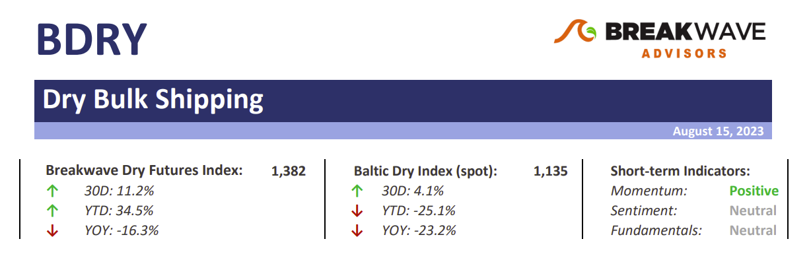
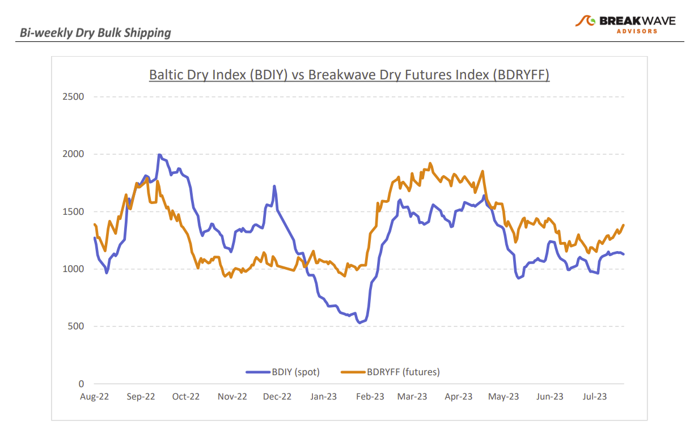
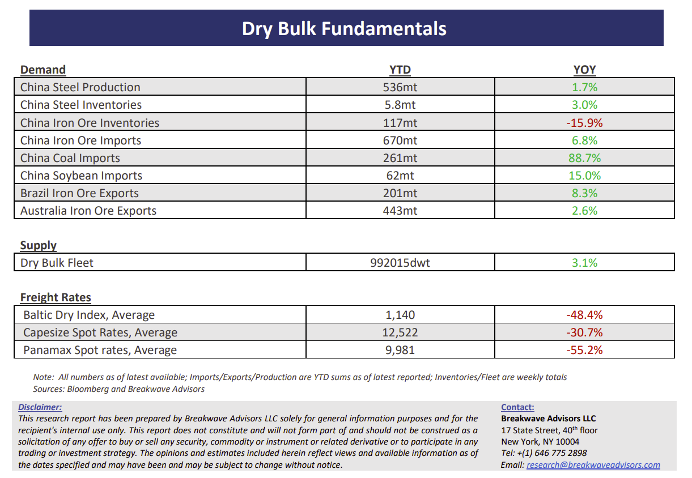

# Breakwave Bi-Weekly Dry Bulk Report - August 15, 2023

**Date:** August 15, 2023  
**Publisher:** Breakwave Advisors | **Category:** Market Insights  
**Original URL:** [https://www.breakwaveadvisors.com/insights/2023/7/11/breakwave-bi-weekly-drybulk-report-aug-15-2023-n3yxf](https://www.breakwaveadvisors.com/insights/2023/7/11/breakwave-bi-weekly-drybulk-report-aug-15-2023-n3yxf)  

---

> **Figure 1: Dbreporttop**  
> [Local Asset](file:///C:/Users/Dell/Github/Shipping/corpus/03-breakwave/insights/2023/assets/2023-08-15_breakwave-bi-weekly-drybulk-report-aug-15-2023-n3yxf_img_dbreporttop_e86f82327f05.png)

**• Panamax spot rates shine as grain and mineral demand increases**– The past few weeks have been quite positive for the smaller size dry bulk vessels, with Panamax spot rates up more than 60% from recent lows while Supramax spot rates also have followed the move higher, though to a lesser extent. Strong demand for grains but also for coal are the main reasons for the recovery, which should remain in place for the foreseeable future as the North Atlantic market appears tight in tonnage. On the other hand, little has changed in the Capesize sector that continues to see spot earnings in the middle of the recent three-month range of 11,000-15,000. However, we believe we are about to enter a period of heightened volatility as September cargoes for Capesizes come into play and the seasonal demand kicks in. Although the macro picture seems bleak especially when it comes to China, the structural base demand combined with the seasonal increase should be enough to push spot rates higher as we head into the fourth quarter. Once again, the Atlantic Capesize market will be the leader when it comes to rate changes, as expensive bunkers resulting from stronger oil prices make it uneconomical for ships to ballast to the Atlantic without first securing employment. The overall dry bulk market remains healthy, though not to the extent that forecasters expected it to be earlier in the year as China’s economy remains under pressure while the rest of the world is barely growing when it comes to the industrial sectors of the economy.

**• China’s economic woes continue as another property developer risks default**– Almost two years after Evergrande’s default fears first emerged, another major Chinese property developer seems to follow the same fate. Chinese property developer Country Graden, with total liabilities of about four times those of Evergrande, send another distress signal from China’s ailing property sector by failing to pay interest on some financial products partly linked to real estate. Sentiment once gain is about to take another major hit when it comes to the property market, which combined with weak economic numbers out of China (see the very low new loans for July, falling home prices, deflationary pricing across the Chinese economy, etc.), should continue to put pressure on commodity demand. Unfortunately, without significant support in the form of major aggressive stimulus, something that so far China’s officials have resisted, we see little reason to believe a recovery in demand is imminent. On the positive side, iron ore inventories continue to decline (now lowest since 2019 excluding the Covid period), as liquidity is tight, which potentially could set the stage for a powerful recovery in restocking when the time comes.

**• Dry bulk focus shifts back to fundamentals**– Following a period of high uncertainty and significant disruptions across the commodity spectrum, the gradual normalization of trade is shifting the market’s attention back to the traditional demand and supply dynamics that have shaped dry bulk profitability for decades. As effective fleet supply growth for the next few years looks marginal, demand will be the main determinant of spot freight rates with China returning back to the driver’s seat as the dominant force of bulk imports and thus shipping demand.

> **Figure 2: Dbreportchart**  
> [Local Asset](file:///C:/Users/Dell/Github/Shipping/corpus/03-breakwave/insights/2023/assets/2023-08-15_breakwave-bi-weekly-drybulk-report-aug-15-2023-n3yxf_img_dbreportchart_9c12e637094e.png)

> **Figure 3: Dbreportbottom**  
> [Local Asset](file:///C:/Users/Dell/Github/Shipping/corpus/03-breakwave/insights/2023/assets/2023-08-15_breakwave-bi-weekly-drybulk-report-aug-15-2023-n3yxf_img_dbreportbottom_d0f1b1fa6bcf.png)

## Subscribe:
