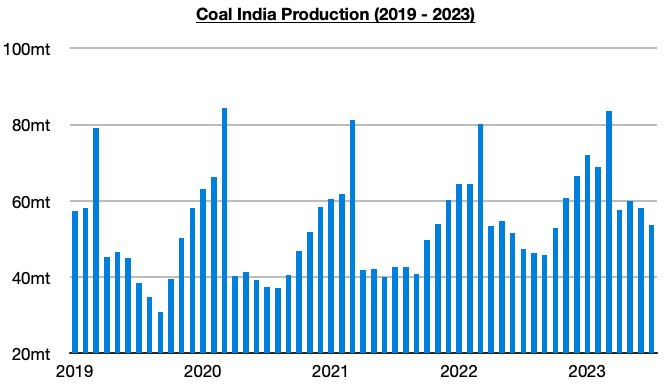
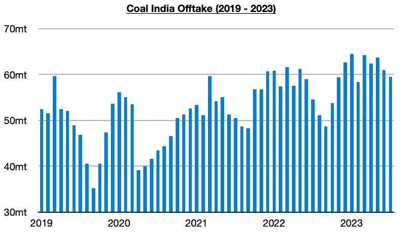

# Coal India Continues to Destock its Stockpiles

**Date:** August 16, 2023  
**Publisher:** Breakwave Advisors | **Category:** Market Insights  
**Original URL:** [https://www.breakwaveadvisors.com/insights/2023/8/16/coal-india-continues-to-destock-its-stockpiles](https://www.breakwaveadvisors.com/insights/2023/8/16/coal-india-continues-to-destock-its-stockpiles)  

---

***By***[***Jeffrey Landsberg***](https://www.linkedin.com/in/jeffrey-landsberg-70ab957/)

Coal India produced approximately 53.7 million tons of coal last month, which marks a month-on-month decrease of 4.3 million tons (-7%) but a year-on-year increase of 6.4 million tons (14%). Coal India’s production has now increased on a year-on-year basis during twenty-six of the last twenty-seven months, and last month’s 14% growth has marked the largest growth seen in over a year. So far this year, production has increased year-on-year by 37.4 million tons (9%).

> **Figure 1: 241**  
> [Local Asset](file:///C:/Users/Dell/Github/Shipping/corpus/03-breakwave/insights/2023/assets/2023-08-16_coal-india-continues-to-destock-its-stockpiles_img_241_faa3bd79103b.jpg)

Offtake (amount sent to customers) totaled 59.5 million tons last month, which marks a month-on-month decrease of 1.5 million tons (-3%) but a year-on-year increase of 5 million tons (9%). Offtake has now increased on a year-on-year basis during twenty-eight of the last twenty-nine months, and last month again saw offtake exceed production. Prior to these last four months, the previous five months all saw offtake fall short of production. Coal India’s stockpiles now stand at approximately 52 million tons.

> **Figure 2: 242**  
> [Local Asset](file:///C:/Users/Dell/Github/Shipping/corpus/03-breakwave/insights/2023/assets/2023-08-16_coal-india-continues-to-destock-its-stockpiles_img_242_96dbdefc786e.jpg)

---

**Tags:** India, Coal, Shipping  
