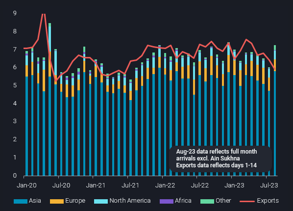
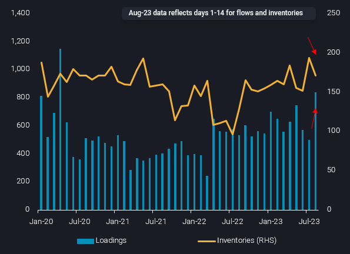

# Global imports of Saudi crude recovering in August

**Date:** August 18, 2023  
**Publisher:** Breakwave Advisors | **Category:** Market Insights  
**Original URL:** [https://www.breakwaveadvisors.com/insights/2023/8/17/global-imports-of-saudi-crude-recovering-in-august](https://www.breakwaveadvisors.com/insights/2023/8/17/global-imports-of-saudi-crude-recovering-in-august)  

---

Global imports of Saudi crude grades are showing signs of recovery in August, after hitting fresh lows last month. The quick swing in import activity underlines the speed at which Asia’s (especially China’s) imports can increase, but also suggest firm competition for Medium-heavy sour crudes going forwards.

***By***[***Jay Maroo***](https://www.linkedin.com/search/results/all/?keywords=Jay%20Maroo&origin=GLOBAL_SEARCH_HEADER&sid=bq-)

Preliminary indications for global arrivals of Saudi crudes stand at 7.2mbd in August, up by 1.1mbd from July, and above the 6.8mbd average across the first half of the year (see chart below). Final arrivals may be lower, as delays to discharges are likely to materialise, especially in Northeast Asia. Global arrivals include Saudi grades loaded from Egypt’s Sidi Kerir storage but exclude cargoes discharged at Ain Sukhna – which is linked via the Sumed pipeline to the former.

Meanwhile, export activity from Saudi Arabia continues to decline, at least for the first half of August. Saudi Arabia’s exports so far in August (1-14) have fallen to the 6mbd mark, the first time this has happened since June 2021. The declining trend fits with Saudi Arabia’s intention to voluntarily curb production, however the question remains as to how sustainable it is for exports to continue falling while Asia’s demand for Saudi crudes remains relatively firm.

> **Figure 1: Global Arrivals of Saudi Crude Grades by Destination Region(mbd)**  
> *Global arrivals of Saudi crude grades by destination region(mbd) vsSaudi exports*  
> **Interactive Data & Source:** [Analytics Vortexa](https://analytics.vortexa.com/?dateRange=2020-01-01T00%3A00%3A00.000Z__2023-08-31T23%3A59%3A59.999Z&filtersEnabled=%5B%22p%22%2C%22o%22%2C%22d%22%2C%22d_r%22%2C%22v%22%2C%22intra%22%2C%22sts_o%22%2C%22c_o%22%2C%22w%22%2C%22sts%22%2C%22v_a%22%2C%22v_o%22%2C%22c%22%5D&geoBreakdownDestinationGlobal=port&geoBreakdownOriginGlobal=port&metric=bpd&movementEvent=unloading_start&page=Flows&products=%5B%22b4b1826674c8975dec55514e47f925bd7622f356fde039c75ab739938ed50194%22%2C%22448d24e0dd61958694eeb59822acea8eeea85326e6cb67a0739856508107ef5b%22%2C%2219bcc501a60d16bb281db88b5b11ad2b3501812a10dc5dd82bd4a8ecadfa937a%22%2C%22ca7f607e2d17ee9708209d0a8f48e183e6099de55eec2e4d58797363cdf0f62b%22%2C%22740f1086353e5734afaf501997b8c0d8dc9917df06a4f51ce22fd15efc2443c3%22%5D&tabId=eb992a9a-0e39-4efd-8ddc-ba782c68710d&timeSeriesProperty=destination_region&timeSeriesSeasonalToggle=0&toExcluded=%5B%229ab4381aab3268d41c92fe179c819cb9e01e5b4fc6c22b231124c2a83e59ff98%22%5D&v=2) | [Local Asset](file:///C:/Users/Dell/Github/Shipping/corpus/03-breakwave/insights/2023/assets/2023-08-18_global-imports-of-saudi-crude-recovering-in-august_img_241_fcc5df049a8a.jpg)

As seen in the chart above, the bulk of the m-o-m rise in August arrivals is due to higher imports from core buyers in Asia. China, Japan, India and Taiwan are on track to collectively raise imports of Saudi crudes by 1.2mbd, putting totals at historical upper ranges. At a broader level, higher crude imports by these refining-heavy nations, despite rising (especially Saudi) crude prices, is well aligned with stronger global product margins.

For China and India, rising Saudi crude imports are also overlaid with the backdrop of Russian Urals becoming scarcer and less favourable in pricing. This is also reflected in shipping where ballasting trends show some owners are shifting away from Russian trade. Meanwhile, Japanese imports of Saudi crude are up sharply in August, by almost 350kbd m-o-m on a preliminary basis, as refinery runs in the country recover post-refinery maintenance.

From a European perspective, the higher imports of Saudi grades by Asian refiners will reinforce the view of supply tightness for much-needed medium and heavy sour grades. It will also highlight once again the importance of Saudi crude supplies at Sidi Kerir, even if OSPs are rising for the most in-demand grade (Arab Light).

Vortexa data shows Sidi Kerir loadings so far in August (1-14) are especially strong at over 800kbd, and this coincides with onshore inventories at location drawing from a previous high (see chart).

Falling Saudi supply is intensifying competition between Asian and European buyers for sour crude and driving the latter to pivot to a sweeter import slate, namely WTI. But with Asian refiners also now looking to bring in larger volumes from the US Gulf Coast, the wider picture is increasingly becoming one of tighter global crude supplies across the spectrum of light-sweet to heavy sour. Reflecting exactly what the OPEC+ voluntary supply cuts were targeting at…

> **Figure 2: Sidi Kerir Loadings of Saudi Crude(lhs**  
> *Sidi Kerir loadings of Saudi crude(LHS, kbd) vsonshore inventory levels Sidi Kerir(RHS, mb)*  
> **Interactive Data & Source:** [Analytics Vortexa](https://analytics.vortexa.com/?dateRange=2020-01-01T00%3A00%3A00.000Z__2023-08-15T23%3A59%3A59.999Z&filtersEnabled=%5B%22p%22%2C%22o%22%2C%22d%22%2C%22d_r%22%2C%22v%22%2C%22intra%22%2C%22sts_o%22%2C%22c_o%22%2C%22w%22%2C%22sts%22%2C%22v_a%22%2C%22v_o%22%2C%22c%22%5D&from=%5B%224818c8f53a8dd12df8c22288dd654e7d29e21d10e294f4eeaed7e144124523c0%22%5D&geoBreakdownDestinationGlobal=region&geoBreakdownOriginGlobal=port&metric=bpd&page=Flows&products=%5B%22b4b1826674c8975dec55514e47f925bd7622f356fde039c75ab739938ed50194%22%2C%22448d24e0dd61958694eeb59822acea8eeea85326e6cb67a0739856508107ef5b%22%2C%2219bcc501a60d16bb281db88b5b11ad2b3501812a10dc5dd82bd4a8ecadfa937a%22%2C%22ca7f607e2d17ee9708209d0a8f48e183e6099de55eec2e4d58797363cdf0f62b%22%2C%22740f1086353e5734afaf501997b8c0d8dc9917df06a4f51ce22fd15efc2443c3%22%5D&tabId=eb992a9a-0e39-4efd-8ddc-ba782c68710d&timeSeriesSeasonalToggle=0&v=2) | [Local Asset](file:///C:/Users/Dell/Github/Shipping/corpus/03-breakwave/insights/2023/assets/2023-08-18_global-imports-of-saudi-crude-recovering-in-august_img_242_168048ae208b.jpg)

***Data Source:***[***Vortexa***](https://www.vortexa.com//oil-gas-data-traders-analysts-data-scientists?gclid=Cj0KCQjw8_qRBhCXARIsAE2AtRZKOvMnbilZ_6_91d7huSFFy71pWLrnPwGwOHVzXsmsG-1a1mZnQw8aAt89EALw_wcB&hsa_acc=1782073842&hsa_ad=548425387665&hsa_cam=14746637662&hsa_grp=125038601902&hsa_kw=&hsa_mt=&hsa_net=adwords&hsa_src=g&hsa_tgt=dsa-1431852288425&hsa_ver=3&utm_campaign=%5BCD%5D%20-%20DSA%20-%20EMEA&utm_medium=cpc&utm_medium=ppc&utm_source=google&utm_source=adwords&utm_term=)

---

**Tags:** Crude, Oil, Tankers  
