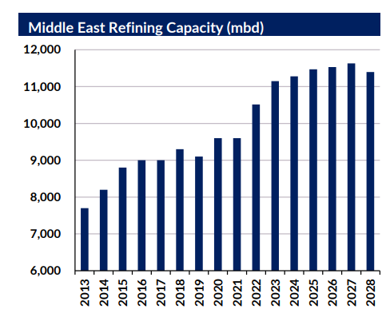

# End of an Era

**Date:** August 21, 2023  
**Publisher:** Breakwave Advisors | **Category:** Market Insights  
**Original URL:** [https://www.breakwaveadvisors.com/insights/2023/8/21/end-of-an-era](https://www.breakwaveadvisors.com/insights/2023/8/21/end-of-an-era)  

---

### Weekly Tanker Market Report

For product tankers, much of the past decade’s investment was focused on changing dynamics in the global refining scene. In short, the story of expanding capacity in the East, primarily driven by Middle East export refineries, and capacity rationalisation in the West supported the case for strong tonne mile demand growth. However, with most Middle East refining projects nearing completion, and plans to close capacity in the West being reassessed in the name of energy security, the sector needs to find a new investment case for the next decade.

From 2013 to 2022, Middle East refining capacity expanded by 2.8mbd, but from 2022, to 2028 that growth slows to 0.9mbd, with around 70% of that growth taking place over the next year. Ultimately this highlights that following the start-up of Duqm early next year, no new export originated Middle East refineries are due to come online. Those projects which do start up, are either small scale expansions or domestically focused. One also has to consider that regional demand is also set to increase over the next 5 years, which ultimately indicates that Middle East product balances will tighten over the medium term. Furthermore, given the lead time it takes to develop a greenfield refinery project, there is little chance of the outlook changing.

> **Figure 1: 1 (2)**  
> **Interactive Data & Source:** [Gibsons Co](https://www.gibsons.co.uk/market-reports) | [Local Asset](file:///C:/Users/Dell/Github/Shipping/corpus/03-breakwave/insights/2023/assets/2023-08-21_end-of-an-era_img_128229_bba01e613f7e.png)

With the Middle East story largely concluded, the next stop should be India. However here, issues with acquiring land have prevented new mega projects materialising, with Middle East based investors choosing China instead. Although India is still expected to boost capacity, much of this is likely to be domestically focused, suggesting little upside for product exports in the medium term.

As is often the case, China is the big sensitivity here. With the country being responsible for the biggest capacity additions over the next 5 years, export policy will be key for global refining margins and products trade. In theory, China will see its middle distillate surplus increase by 1mbd by 2028; however, government policy will be the key determent of whether (or not) material gains in exports are witnessed.

In the long term, a slowing demand side story and expanding refining capacity will lead to overcapacity in the sector, which will require some rationalisation. Logically that would take place in Europe; however, uncertainty around government policy concerning energy security and healthy margins in the near term, are likely to delay refining closures.

Data source:[Gibson Shipbrokers](https://www.gibsons.co.uk/market-reports)

---

**Tags:** Tankers, Shipping, Crude  
