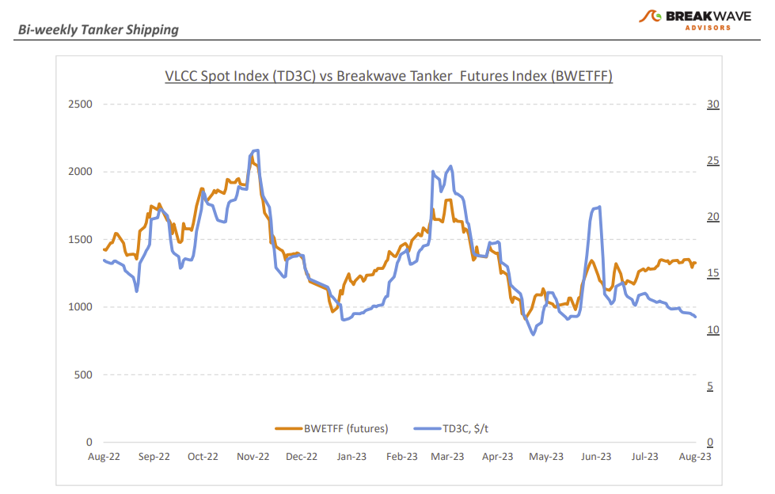
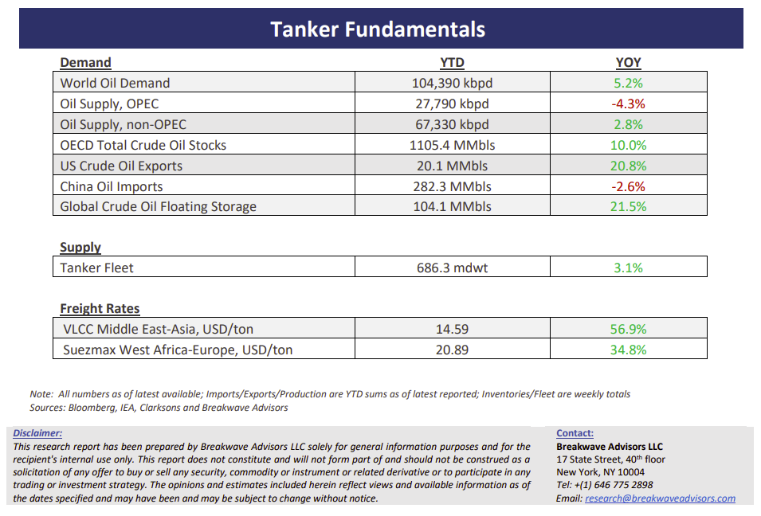

# Breakwave Bi-Weekly Tanker Report - August 22, 2023

**Date:** August 22, 2023  
**Publisher:** Breakwave Advisors | **Category:** Market Insights  
**Original URL:** [https://www.breakwaveadvisors.com/insights/2023/7/11/bi-weekly-tanker-report-august-22-2023-5xs3g](https://www.breakwaveadvisors.com/insights/2023/7/11/bi-weekly-tanker-report-august-22-2023-5xs3g)  

---

> **Figure 1: Tankerreporttop**  
> [Local Asset](file:///C:/Users/Dell/Github/Shipping/corpus/03-breakwave/insights/2023/assets/2023-08-22_bi-weekly-tanker-report-august-22-2023-5xs3g_img_tankerreporttop_e6b9c7543057.png)

**• Summer blues for crude tankers as VLCC spot rates stabilize**– So far, August has been a quiet month for crude tankers, with relatively few deals concluded and limited prospects on the horizon for the VLCC market. We remain in a transitional phase between the remaining late August Middle East cargoes and the upcoming potential rise in the September ones. Breaking it down further, the route from the Middle East to the U.S. Gulf saw a steady decline during the last two weeks, while rates from the Middle East to China have remained fairly stable and resisted further declines. Interestingly, utilization of VLCC routes from the U.S. Gulf and the Middle East to China do not yet appear to have been affected by the recently announced Saudi Arabian oil production cuts and it remains to be seen how VLCC rates will eventually respond, if at all, given the reduced oil export flows. VLCC freight futures for the fourth quarter of the year call for a modest increase in spot rates, although in the last few years volatility has been much higher during periods of strong demand and thus we would expect higher spot rates versus what the futures market is indicating, if indeed demand for crude oil seasonally increases. Oil in transit remains elevated, some 10% above recent levels roughly matching the record high 2020 levels, while oil in storage is also some 20% above last year, both of which represent positives for the market as more tankers remain occupied and less available for spot trading.

**• Oil market balance tightens as we head into the seasonally strong period of the year**– The recent OPEC report painted quite an optimistic picture for oil for the rest of the year. Based on the report, global oil demand is forecasted to increase by a healthy 2.25 million barrels per day in 2024 reaching more than 104 million barrels per day, slightly less than the expansion expected in 2023, but in line with previous forecasts. This optimistic outlook from OPEC coincides with global oil prices reaching their highest level since January. Tight supply has acted as a catalyst for continued price increases, and Saudi Arabia's compliance with voluntary production cuts in July underscores a shared commitment to stabilize the market at a higher price level. China’s economic woes represent an important risk to such an outlook, as the economy remains weak and although consumption for transportation fuels has sharply recovered (as an example, jet fuel demand was up more than 80% in June, while gasoline & diesel was up more than 11% yoy), the risks for a slower than expected economic growth could weight on Chinese oil demand which for now looks like expanding by ~0.6% yoy in 2024.

**• Tanker cycle driven by tight supply, recovering demand**– The tanker market is recovering from a long period of staggered rates as the growth in new vessel supply shrinks while oil demand is recovering in line with the global economy. A historically low orderbook combined with favorable demand fundamentals should continue to support increased spot rate volatility, which combined with the ongoing geopolitical turmoil, should support freight rates in the medium term.

> **Figure 2: Tankerreportchart**  
> [Local Asset](file:///C:/Users/Dell/Github/Shipping/corpus/03-breakwave/insights/2023/assets/2023-08-22_bi-weekly-tanker-report-august-22-2023-5xs3g_img_tankerreportchart_be71a81d69b6.png)

> **Figure 3: Tankerreportbottom**  
> [Local Asset](file:///C:/Users/Dell/Github/Shipping/corpus/03-breakwave/insights/2023/assets/2023-08-22_bi-weekly-tanker-report-august-22-2023-5xs3g_img_tankerreportbottom_a5929eb9cfc5.png)

### Subscribe
