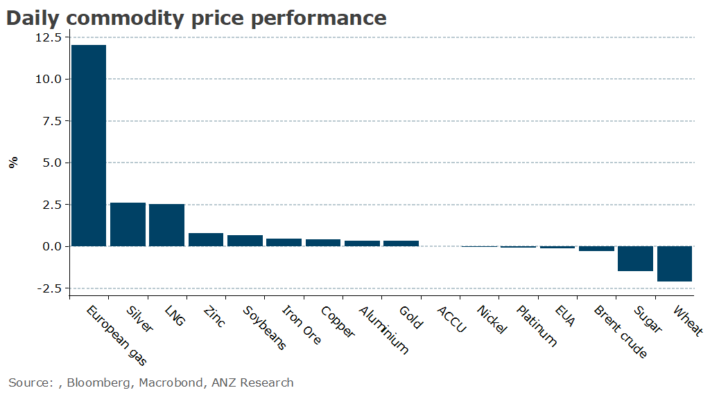

# Gas prices rally as risk of supply disruptions increase

**Date:** August 22, 2023  
**Publisher:** Breakwave Advisors | **Category:** Market Insights  
**Original URL:** [https://www.breakwaveadvisors.com/insights/2023/8/22/gas-prices-rally-as-risk-of-supply-disruptions-increase](https://www.breakwaveadvisors.com/insights/2023/8/22/gas-prices-rally-as-risk-of-supply-disruptions-increase)  

---

*By*[*Daniel Hynes*](https://www.linkedin.com/in/dahynes/)

Commodity markets edged higher after Beijing slightly eased monetary policy to help support economic growth. Energy markets were pushed higher amid rising risks of supply disruptions.

> **Figure 1: 1692655161329 (1)**  
> [Local Asset](file:///C:/Users/Dell/Github/Shipping/corpus/03-breakwave/insights/2023/assets/2023-08-22_gas-prices-rally-as-risk-of-supply-disruptions-increase_img_169265516132928129_25f77c873973.png)

**Gas**across Europe and Asia extended gains as strike action looms in Australia. The Offshore Alliance announced over the weekend that strikes at Woodside’s North West Shelf facility could start as soon as Wednesday this week if no agreement is reached over wages and job security. This comes as workers at Chevron’s Wheatstone and Gorgon offshore platforms are voting on industrial action over similar wage demands. Industrial action must start within 30 days of a completed ballot, and unions must provide seven days’ notice before a strike can begin. This could see disruptions begin in early September. This sent the European benchmark price up 12% to hit a two-month high of EUR40.78/MWh. Despite already reaching its storage capacity target of 90%, Europe is still heavily reliant on the international LNG market to meet demand over the coming heating season. North Asian LNG also jumped higher, with the Japan Korea Marker pushing above USD14/MMBtu. Any disruption lasting more than a month is likely to have a material impact on the supply-demand balance over the northern winter. More significantly, it could[ignite a bidding war between Europe and Asia](../pdfs/2023-08-22_gas-prices-rally-as-risk-of-supply-disruptions-increase_commodity-call-striking-fear-into-ga_5c5de6cb99c5.pdf).

**Crude oil**struggled to keep its head above water on signs of supply tightness easing. Iraq’s oil minister, Hayyan Abdul Ghani, is reported to be planning the resumption of oil exports through the Ceyhan terminal. Output has been curtailed by a dispute over payments between Iraq and Turkey over the past few months. Prior to this, it was exporting around 500kb/d. This was exacerbated by data showing exports from Iran surged to 2.2mb/d this month, according to data from TankerTracker.com. This is around levels seen prior to the US pulling out of the 2015 Iran nuclear deal and re-imposing sanctions on its oil industry. The rise in output may dull the impact of the cut in output from OPEC+ alliance.

**Gold**erased earlier gains as the market frets about the US Federal Reserve’s next move on interest rates. Central bankers are gathering in Jackson Hole this week for the annual symposium, where Chair Jerome Powell is expected to strike a more balanced tone. However, recent strong economic data could see the Fed tighten monetary policy further.

**Iron ore**futures were under pressure early in the session after Beijing offered only tepid support for the economy. Chinese banks made a smaller-than-expected cut to their benchmark lending rate on Monday and avoided trimming the reference rate for mortgages. This comes ahead of the key construction period, where activity typically accelerates in September and October.**Copper**managed to finish the session higher despite a lack of further stimulus measures. Prices remain well supported amid signs of tightness in the physical market.

Data source:[Commodities Wrap](https://www.linkedin.com/newsletters/commodities-wrap-6692196755876012032/?fbclid=IwAR3kiXJqZdxmp9ZcRwBNI7FsBySI-XSC0pfPur1qzjt7OZp7PTE59Tsl1QI)
