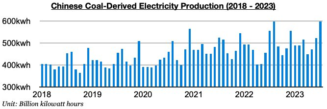
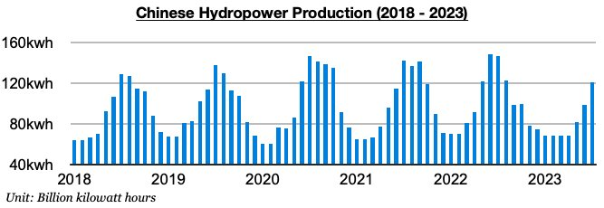

# Divergence in China's Coal-Derived Electricity Generation and Hydropower Generation Continues

**Date:** August 24, 2023  
**Publisher:** Breakwave Advisors | **Category:** Market Insights  
**Original URL:** [https://www.breakwaveadvisors.com/insights/2023/8/23/divergence-in-chinas-coal-derived-electricity-generation-and-hydropower-generation-continues](https://www.breakwaveadvisors.com/insights/2023/8/23/divergence-in-chinas-coal-derived-electricity-generation-and-hydropower-generation-continues)  

---

*By*[*Jeffrey Landsberg*](https://www.linkedin.com/in/jeffrey-landsberg-70ab957/)

Thermal coal-derived electricity generation continues to make up the bulk of China's electricity production and totaled a record 599.7 billion kilowatt hours last month. This has marked a month-on-month increase of 76.9 billion kilowatt hours (15%) and is up year-on-year by 43.7 billion kilowatt hours (8%). China's thermal coal-derived electricity generation growth has now exceeded coal production growth for five straight months. Previously, coal production growth had exceeded coal-derived electricity generation growth during fourteen of the prior sixteen months.

> **Figure 1: Chart 1 (75)**  
> [Local Asset](file:///C:/Users/Dell/Github/Shipping/corpus/03-breakwave/insights/2023/assets/2023-08-24_divergence-in-chinas-coal-derived-electricity-generation-and-hydropower-generati_img_chart1287529_69ede293f74f.jpg)

China's hydropower generation totaled 121.1 billion kilowatt hours last month. This has marked a month-on-month increase of 22.9 billion kilowatt hours (23%) but is down year-on-year by 25.2 billion kilowatt hours (-17%). Chin'a's hydropower generation has now contracted on a year-on-year basis for seven straight months. Overall, the divergence in thermal coal-derived electricity generation and hydropower generation remains supportive for Chinese coal imports prospects and the dry bulk market. China is continuing to consume a record amount of thermal coal, and there are still no signs that China's robust appetite for thermal coal is set to suddenly reverse.

> **Figure 2: Chart 2 (64)**  
> [Local Asset](file:///C:/Users/Dell/Github/Shipping/corpus/03-breakwave/insights/2023/assets/2023-08-24_divergence-in-chinas-coal-derived-electricity-generation-and-hydropower-generati_img_chart2286429_d55232e8eab1.jpg)
