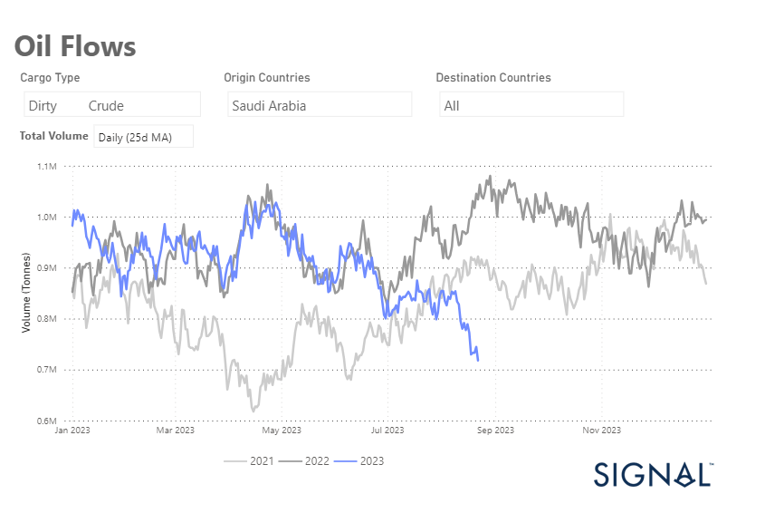
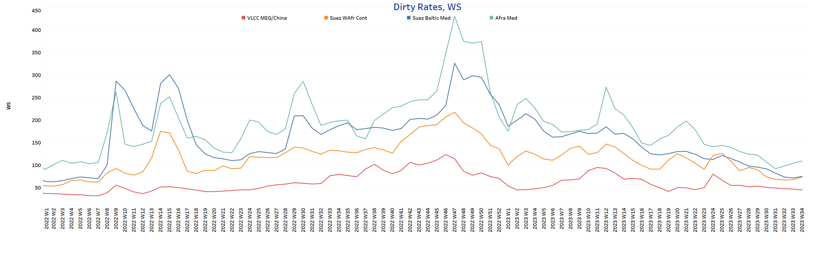
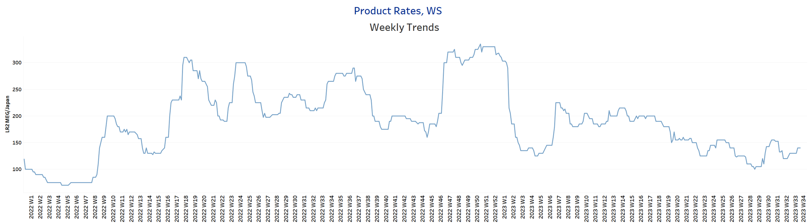
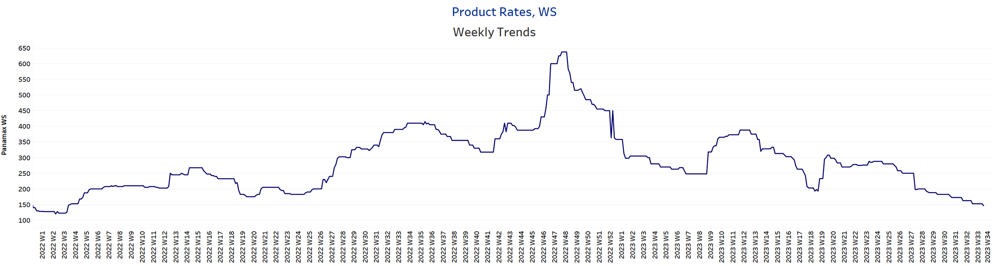
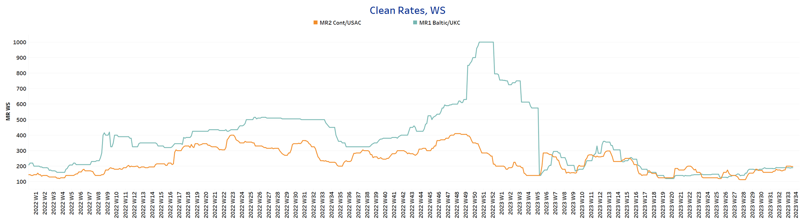
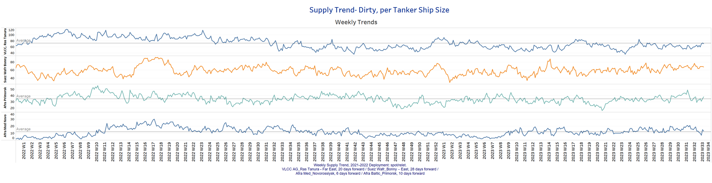
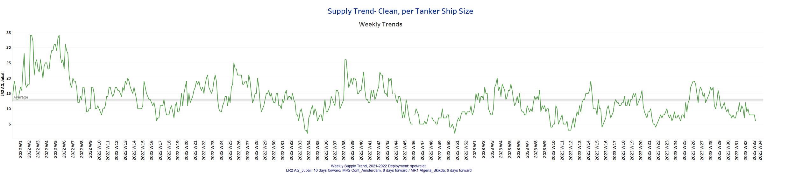
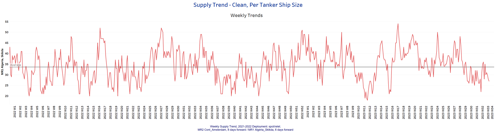
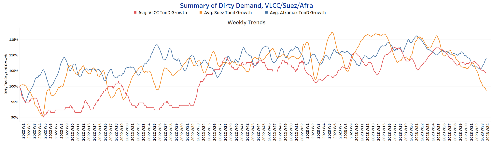
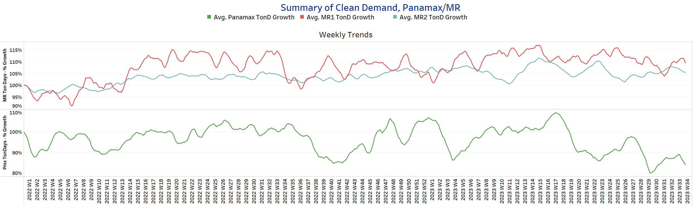

# Signal Tanker Weekly Report

**Date:** August 25, 2023  
**Publisher:** Breakwave Advisors | **Category:** Market Insights  
**Original URL:** [https://www.breakwaveadvisors.com/insights/2023/8/24/signal-tanker-weekly-report](https://www.breakwaveadvisors.com/insights/2023/8/24/signal-tanker-weekly-report)  

---

## Chart of the Week: Saudi Arabian Crude Oil Flows

*Saudi Arabia's crude oil exports to all destinations are heading for significantly lower volumes in the summer*

> **Figure 1: Market Chart 1**  
> **Interactive Data & Source:** [Signal Ocean Platform](https://go.signalocean.com/e/983831/tanker-dynamic-oilflows/2p9jlc/341164669?h=SY3B2ImMmGC7IfAMpgojWsi7gntXcRxIBYW7NNR4MKM) | [Local Asset](file:///C:/Users/Dell/Github/Shipping/corpus/03-breakwave/insights/2023/assets/2023-08-25_signal-tanker-weekly-report_img_unnamed-2023-08-24t234809808_9e164383c261.png)

Data Source:[Signal Ocean Platform](https://go.signalocean.com/e/983831/tanker-dynamic-oilflows/2p9jlc/341164669?h=SY3B2ImMmGC7IfAMpgojWsi7gntXcRxIBYW7NNR4MKM)

In the third week of August, downward pressure continues on the VLCC MEG route to China, while Saudi Arabia's crude oil exports to all destinations are expected to decline significantly over the summer compared to the previous two years. As shown in the chart above, Saudi Arabia's crude oil exports fell in July and August to the lowest level in a similar period in the last two years. The decline follows Saudi Arabia's announcement in early August that it would extend its voluntary cut in oil production by one million barrels per day for another month.

The energy market saw a 1% drop in oil prices on Wednesday. The downward movement was triggered by fears of lower demand due to a significant increase in gasoline inventories in the U.S., combined with sluggish production data at the global level.
These factors managed to outweigh the initial enthusiasm triggered by a surprisingly significant reduction in U.S. crude oil reserves. According to Reuters, the price of Brent crude oil fell 82 cents, or 0.98%, to close at $83.21 per barrel. Earlier, the price had fallen by a considerable 2.5%. U.S. West Texas Intermediate crude oil also fell 75 cents, or 0.9%, to close at $78.89. The low for this type of crude oil was even more pronounced at 3.4%.

For more information on this week's trends, see the analysis sections below:

Freight Market, Supply and Demand

## Section 1/ Freightmarket Rates (WS)

> **Figure 2: ‘Dirty’ WS​​​​ VLCC - Suezmax - Aframax Mixed**  
> **Interactive Data & Source:** [Signal Ocean Platform](https://www.thesignalgroup.com/signal-ocean-platform) | [Local Asset](file:///C:/Users/Dell/Github/Shipping/corpus/03-breakwave/insights/2023/assets/2023-08-25_signal-tanker-weekly-report_img_unnamed-2023-08-24t235111527_9db4472d3d9e.png)

Downward pressure on VLCC MEG -China rates continued in the third week of August, while Suzemax and Aframax segments experienced a gradual upswing.

- **VLCC MEG-China f**reight rates fell to levels around WS45, and remained below the 50 mark for four consecutive weeks.
- **Suezmax**freight rates for shipments from**West Africa**to continental Europe rose above WS70, a level almost similar to four weeks ago, and it remains to be seen whether similar firmness will follow in the coming days of August. On the Suez-Baltic-Med route, rates also hovered around 70WS, but were still weaker than the WS90 recorded in week 30.
- **Aframax**Med freight rates rates rose above 100WS, 17 points higher than the previous week.

> **Figure 3: ‘Product’ Wslr Firmer**  
> **Interactive Data & Source:** [Signal Ocean Platform](https://www.thesignalgroup.com/signal-ocean-platform) | [Local Asset](file:///C:/Users/Dell/Github/Shipping/corpus/03-breakwave/insights/2023/assets/2023-08-25_signal-tanker-weekly-report_img_unnamed-2023-08-24t235148900_e2d5c846016a.png)

- LR2 AG freight rates fell to WS95 this week, down 25 points from early last week, with signs of weaker momentum in the coming days of August.

> **Figure 4: PANAMAX (Sentiment: Weaker)**  
> **Interactive Data & Source:** [Signal Ocean Platform](https://www.thesignalgroup.com/signal-ocean-platform) | [Local Asset](file:///C:/Users/Dell/Github/Shipping/corpus/03-breakwave/insights/2023/assets/2023-08-25_signal-tanker-weekly-report_img_unnamed-2023-08-24t235433632_7ba0a09a280d.png)

- **Panamax**Carib-to-USG rates fell below WS150, with a steady decline over the last seven weeks.

> **Figure 5: ‘Clean’mr1 Steady - MR2 Firmer**  
> **Interactive Data & Source:** [Signal Ocean Platform](https://www.thesignalgroup.com/signal-ocean-platform) | [Local Asset](file:///C:/Users/Dell/Github/Shipping/corpus/03-breakwave/insights/2023/assets/2023-08-25_signal-tanker-weekly-report_img_unnamed-2023-08-24t235658791_2df93df718a4.png)

- **MR1**rates for the**Baltic**continent have shown steady momentum since last week at levels around WS190 in mid-week, though it remains to be seen if firmer momentum develops towards the end of the month.

- **MR2**rates for shipments from the continent to the U.S. rose to WS198, up nearly 38 points from three weeks ago.

## Section 2/ Supplysupply Trend Lines for Key Load Areas

> **Figure 6: Dirty (#Vessels) - Mixed**  
> **Interactive Data & Source:** [Signal Ocean Platform](https://www.thesignalgroup.com/signal-ocean-platform) | [Local Asset](file:///C:/Users/Dell/Github/Shipping/corpus/03-breakwave/insights/2023/assets/2023-08-25_signal-tanker-weekly-report_img_unnamed-2023-08-24t235837412_40d6043d03cc.png)

Crude oil tanker supply presented a mixed picture in August with some signs of a downward trend, but upward pressure is back in the VLCC segment with numbers nearly exceeding the annual average.

- **VLCC Ras Tanura**: The current count is 71 ships, almost on par with the average for the year, with signs of an upward trend in the remaining days of August.
- **​Suezmax Wafr**: The current count of 68 vessels is 10 lower than at the beginning of last week, and volatility is high with no clear signs of upward or downward movement.
- **Aframax Primorsk**: The current ship count has now risen to 38 ships, while the trend now exceeds the year-end average of 35 ships.
- **Aframax Med Novo:**The number of ships is now at an annual average of 12, although it remains to be seen if there will be a drop in the last week of the month as the overall trend for this year is around the annual number.

> **Figure 7: ’Clean’lr2 (#Vessels) - Decreasing**  
> **Interactive Data & Source:** [Signal Ocean Platform](https://www.thesignalgroup.com/signal-ocean-platform) | [Local Asset](file:///C:/Users/Dell/Github/Shipping/corpus/03-breakwave/insights/2023/assets/2023-08-25_signal-tanker-weekly-report_img_unnamed-2023-08-25t000104894_0f76809a4884.png)

> **Figure 8: MR1 (#Vessels) - Decreasing**  
> **Interactive Data & Source:** [Signal Ocean Platform](https://www.thesignalgroup.com/signal-ocean-platform) | [Local Asset](file:///C:/Users/Dell/Github/Shipping/corpus/03-breakwave/insights/2023/assets/2023-08-25_signal-tanker-weekly-report_img_unnamed-2023-08-25t000237595_844fc647995d.png)

- **Clean LR2 AG Jubail:**The current number of ships is currently 6, which is 6 less than the average for the year and 70% less than the peak eight weeks ago.

- **Clean MR1 Algeria Skikda:**The current ship count is now 27 ships, which is 47% below the last peak in week 29 and below the average for the year since the end of the previous week.

## Section 3/ Demandsummary of Tanker Demand per Ship Size & Segment

> **Figure 9: ​​‘Dirty’tonne Days Mixed**  
> **Interactive Data & Source:** [Signal Ocean Platform](https://www.thesignalgroup.com/signal-ocean-platform) | [Local Asset](file:///C:/Users/Dell/Github/Shipping/corpus/03-breakwave/insights/2023/assets/2023-08-25_signal-tanker-weekly-report_img_unnamed-2023-08-25t000524297_8e533f84dbd7.png)

- **Dirty tonne days:**In the second half of August, the percentage increase in demand (tonnage days) in the Suezmax and VLCC segments continuously declined sharply, while an upward trend was gradually observed in the Aframax segment.

> **Figure 10: ‘Clean’tonne Days Panamax Decreasing / MR Mixed**  
> **Interactive Data & Source:** [Signal Ocean Platform](https://www.thesignalgroup.com/signal-ocean-platform) | [Local Asset](file:///C:/Users/Dell/Github/Shipping/corpus/03-breakwave/insights/2023/assets/2023-08-25_signal-tanker-weekly-report_img_unnamed-2023-08-25t000655549_06f277f331bc.png)

- **Panamax**tonne days: While there was an upward trend in the previous days of August, there was a downward trend in the third week, with the last high recorded seven weeks ago.

- **Clean**MR tonne days: In the last days of August, the picture is mixed, with an upward trend in MR1 and a downward trend in MR2.

Data Source:[Signal Ocean Platform](https://www.thesignalgroup.com/signal-ocean-platform)
