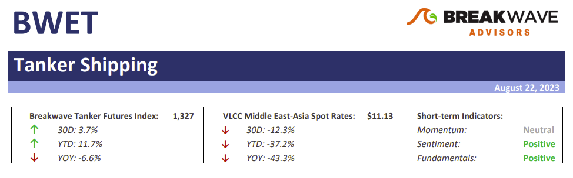

# Weekly Insights Review

**Date:** August 26, 2023  
**Publisher:** Breakwave Advisors | **Category:** Market Insights  
**Original URL:** [https://www.breakwaveadvisors.com/insights/2023/8/26/weekly-insights-review](https://www.breakwaveadvisors.com/insights/2023/8/26/weekly-insights-review)  

---

## Welcome to Our Weekly Insights Review

## Read Here Everything You Need to Know

## Breakwave Bi-Weekly Tanker Report

• Summer blues for crude tankers as VLCC spot rates stabilize– So far, August has been a quiet month for crude tankers, with relatively few deals concluded and limited prospects on the horizon for the VLCC market.
[Read More](https://www.breakwaveadvisors.com/insights/2023/7/11/bi-weekly-tanker-report-august-22-2023-5xs3g)

> **Figure 1: Tanker+report+top (3)**  
> **Interactive Data & Source:** [Breakwave Advisors Market Insights](https://www.breakwaveadvisors.com/insights/2023/8/21/end-of-an-era) | [Local Asset](file:///C:/Users/Dell/Github/Shipping/corpus/03-breakwave/insights/2023/assets/2023-08-26_weekly-insights-review_img_tanker2breport2btop28329_e6b9c7543057.png)

## End of an Era

## Gibson Tanker Market Report

For product tankers, much of the past decade’s investment was focused on changing dynamics in the global refining scene. In short, the story of expanding capacity in the East, primarily driven by Middle East export refineries, and capacity rationalisation in the West supported the case for strong tonne mile demand growth.
[Read More](https://www.breakwaveadvisors.com/insights/2023/8/21/end-of-an-era)

> **Figure 2: Market Chart 2**  
> **Interactive Data & Source:** [Breakwave Advisors Market Insights](https://www.breakwaveadvisors.com/insights/2023/8/21/china-continues-to-consume-large-amount-of-thermal-coal-and-iron-ore) | [Local Asset](file:///C:/Users/Dell/Github/Shipping/corpus/03-breakwave/insights/2023/assets/2023-08-26_weekly-insights-review_img_image-asset281929_89986ca5a0be.jpeg)

## China Continues to Consume Large Amount of Thermal Coal and Iron Ore

## Increase From Late July

The most recently released data shows that daily crude steel output at large and medium-sized mills in China averaged 2.15 million tons during August 1 - 10. This marks a 0.5% increase from late July and is up year-on-year by 11%.

> **Figure 3: Market Chart 3**  
> **Interactive Data & Source:** [Breakwave Advisors Market Insights](https://www.breakwaveadvisors.com/insights/2023/8/21/china-continues-to-consume-large-amount-of-thermal-coal-and-iron-ore) | [Local Asset](file:///C:/Users/Dell/Github/Shipping/corpus/03-breakwave/insights/2023/assets/2023-08-26_weekly-insights-review_img_unnamed283929_ca380fe022c4.jpg)

## China Continues to Consume Large Amount of Thermal Coal and Iron Ore

## Increase From Late July

The most recently released data shows that daily crude steel output at large and medium-sized mills in China averaged 2.15 million tons during August 1 - 10. This marks a 0.5% increase from late July and is up year-on-year by 11%.

> **Figure 4: Market Chart 4**  
> **Interactive Data & Source:** [Breakwave Advisors Market Insights](https://www.breakwaveadvisors.com/insights/2023/8/22/gas-prices-rally-as-risk-of-supply-disruptions-increase) | [Local Asset](file:///C:/Users/Dell/Github/Shipping/corpus/03-breakwave/insights/2023/assets/2023-08-26_weekly-insights-review_img_unnamed284029_964efd0ebc4e.jpg)

## Gas Prices Rally As Risk of Supply Disruptions Increase

## Beijing Offered Only Tepid Support for the Economy

Commodity markets edged higher after Beijing slightly eased monetary policy to help support economic growth. Energy markets were pushed higher amid rising risks of supply disruptions.
[Read More](https://www.breakwaveadvisors.com/insights/2023/8/22/gas-prices-rally-as-risk-of-supply-disruptions-increase)

## Divergence in China's Coal-Derived Electricity Generation and Hydropower Generation Continues

Thermal coal-derived electricity generation continues to make up the bulk of China's electricity production
[Read More](https://www.breakwaveadvisors.com/insights/2023/8/23/divergence-in-chinas-coal-derived-electricity-generation-and-hydropower-generation-continues)

> **Figure 5: Third Week of August Began with More Robust Sentiment**  
> *The third week of August began with more robust sentiment, which countered fears about a possible downward trend in the Capesize segment.Read More*  
> **Interactive Data & Source:** [Breakwave Advisors Market Insights](https://www.breakwaveadvisors.com/insights/2023/8/23/signal-dry-bulk-weekly-report) | [Local Asset](file:///C:/Users/Dell/Github/Shipping/corpus/03-breakwave/insights/2023/assets/2023-08-26_weekly-insights-review_img_unnamed284129_863a02ee88ea.jpg)

## Signal Dry Bulk Weekly Report

## Snapshot of Spot Freight Rates, Supply-Demand Trends, Port Congestions

> **Figure 6: Market Chart 6**  
> **Interactive Data & Source:** [Breakwave Advisors Market Insights](https://www.breakwaveadvisors.com/insights/2023/8/24/signal-tanker-weekly-report) | [Local Asset](file:///C:/Users/Dell/Github/Shipping/corpus/03-breakwave/insights/2023/assets/2023-08-26_weekly-insights-review_img_unnamed284229_07ec2ee284ad.jpg)

## Signal Tanker Weekly Report

## Snapshot of Crude and Product Freight Rates, Supply-Demand

In the third week of August, downward pressure continues on the VLCC MEG route to China, while Saudi Arabia's crude oil exports to all destinations are expected to decline significantly over the summer compared to the previous two years.
[Read More](https://www.breakwaveadvisors.com/insights/2023/8/24/signal-tanker-weekly-report)

> **Figure 7: Market Chart 7**  
> [Local Asset](file:///C:/Users/Dell/Github/Shipping/corpus/03-breakwave/insights/2023/assets/2023-08-26_weekly-insights-review_img_unnamed284329_727e7c0b0be2.jpg)
