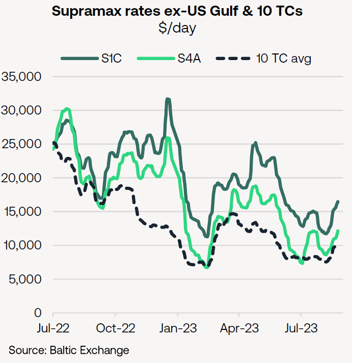
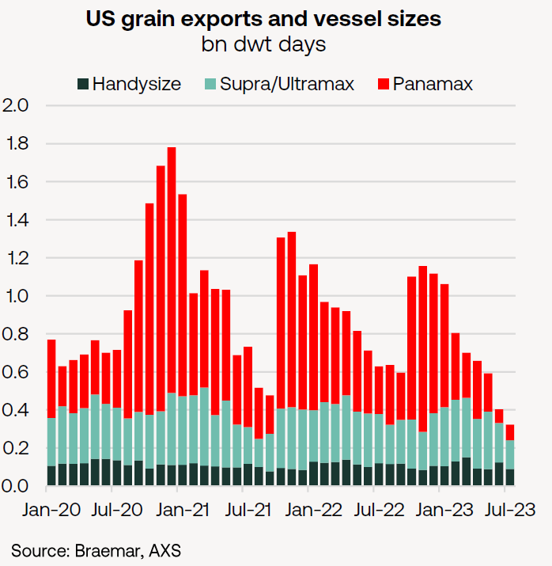
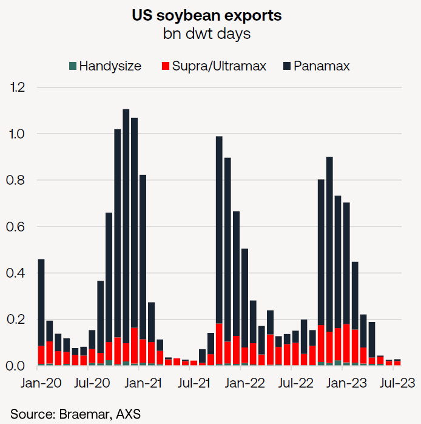
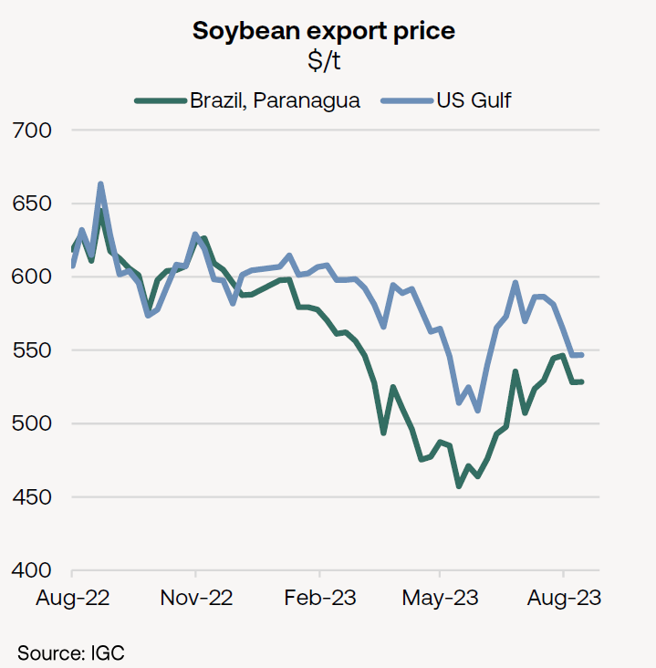

# The Big Picture: US grain effect

**Date:** August 28, 2023  
**Publisher:** Breakwave Advisors | **Category:** Market Insights  
**Original URL:** [https://www.breakwaveadvisors.com/insights/2023/8/28/braemar-weekly-dry-market-report](https://www.breakwaveadvisors.com/insights/2023/8/28/braemar-weekly-dry-market-report)  

---



## The Big Picture: Us Grain Effect

- US grain trades have been less prominent this year, mainly to the detriment of Panamaxes, but also negative for geared sectors.
- US soybean-related enquiry now emerging.
- With a view to the Q4, it looks likely that the main US soybean export season will benefit Panamax demand in particular.

**With the Supramax 10 TC average having briefly crept above $10,000/day this week and increased grain-related Panamax enquiry emerging in the Atlantic, the main US soybean export season has attracted our attention.**

The fronthaul S1C route (US Gulf to Shanghai-Tokyo range) has climbed to its highest point since early June (of $16,471/day) after a $4,400/day gain in the last two weeks, accompanied by upward movement from S4A (US Gulf to Cont/Med).

> **Figure 1: Market Chart 1**  
> [Local Asset](file:///C:/Users/Dell/Github/Shipping/corpus/03-breakwave/insights/2023/assets/2023-08-28_braemar-weekly-dry-market-report_img_image0281229_660c3bd97c69.png)

The second chart, right, outlines the effect of US grain trades on vessel demand and is expressed in dwt days.

The picture is one of enormous fluctuations.

In 2020/21 (Sep-Aug) surging US soybean exports of 61.7m tonnes helped to propel ship demand higher during the second half of 2020 alongside some 68.3m tonnes of outbound corn shipments.

The following trade year (2021/22) brought still-robust exports of corn and soybeans/meal from the US, but the country’s grain trades have been less prominent this year.

In Q2 combined exports of corn, soybeans/meal and wheat slipped below 27m tonnes, compared with 36.0m tonnes in the same quarter last year. With Q1 witnessing a yearly drop of almost 5m tonnes, US grain exports fell in the first half of 2023 by almost 14m tonnes YoY, according to official data collected by the International Grains Council (IGC).

The underperformance owes largely to a retreat in corn exports, which dropped from close to 40m tonnes in January-June 2022 to 26.4m tonnes in the 1H 2023. This was part of a 20m tonne annual retreat in corn exports in 2022/23, data from the US Department of Agriculture (USDA) show.

Whereas volumes carried in Handysize, Supramax and Ultramax tonnage in 2023 have been broadly comparable with year-ago levels, the Panamax component has dropped more noticeably and faced a particularly acute squeeze in June and July.

> **Figure 2: Market Chart 2**  
> [Local Asset](file:///C:/Users/Dell/Github/Shipping/corpus/03-breakwave/insights/2023/assets/2023-08-28_braemar-weekly-dry-market-report_img_image1281229_8457435c9780.png)

Therefore, with a view to the Q4, it looks likely that the main US soybean export season is set to benefit Panamax demand in particular, given the preponderance of that fleet sector in those trades (see below), but also a positive for smaller sizes.

> **Figure 3: Market Chart 3**  
> [Local Asset](file:///C:/Users/Dell/Github/Shipping/corpus/03-breakwave/insights/2023/assets/2023-08-28_braemar-weekly-dry-market-report_img_image2281129_551be97982cf.png)

US suppliers have faced intensified competition in recent years from Brazil thanks to higher soybean production and improved access to export facilities (especially in the north of the country).

Another massive crop from Brazil this year helped push the FOB price of beans at Paranagua below $500/t during Q2 even establishing a discount of as much as $100/t to the US Gulf equivalent at one point in April, judging by IGC price assessments. By mid-August, however, the spread had narrowed to less than $20/t.

In its 17 August report, the IGC commented that US commitments for soybean delivery in the year to August 2024 were running more than 40% behind last year’s pace and that sales to Mexico were ahead of the year-ago pace.

In the IGC’s view, this reflects less demand from Asia due to “heavy” purchases from Brazil.

> **Figure 4: Market Chart 4**  
> [Local Asset](file:///C:/Users/Dell/Github/Shipping/corpus/03-breakwave/insights/2023/assets/2023-08-28_braemar-weekly-dry-market-report_img_image3281029_45a002027b5b.png)

A seasonal shift to the US is still expected, but with a yearly contraction of -6% in export volumes, the IGC projects.
