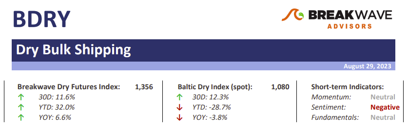
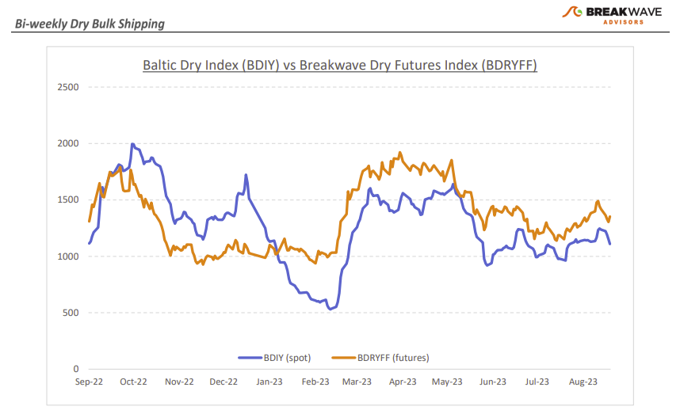
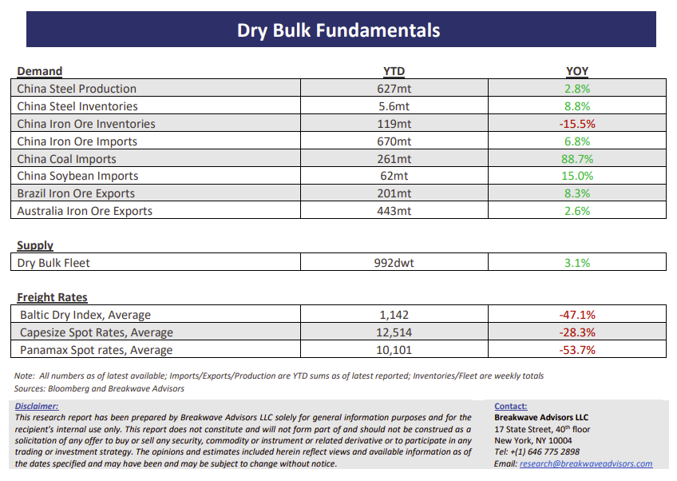

# Breakwave Bi-Weekly Dry Bulk Report - August 29, 2023

**Date:** August 29, 2023  
**Publisher:** Breakwave Advisors | **Category:** Market Insights  
**Original URL:** [https://www.breakwaveadvisors.com/insights/2023/8/29/breakwave-bi-weekly-dry-report-7x7sebulk](https://www.breakwaveadvisors.com/insights/2023/8/29/breakwave-bi-weekly-dry-report-7x7sebulk)  

---

> **Figure 1: Dbreporttop**  
> [Local Asset](file:///C:/Users/Dell/Github/Shipping/corpus/03-breakwave/insights/2023/assets/2023-08-29_breakwave-bi-weekly-dry-report-7x7sebulk_img_dbreporttop_2daf1a016f2e.png)

**• A muted, rangebound market continues as fleet inefficiencies hit record lows**– The dry bulk market seems to operate in a very streamlined and efficient manner, with effective supply now even higher than in the pre-Covid years. Although the present situation is limiting the ability of freight rates to move higher, looking forward, the stage is set for a tightening in such effective supply once weather issues appear and as the winter months approach. However, despite the well-supplied market, spot rates remain relatively elevated versus previous instances when charterers had managed to push rates for Capesize ships in the low single digit levels. We remain of the opinion that the oversupply of the previous decade is behind us, and we are now faced with a more balanced dry bulk market where any potential tightness in supply can cause utilization to spike and lead to a fast-moving spot market that can get to high levels in matter of days. For now, though, we have to wait for some West African bauxite demand to return after the slow summer months and start pulling some vessels, in the process tightening the Atlantic market and thus providing the fuel for a potential fourth quarter rally in Capesize rates. In addition, the fact that Panamax rates have seen a very strong recovery from their early August lows is noteworthy, especially given the historically slow months for these types of ships, which should also aid the larger segments down the road.

**• No good solutions for China’s economic woes**– After decades of booming economic growth fueled by infrastructure spending and real estate construction, China is faced with its biggest economic challenge yet. Activity has clearly slowed well below the government’s comfort zone, and there are limited realistic answers. The Chinese government has so far steered clear of a major stimulus program, mainly focusing on small, targeted adjustments in policy as it relates to mortgages, relaxation in housing-related rules, and interest rate cuts. However, such measures have so far fallen short of restoring confidence among investors and consumers alike. On the other hand, any potential major stimulus program will inevitably bring more pain in the long term even if it initially boosts economic activity. There are no good solutions to deal with years of inefficient economic growth, and investors are slowly realizing that, as evident by the performance of Chinese-related assets. We believe that the government will at the end act with a bigger stimulus, but smaller in size versus past. If that happens, commodities will initially benefit, but longer-term, demand growth coming from China has to inevitably slow down to the low-single digits, although on absolute terms, China will still continue to represent the biggest demand growth driver globally.

**• Dry bulk focus shifts back to fundamentals**– Following a period of high uncertainty and significant disruptions across the commodity spectrum, the gradual normalization of trade is shifting the market’s attention back to the traditional demand and supply dynamics that have shaped dry bulk profitability for decades. As effective fleet supply growth for the next few years looks marginal, demand will be the main determinant of spot freight rates with China returning back to the driver’s seat as the dominant force of bulk imports and thus shipping demand.

> **Figure 2: Dbreportchart**  
> [Local Asset](file:///C:/Users/Dell/Github/Shipping/corpus/03-breakwave/insights/2023/assets/2023-08-29_breakwave-bi-weekly-dry-report-7x7sebulk_img_dbreportchart_62b63df59bef.png)

> **Figure 3: Dbreportbottom**  
> [Local Asset](file:///C:/Users/Dell/Github/Shipping/corpus/03-breakwave/insights/2023/assets/2023-08-29_breakwave-bi-weekly-dry-report-7x7sebulk_img_dbreportbottom_00eb5bdf6f81.png)

### Subscribe:
