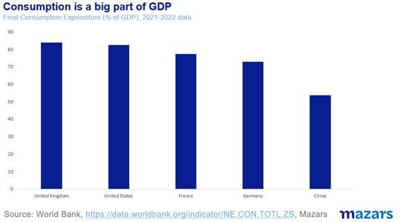
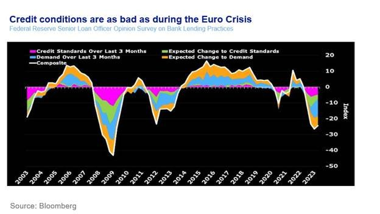
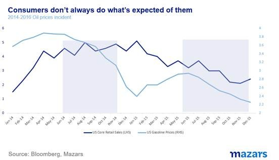

# Irrational consumption can only last so long

**Date:** August 29, 2023  
**Publisher:** Breakwave Advisors | **Category:** Market Insights  
**Original URL:** [https://www.breakwaveadvisors.com/insights/2023/8/29/irrational-consumption-can-only-last-so-long](https://www.breakwaveadvisors.com/insights/2023/8/29/irrational-consumption-can-only-last-so-long)  

---

*By*[*George Lagarias*](https://www.linkedin.com/in/george-lagarias-mba-3baa769/)

*The three things I would tell my investors this week*

- *Jerome Powell’s speech at Jackson Hole had a little in it for everyone. Some hawkish talk about raising interest rates if consumption continues to be strong and some dovish talk about the labour market. As far as markets are concerned, the central banking main “event of the year” had all the excitement of a corporate away day.*
- *Presently, Americans are still flush with cash after the pandemic checks. We can’t predict growth in a volatile economic environment, because we can’t predict consumption. When the whole economy is unbalanced and volatile,*[*our key theme from the beginning of the year*](https://www.mazars.co.uk/Home/Services/Financial-Planning/Latest-economic-market-and-investment-news/Quarterly-investment-outlook-Q1-2023)*, then this uncertainty translates into policy uncertainty.*
- *What does this all mean for investors?*

*The concentrated efforts of central banks to curb consumption usually work. We haven’t bet against the Fed yet and we don’t intend to. And in this case, when consumption recedes, bad news for the economy will, all other things being equal, be good news for markets, who will finally see the cost of money recede.*

The world’s eyes were set on the Fed’s annual symposium last week. Thousands of analysts stood at the ready to dissect even the tiniest morsel of new information. Consumption is stronger than expected, so Mr Powell’s cohort is set on keeping rates tight until either the economy or inflation recedes.

And yet, the trajectory of interest rates is still anyone’s guess.

Jerome Powell’s speech at Jackson Hole had a little in it for everyone. Some hawkish talk about raising interest rates if consumption continues to be strong and some dovish talk about the labour market. As such, there was nothing of note. No conviction, as fund managers would say.

As far as markets are concerned, the central banking main “event of the year” had all the excitement of a corporate away day.

So let’s talk a little bit about economic strength and consumption, as they affect interest rates, the velocity of money and thus financial markets, at least now.

GDP, the standard measure of growth is a fairly simple calculation. Its roots date back to the 17th century, when a certain William Petty, a British philosopher-turned-soldier-of-fortune-turned-landlord in Ireland, wanted to prove that land owners shouldn’t be paying all the taxes as there were other sources of wealth that could also be taxed.

The standard formula is Government Expenditure + Investment + Consumption + Exports – Imports.

One can ascertain government expenditure as the powers that be are usually on a budget. Investment also follows seasonal trends, as do exports and imports. But the problem, what makes GDP so unpredictable, is consumption. Not only is[consumption a psychological process](https://hbr.org/2002/09/pricing-and-the-psychology-of-consumption), it is also by far the biggest component of GDP. In the Western world, it accounts for 70%-85% of GDP.

> **Figure 1: Market Chart 1**  
> **Interactive Data & Source:** [Mazars Co](https://www.mazars.co.uk/Home/Services/Financial-Planning/Latest-economic-market-and-investment-news/Quarterly-investment-outlook-Q1-2023) | [Local Asset](file:///C:/Users/Dell/Github/Shipping/corpus/03-breakwave/insights/2023/assets/2023-08-29_irrational-consumption-can-only-last-so-long_img_image00428629_2c9f4f0b1cf9.jpg)

Presently, credit conditions for consumers are as bad as they have been since the Euro Crisis.

> **Figure 2: Market Chart 2**  
> **Interactive Data & Source:** [Mazars Co](https://www.mazars.co.uk/Home/Services/Financial-Planning/Latest-economic-market-and-investment-news/Quarterly-investment-outlook-Q1-2023) | [Local Asset](file:///C:/Users/Dell/Github/Shipping/corpus/03-breakwave/insights/2023/assets/2023-08-29_irrational-consumption-can-only-last-so-long_img_image00528829_0e7638479073.jpg)

Yet, according to the Fed, consumption has been much stronger than anticipated. So why is the economy strong?

Back in 2014, when the US was pumping a lot of shale gas and gaining market share, OPEC decided to plunge oil prices from $107 per barrel to $44, in an attempt to shut shale fields down.

As a result, Gasoline prices also plunged, from over $5 per gallon to $2. The US is a heavily driving culture. 2.4% of household expenditure goes to gasoline. Less money for gasoline means more money for other purchases. The assumption was that a heavy drop in gasoline prices would lead to a pickup in consumption. In reality, the needle barely moved. The collapse in gasoline prices led to only a modest pick in core consumption (5% up from 4%). In late 2015, consumption fell alongside gasoline prices.

> **Figure 3: Market Chart 3**  
> **Interactive Data & Source:** [Mazars Co](https://www.mazars.co.uk/Home/Services/Financial-Planning/Latest-economic-market-and-investment-news/Quarterly-investment-outlook-Q1-2023) | [Local Asset](file:///C:/Users/Dell/Github/Shipping/corpus/03-breakwave/insights/2023/assets/2023-08-29_irrational-consumption-can-only-last-so-long_img_image006281329_f4f5cb7b1588.jpg)

Presently, Americans are still flush with cash after the pandemic checks. Credit card delinquencies might be going upwards, but at 0.5% for 90+ days they are still at half their historical average.

If consumers have money, they will spend it. And if they have become accustomed to higher levels of spending, then it will take a serious event, a personal default and such, to adapt one’s way of living on the downside. This means that even when they don’t have money, they might still spend it.

The point is that we can’t predict growth in a volatile economic environment, because we can’t predict consumption. When the whole economy is unbalanced and volatile,[our key theme from the beginning of the year](https://www.mazars.co.uk/Home/Services/Financial-Planning/Latest-economic-market-and-investment-news/Quarterly-investment-outlook-Q1-2023), then this uncertainty translates into policy uncertainty. Add to the mix commodity uncertainty because of rising oil prices and the ongoing war in Ukraine, and one can understand why the Fed is so reticent to be more specific about the future.

It was well-known anyway for some time that central banks wanted to move away from the forward guidance that became the norm after the 2008 Global Financial Crisis. Central bankers felt that it was too restrictive, and markets could handle a surprise or two. Macroeconomic volatility lets them do just that.

What does this all mean for investors?

For one, it means more volatility to be sure. At the beginning of the year, the first rate cut was forecasted for January 2024. After the March Banking Crisis, the goalpost moved forward to September 2023. Presently, the market forecast is for mid 2024. We expect markets will miss the mark again.

Second, it means that bond yields will remain elevated for a bit longer. This also means that the big rebound after last year’s rout is delayed further.

Having said, that, volatility and uncertainty have always been part of the longer-term investment game. At the end of the day, consumers can only spend the money they have and only some that they don’t. No one goes voluntarily bankrupt. The concentrated efforts of central banks to curb consumption usually work. We haven’t bet against the Fed yet, and we don’t intend to. And in this case, when consumption recedes, bad news for the economy will, all other things being equal, be good news for markets, who will finally see the cost of money recede.

And while we may not go back to zero interest rates anytime soon, a 2% downward move in the US 10y bond yield would still mean a 20% return for bondholders (an improbable return to 1% yield would mean a 30% gain for bondholders!). Investors in less risky portfolios, dominated by bonds, have been patient for a long time. Some more patience might be required, but if we got anything from the Jackson Hole Symposium is that, despite all the road bumps, we are seeing the beginning of the end of the era of very high interest rates.
