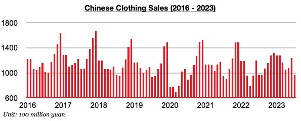
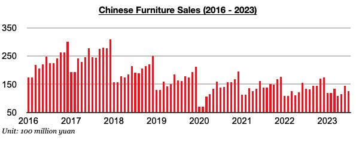
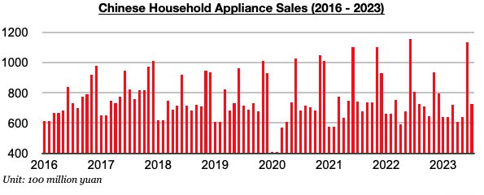

# Weakness in Chinese Retail Sales

**Date:** August 30, 2023  
**Publisher:** Breakwave Advisors | **Category:** Market Insights  
**Original URL:** [https://www.breakwaveadvisors.com/insights/2023/8/29/weakness-in-chinese-retail-sales](https://www.breakwaveadvisors.com/insights/2023/8/29/weakness-in-chinese-retail-sales)  

---

*By*[*Jeffrey Landsberg*](https://www.linkedin.com/in/jeffrey-landsberg-70ab957/)

As we discussed in Commodore's most recent Weekly China Report, China’s clothing sales, furniture sales, and household appliance (including consumer electronics) sales all contracted on a year-on-year basis last month. Clothing sales in China (which includes garments, footwear, hats, and knitwear) contracted year-on-year last month by 0.5%. Previously, clothing sales had increased on a year-on-year basis for six straight months.

> **Figure 1: Chart 1 (74)**  
> [Local Asset](file:///C:/Users/Dell/Github/Shipping/corpus/03-breakwave/insights/2023/assets/2023-08-30_weakness-in-chinese-retail-sales_img_chart1287429_0d6179a4d026.jpg)

Furniture sales in China fell year-on-year by 6%. Sales have now contracted on a year-on-year basis for four straight months. Prior to these last four months, furniture sales had grown on a year-on-year basis for three straight months.

> **Figure 2: Chart 2 (63)**  
> [Local Asset](file:///C:/Users/Dell/Github/Shipping/corpus/03-breakwave/insights/2023/assets/2023-08-30_weakness-in-chinese-retail-sales_img_chart2286329_6fc0774c7f9d.jpg)

Household appliance sales (which includes consumer electronics) in China fell on a year-on-year basis by 10%. Sales have now contracted during ten of the last eleven months.

> **Figure 3: Chart 3 (45)**  
> [Local Asset](file:///C:/Users/Dell/Github/Shipping/corpus/03-breakwave/insights/2023/assets/2023-08-30_weakness-in-chinese-retail-sales_img_chart3284529_7ba1b6eb2af6.jpg)
