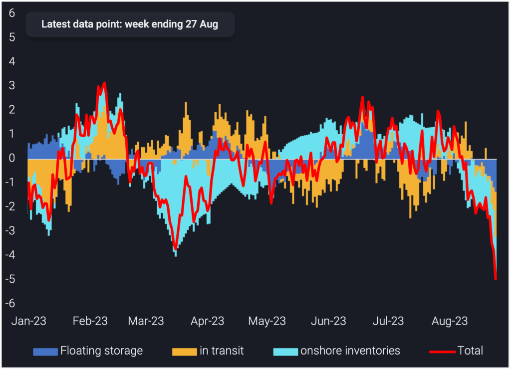
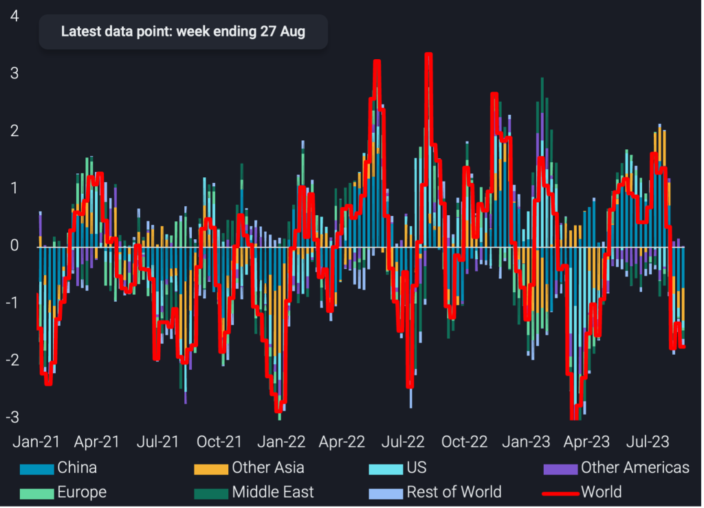

# On- and offshore crude oil inventory drop reflects fundamental market tightening

**Date:** August 31, 2023  
**Publisher:** Breakwave Advisors | **Category:** Market Insights  
**Original URL:** [https://www.breakwaveadvisors.com/insights/2023/8/31/rrqfko015lr1j808udjw33p2u284q8](https://www.breakwaveadvisors.com/insights/2023/8/31/rrqfko015lr1j808udjw33p2u284q8)  

---

OPEC+ cut efforts combined with more resilient demand than most think are leading to a steep drop in crude oil stocks in onshore tanks and on the water.

*By*[*Armen Azizian*](https://www.linkedin.com/search/results/all/?fetchDeterministicClustersOnly=true&heroEntityKey=urn%3Ali%3Afsd_profile%3AACoAABcR8rABbq0IzC6LkmXkEIICI-LUmZ3s9SU&keywords=armen%20azizian&origin=RICH_QUERY_SUGGESTION&position=0&searchId=7abb3001-e90a-47ce-90bc-54ac852000f6&sid=O%21U)

Lacklustre market fundamentals or at least the perception thereof have put oil prices under quite some pressure over the spring period. OPEC+ has reacted with announced cuts, but individual countries led by Saudi Arabia and Russia have really scaled up efforts over the last two months.

This is now really paying off, as Vortexa global crude inventory coverage – including onshore crude inventories in 110+ countries, as well as oil at sea (in transit and on floating storage) – shows a huge crude stock draw emerging over the last couple of months.

> **Figure 1: Insight Image 1 1 1024x742**  
> **Interactive Data & Source:** [Analytics Vortexa](https://analytics.vortexa.com/?dateRange=2023-01-01T00%3A00%3A00.000Z__2023-08-24T23%3A59%3A59.999Z&frequency=day&geoBreakdownOriginGlobal=port&metric=bpd&movementEvent=storing_state&page=Flows&products=%5B%2254af755a090118dcf9b0724c9a4e9f14745c26165385ffa7f1445bc768f06f11%22%5D&tabId=e4ea7b88-52d5-4ad9-a7d9-0e73fdc3c4d0&v=2) | [Local Asset](file:///C:/Users/Dell/Github/Shipping/corpus/03-breakwave/insights/2023/assets/2023-08-31_rrqfko015lr1j808udjw33p2u284q8_img_insight-image-1-1-1024x742_0985127cc63a.png)

**World crude inventories by**[**floating storage**](https://analytics.vortexa.com/?dateRange=2023-01-01T00%3A00%3A00.000Z__2023-08-24T23%3A59%3A59.999Z&frequency=day&geoBreakdownOriginGlobal=port&metric=bpd&movementEvent=storing_state&page=Flows&products=%5B%2254af755a090118dcf9b0724c9a4e9f14745c26165385ffa7f1445bc768f06f11%22%5D&tabId=e4ea7b88-52d5-4ad9-a7d9-0e73fdc3c4d0&v=2)**,**[**in-transit**](https://analytics.vortexa.com/?dateRange=2023-01-01T00%3A00%3A00.000Z__2023-08-24T23%3A59%3A59.999Z&frequency=day&geoBreakdownOriginGlobal=port&metric=bpd&movementEvent=transiting_state&page=Flows&products=%5B%2254af755a090118dcf9b0724c9a4e9f14745c26165385ffa7f1445bc768f06f11%22%5D&tabId=e4ea7b88-52d5-4ad9-a7d9-0e73fdc3c4d0&v=2)**&**[**onshore inventories**](https://analytics.vortexa.com/?dateRange=2023-01-01T00%3A00%3A00.000Z__2023-08-24T23%3A59%3A59.999Z&onshoreInventoriesLocations=%5B%5D&page=OnShoreCrudeInventories&tabId=4e2efe62-ad7a-4a90-a418-2bd546cc4b81&tankCrude=%5B%22confirmed%22%2C%22probable%22%5D)**(4-week average, mbd)**

The above chart, based on a 4-week moving average, suggests that global crude inventories went into a drawing mode some time in early July. As of August the implied crude shortfall has really accelerated with the latest 4-week average showing draws of close to 5mbd. About 2mbd come from onshore tanks, with China having shifted from a stockbuilding to a stockdrawing pattern (see below chart). And an even bigger figure is emerging for crude oil at sea.

The latter is well aligned with plunging global dirty freight rates, which suggest additionally that no quick turnaround is in sight in terms of crude exports, due to the forward-looking nature of vessel bookings.

> **Figure 2: Insight Image 2 1024x739**  
> **Interactive Data & Source:** [Analytics Vortexa](https://analytics.vortexa.com/?dateRange=2021-01-01T00%3A00%3A00.000Z__2023-08-24T23%3A59%3A59.999Z&onshoreInventoriesLocations=%5B%5D&page=OnShoreCrudeInventories&splitSelected=location_region&tabId=4e2efe62-ad7a-4a90-a418-2bd546cc4b81&tankCrude=%5B%22confirmed%22%2C%22probable%22%5D) | [Local Asset](file:///C:/Users/Dell/Github/Shipping/corpus/03-breakwave/insights/2023/assets/2023-08-31_rrqfko015lr1j808udjw33p2u284q8_img_insight-image-2-1024x739_810279b93afe.png)

In difference to dirty freight rates, clean freight rates are doing markedly better. Also most refined product cracks, from transportation fuels to fuel oil, are hovering at pretty lofty levels. Both observations suggest that oil product demand is likely doing pretty well. There are widespread observations that this is the case for jet fuel and gasoline, while diesel demand is the main concern amid recessionary trends, especially in manufacturing.

Vortexa data for the top-100 diesel import ports all over the world, however, shows a healthy 7% growth rate on average so far this year, albeit momentum is slowing. This is in sharp contrast to negative readings from easily available datasets, such as weekly US distillate deliveries in the US market. Also[naphtha import demand into Asia](https://www.vortexa.com/insights/products/exploring-the-forces-behind-the-weakness-of-naphtha-prices/)is slightly surpassing average historical 2016-2022 readings so far this year.

All this suggests that there is a risk that deep OPEC+ cuts could lead to significant market shortages and a (temporary) surge in prices.

Data Source:[Vortexa](https://www.vortexa.com//oil-gas-data-traders-analysts-data-scientists?gclid=Cj0KCQjw8_qRBhCXARIsAE2AtRZKOvMnbilZ_6_91d7huSFFy71pWLrnPwGwOHVzXsmsG-1a1mZnQw8aAt89EALw_wcB&hsa_acc=1782073842&hsa_ad=548425387665&hsa_cam=14746637662&hsa_grp=125038601902&hsa_kw=&hsa_mt=&hsa_net=adwords&hsa_src=g&hsa_tgt=dsa-1431852288425&hsa_ver=3&utm_campaign=%5BCD%5D%20-%20DSA%20-%20EMEA&utm_medium=cpc&utm_medium=ppc&utm_source=google&utm_source=adwords&utm_term=)
