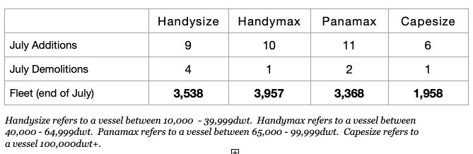

# Large Amount of Tropical Storms Helpful For Dry Bulk Market

**Date:** September 01, 2023  
**Publisher:** Breakwave Advisors | **Category:** Market Insights  
**Original URL:** [https://www.breakwaveadvisors.com/insights/2023/9/1/large-amount-of-tropical-storms-helpful-for-dry-bulk-market](https://www.breakwaveadvisors.com/insights/2023/9/1/large-amount-of-tropical-storms-helpful-for-dry-bulk-market)  

---

*By*[*Jeffrey Landsberg*](https://www.linkedin.com/in/jeffrey-landsberg-70ab957/)

As we have been highlighting in Commodore's Weekly Dry Bulk Reports, the demand-side has been problematic for the dry bulk market this year as both global grain trade and global steel production outside of China have suffered year-on-year contractions. At the same time, the fleet has also continued to grow by a moderate amount. As we discussed in our most recent Weekly Dry Bulk Report, July alone saw 36 dry bulk newbuildings delivered while only 8 dry bulk vessels were scrapped. Month after month of moderate fleet growth has remained a headwind for the dry bulk market.

> **Figure 1: Chart (2)**  
> [Local Asset](file:///C:/Users/Dell/Github/Shipping/corpus/03-breakwave/insights/2023/assets/2023-09-01_large-amount-of-tropical-storms-helpful-for-dry-bulk-market_img_chart28229_65b04f01a2b8.jpg)

More helpful on the vessel-supply side is that the dry bulk market is finally set to deal with multiple weather issues, as seven active tropical weather disturbances are currently in existence. As we have been discussing in updates for our subscribers, four of the storms are in the Pacific and the other three are in the Atlantic. While it is currently peak typhoon/hurricane season, seven storms is a very large amount to be occurring at the same time. Overall, this year has seen an efficient dry bulk fleet, and storms like these are bullish due to increases in port congestion. It is helpful for the dry bulk market that so many storms are occuring.
