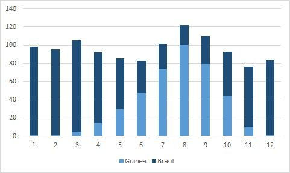

# The growing importance of West Africa

**Date:** September 01, 2023  
**Publisher:** Breakwave Advisors | **Category:** Market Insights  
**Original URL:** [https://www.breakwaveadvisors.com/insights/2023/9/1/r0jmofmnrmwqfcqw14e99z5i9dsyky](https://www.breakwaveadvisors.com/insights/2023/9/1/r0jmofmnrmwqfcqw14e99z5i9dsyky)  

---

## Is the Growing Importance of West Africa for Capesizes Changing the Seasonality of the Atlantic Market and, Thus, the Cape Market As a Whole?

> **Figure 1: F Etched Bronze Size2 Cmyk 300**  
> **Interactive Data & Source:** [Linkedin](https://www.linkedin.com/in/roaradland/) | [Local Asset](file:///C:/Users/Dell/Github/Shipping/corpus/03-breakwave/insights/2023/assets/2023-09-01_r0jmofmnrmwqfcqw14e99z5i9dsyky_img_f-etched-bronze-size2-cmyk-300_0a4c0d40a2e1.jpg)

**The best news for the Capesize market in 2023 has arguably been Brazil’s iron ore exports finally clawing its way back to pre-Brumadinho-disaster levels and the continued growth in Guinea’s bauxite exports.**

*By*[*Roar Adland*](https://www.linkedin.com/in/roaradland/)

Both trades exhibit strong seasonality in volumes due to the countries’ respective rainy seasons (Guinea: May to Oct; Brazil: Oct to Apr), with exports bottoming during the peak rains. Interestingly, seasonal precipitation patterns in the two countries are almost completely out of phase (i.e. shifted by 6 months). Based on historical averages between 1990 and 2020 as published by the World Bank, Brazil precipitation peaks in March and that of Guinea in August. If we index the month of maximum precipitation as 100 and add the resulting seasonal indices for the two countries, we get the graph shown below.

With both trades sourcing vessels primarily from Far East ballasters and Guinea and Brazil being roughly equidistant to China, the growing importance of the Atlantic bauxite market relative to Brazilian iron ore raises the question of whether seasonality in the Atlantic Capesize market is changing as a result.

Based on vessel tracking data, average monthly exports for 2023 on standard Capes through August were in the order of 12.6 Mt ex-Brazil and 8.5 Mt ex -Guinea. Add on another 1.0 Mt of iron ore ex- Mauritania and the fact that some of Brazil’s iron ore exports are merely transatlantic, and the numbers suggest that the tonne-mile impact of the West Africa Capesize market is already equivalent to over 75% of the demand for standard Capes ex-Brazil (i.e. excluding VLOCs).

As you may have recalled from high-school math already—adding two sinusoidal waves that are completely out of phase produces a flat line! Certainly, Atlantic Capesize market seasonality isn’t disappearing any time soon, but as the West Africa market continues to grow in terms of exports, seasonality is likely to become different from the past. As the Atlantic market tends to lead the way for the Cape market as a whole, this possibility has some interesting implications for the seasonal shape of the FFA curve.

> **Figure 2: 1693478786694**  
> **Interactive Data & Source:** [Linkedin](https://www.linkedin.com/posts/roaradland_drybulk-shipping-activity-7102964857146093568-bCFv/?utm_medium=member_ios&utm_source=share) | [Local Asset](file:///C:/Users/Dell/Github/Shipping/corpus/03-breakwave/insights/2023/assets/2023-09-01_r0jmofmnrmwqfcqw14e99z5i9dsyky_img_1693478786694_d517d08a8d52.jpg)

Data Source:[Roar Adland](https://www.linkedin.com/posts/roaradland_drybulk-shipping-activity-7102964857146093568-bCFv/?utm_medium=member_ios&utm_source=share)
