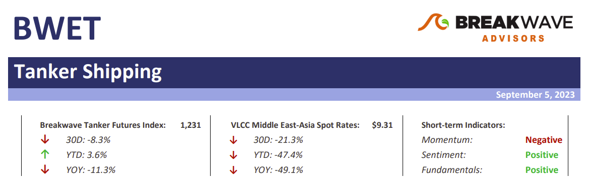
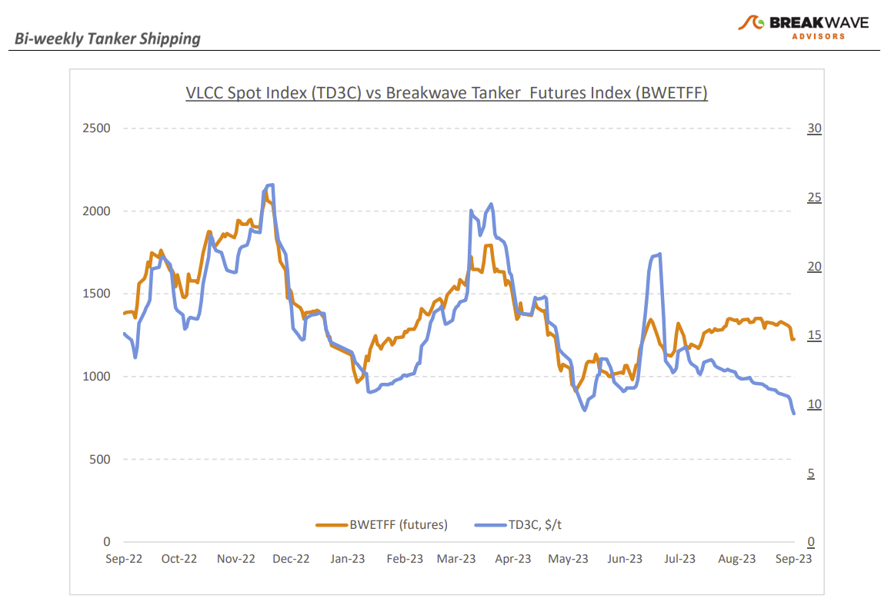
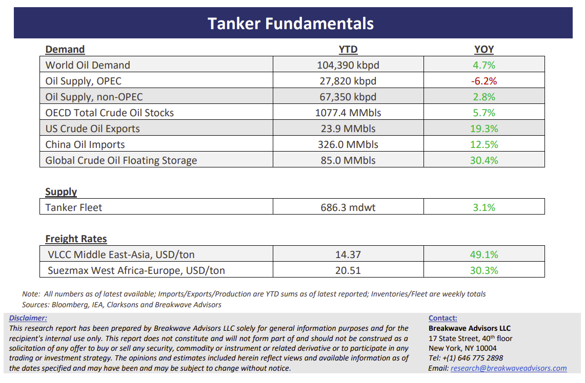

# Breakwave Bi-Weekly Tanker Report - September 5, 2023

**Date:** September 05, 2023  
**Publisher:** Breakwave Advisors | **Category:** Market Insights  
**Original URL:** [https://www.breakwaveadvisors.com/insights/2023/9/5/breakwave-bi-weekly-tanker-report-sep-5-2023-8g9mb](https://www.breakwaveadvisors.com/insights/2023/9/5/breakwave-bi-weekly-tanker-report-sep-5-2023-8g9mb)  

---

> **Figure 1: Tankerreporttop**  
> [Local Asset](file:///C:/Users/Dell/Github/Shipping/corpus/03-breakwave/insights/2023/assets/2023-09-05_breakwave-bi-weekly-tanker-report-sep-5-2023-8g9mb_img_tankerreporttop_c3af64ee4733.png)

**• VLCCs plummet as OPEC cuts take a toll, but sentiment remains upbeat –**Spot VLCC rates have now dropped back to their 2021 range and below $10/ton, as lower exports out of the Middle East due to the recent OPEC export cuts have reduced demand for tonnage. There is little evidence of an imminent rebound, however, fourth quarter futures remain at elevated levels, reflecting the ongoing optimism for the overall tanker sector that is faced with record low fleet supply growth, a very bullish setup if and when demand recovers. Such a development has already been reflected in oil prices that recently hit the highest level this year, as recovering transportation fuel demand combined with the beforementioned OPEC cuts and the limited potential for increased supply from non-OPEC producers have led to a tight global oil market. On the other hand, in the near term, there is the potential for some deceleration in China's crude oil import momentum in the coming weeks, which could be accompanied by constraints on its clean product exports due to restricted export quotas. As we look into the fourth quarter, we also remain of the opinion that VLCC rates will eventually recover and maybe even exceed the futures’ market expectations, as in recent years rallies in freight rates have been steeper and more volatile versus market estimates, a distinct characteristic of tight overall shipping fundamentals.

**• Oil prices react to the tight oil market balance outlook, a sharp contrast to the early summer gloom –**Sentiment has seen a major shift in the last several months when it comes to the oil markets. Early in the summer, with prices hovering in the high $60s/low $70s, market participants were focused on low expected demand and the potential for an upcoming economic slowdown which could have negatively affected oil demand. At the time, we argued that the announced oil production cuts would tighten the market going into Q4, something that seems to dominate now the narrative around oil prices and has consequently led to a sharp rally, with Brent oil at almost $90 per barrel. Looking at specific regions, it is worth noting that the European Union is now the largest seaborne importer of crude oil, while India has gradually reduced its dependence on Russian crude oil purchases. Furthermore, imports of Russian oil are expected to remain at subdued levels for a couple of months due to lower discounts, forcing suppliers of Russian oil to provide deeper discounts. This is significant given the current challenging situation of the crude tanker freight market and could once again reshape the global tanker trade affecting tonne-mile demand in the process.

**• Tanker cycle driven by tight supply, recovering demand –**The tanker market is recovering from a long period of staggered rates as the growth in new vessel supply shrinks while oil demand is recovering in line with the global economy. A historically low orderbook combined with favorable demand fundamentals should continue to support increased spot rate volatility, which combined with the ongoing geopolitical turmoil, should support freight rates in the medium term.

> **Figure 2: Tankerreportchart**  
> [Local Asset](file:///C:/Users/Dell/Github/Shipping/corpus/03-breakwave/insights/2023/assets/2023-09-05_breakwave-bi-weekly-tanker-report-sep-5-2023-8g9mb_img_tankerreportchart_2c29d9a26651.png)

> **Figure 3: Tankerreportbottom**  
> [Local Asset](file:///C:/Users/Dell/Github/Shipping/corpus/03-breakwave/insights/2023/assets/2023-09-05_breakwave-bi-weekly-tanker-report-sep-5-2023-8g9mb_img_tankerreportbottom_9f4430286415.png)

### Subscribe:
