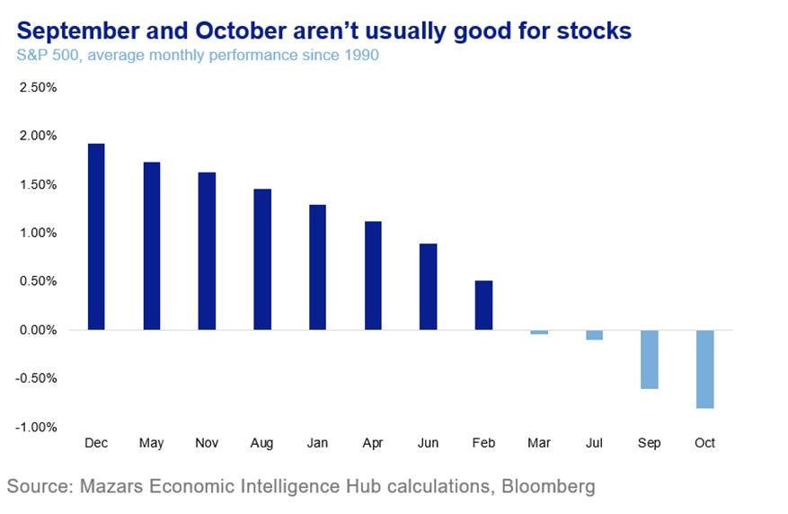
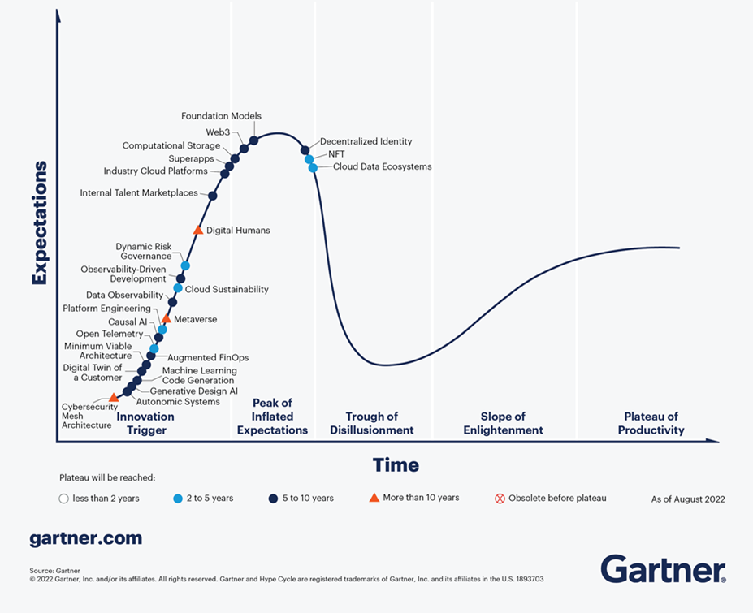
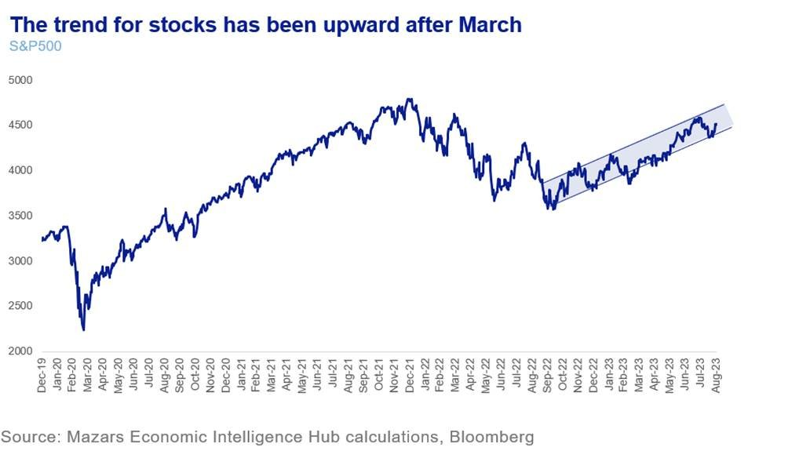

# Watch the Fed, buy the dips

**Date:** September 05, 2023  
**Publisher:** Breakwave Advisors | **Category:** Market Insights  
**Original URL:** [https://www.breakwaveadvisors.com/insights/2023/9/5/capitalism-101-watch-the-fed-buy-the-dips](https://www.breakwaveadvisors.com/insights/2023/9/5/capitalism-101-watch-the-fed-buy-the-dips)  

---

*By*[*George Lagarias*](https://www.linkedin.com/in/george-lagarias-mba-3baa769/)

*The three things I would tell my clients this week:*

1. *The economic situation is about to deteriorate, as the forces that supported the global economy in the first half of the year are dissipating.*
2. *September and October are usually bad months for the market.*
3. *For investors, this is all good news. A possible seasonal drop in market values could provide investors with an entry point. Worse economic performance may well convince the Fed to put the definitive breaks on rate hikes- something which could possibly tilt a sideways market upwards. No one is saying “Bull Market” yet, but a stoppage of rate hikes is a good start.*

“Sell in May and go away”, the old traders say. This is not because markets fall in the summer. It is because volumes are low and signals are not trustworthy. In September traders return, and the month is usually the second worst for stocks.

> **Figure 1: Market Chart 1**  
> **Interactive Data & Source:** [Searchenginejournal](https://www.searchenginejournal.com/is-chatgpt-getting-dumber-usage-drops-as-users-complain/491659/#close) | [Local Asset](file:///C:/Users/Dell/Github/Shipping/corpus/03-breakwave/insights/2023/assets/2023-09-05_capitalism-101-watch-the-fed-buy-the-dips_img_image00228429_f995fc5b79d6.jpg)

Despite robots doing much of the work these days, trading volumes in the summer were quite muted. Their human masters, it seems, don’t quite trust them with the shop while they are away. Why would they, by the way? ChatGPT, the face of the AI revolution, is losing subscribers and some of its[lustre](https://www.searchenginejournal.com/is-chatgpt-getting-dumber-usage-drops-as-users-complain/491659/#close), as users complain that the model gives more wrong answers. To be sure, OpenAI says that’s not the case, they are just using it more and noticing stuff they didn’t before. Others say that the world experienced through the internet and social media is bound to make any intelligence dumber. I’m no expert either way (primarily because no human would admit they have gotten dumber by being glued to their phone), but it seems that we are at the “peak of inflated expectations”, the phase where the tech hype is wearing off and practical realities set in.

> **Figure 2: Market Chart 2**  
> **Interactive Data & Source:** [Bbc](https://www.bbc.com/news/business-66506132) | [Local Asset](file:///C:/Users/Dell/Github/Shipping/corpus/03-breakwave/insights/2023/assets/2023-09-05_capitalism-101-watch-the-fed-buy-the-dips_img_image00328129_3d5dddb4c579.png)

But I digress. As we approach the final third of the year, let us look at where we are and how we got here. The first half was supposed to be bleak. Yet global economic growth far outperformed expectations. This was due to China reopening and a long-time needed inventory buildup. Consumers were also much more resilient than anticipated. Markets also performed very well, as the AI craze gripped traders until the summer, so press headlines added to the optimism.

Yet now the situation is reversing. China is slowing down significantly. Although we don’t know by how much (the Chinese[are telling us less and less](https://www.bbc.com/news/business-66506132)about all that), we are seeing[more stimulus](assets/2023-09-05_capitalism-101-watch-the-fed-buy-the-dips_index_621e3e57420e.html)to keep the real estate sector afloat. Meanwhile, in the US, employment data[deteriorated](https://www.ft.com/content/203c925e-3f65-44b1-b3aa-a86caa416d0c)somewhat, the inventory buildup is done, and irrational consumption[may be on its last legs,](assets/2023-09-05_capitalism-101-watch-the-fed-buy-the-dips_high-rates-will-lead-to-a-consumer-l_bead5f1e076d.html)according to Wall Street legend David Rosenberg (and also our own research). And as we said, the AI craze is probably over for markets. Now the time has come for capital expenditure to meet bloated investor expectations.

If September is usually a bad month for stocks, we can see how the immediate data may help uphold the pattern.

**Incredibly, this would be good news for investors. If valuations recede in the next few weeks, it could give those sitting on the fence a good entry point. Why?**

**Because worse economic performance and possibly reticent consumers, along with worse markets, could finally convince the Fed to stop hiking altogether**. At the back end of last week, Raphael Bostic, Chairman of the Atlanta Fed, said that rates were at the “appropriate levels”, giving hope to markets that we have seen the end of rate hikes. Of course, Mr Bostic is not a voting member this year, so we would wait for the Board members and voting Chairpersons to voice their opinions, which they might well do in the coming weeks. Whether we have one more rate hike in the US ahead of us or not, however, is by and large irrelevant. The larger picture is that we are near the flattening rate point. This will be positive for markets. Assuming that at some point near the back end of next year, rates will begin to drop, we could even see equities break new highs and bonds finally giving investors the long-awaited rebound, after an annus horribilis 2022.

**To reiterate: with rates near the flattening point, market retrenchments may again be buying signals. And while with QT persisting we are nowhere near the persistent low-volatility bull market we got used to in the past decade, a shift from sideways trading to a volatile upward trend is already happening.**

> **Figure 3: Market Chart 3**  
> [Local Asset](file:///C:/Users/Dell/Github/Shipping/corpus/03-breakwave/insights/2023/assets/2023-09-05_capitalism-101-watch-the-fed-buy-the-dips_img_image006281429_0b859d50fcf1.jpg)

**We can take advantage of it if we can weather the occasional storm and crisis. In this environment, tactical asset allocation, security and industry selection will matter significantly over the next few quarters.**
