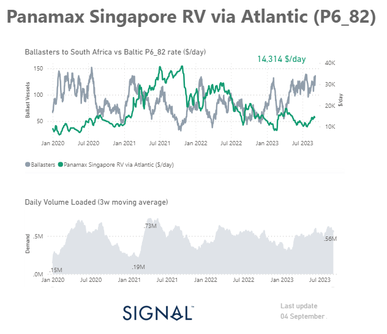
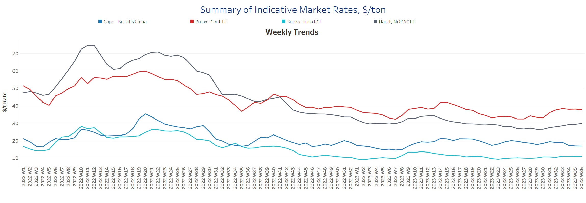
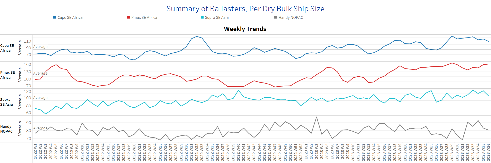
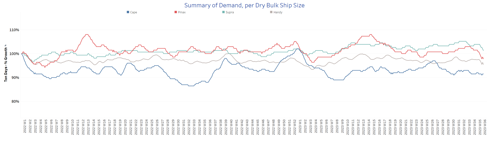
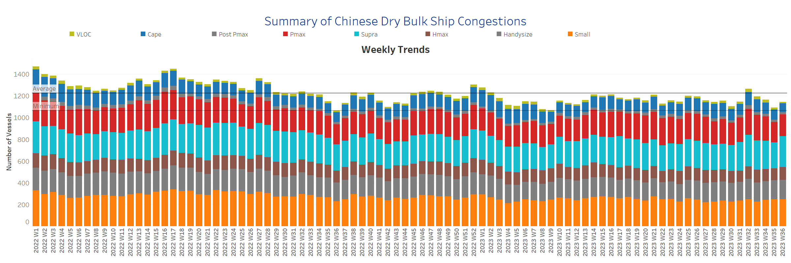

# Signal Dry Bulk Weekly Report

**Date:** September 06, 2023  
**Publisher:** Breakwave Advisors | **Category:** Market Insights  
**Original URL:** [https://www.breakwaveadvisors.com/insights/2023/9/6/signal-dry-bulk-weekly-report](https://www.breakwaveadvisors.com/insights/2023/9/6/signal-dry-bulk-weekly-report)  

---

## Chart of the Week: Panamax Singapore Rv Via Atlantic Ballast Vessels

**Higher freight rates despite the increase in the volume of ballast ships as demand gradually rises**

> **Figure 1: Market Chart 1**  
> **Interactive Data & Source:** [Signal Ocean Platform](https://www.thesignalgroup.com/signal-ocean-platform) | [Local Asset](file:///C:/Users/Dell/Github/Shipping/corpus/03-breakwave/insights/2023/assets/2023-09-06_signal-dry-bulk-weekly-report_img_unnamed-2023-09-06t122426860_131c1f87e5e1.png)

As September began, freight rates continued to remain firm, as recorded at the end of the summer season. However, the Capesize segment remained under downward pressure. On the other hand, the Panamax and Handysize vessel freight rates showed an upturn. Despite this recent firmness, there are still uncertainties regarding the stability of the market, given the ongoing grain crisis and the gloomy economic outlook in China.
When we look at the Panamax vessel size segment, we can observe that there is a rise in the number of ballasters heading towards South Africa. However, it is interesting to note that the Panamax Singapore RV route (P6_82) is experiencing a stronger momentum of freight rates. The recent firmness follows an upward trend that has been evident in daily volume loaded since July.

In the midst of these developments, iron ore prices managed to rally on Monday, defying the prevailing weakness in steel demand stemming from the struggling Chinese property sector. This surprising resilience can be attributed to Chinese mills, which are continuing their production unabated, taking advantage of the absence of a concrete government production cap and working to replenish their dwindling inventories of this crucial raw material.
In the realm of grains, a significant breakthrough in negotiations remains elusive, with President Putin firmly stating that there will be no agreement on grain until the Western counterparts fulfil their obligations.

For more information on this week's trends, see the analysis sections below:

Freight Market, Supply, Demand and Port Congestion

## Section 1/ Freight​​​

‘The Big Picture’ - Capesize and Panamax Bulkers and Smaller Ship Sizes
Market Rates ($/t) Firmer

> **Figure 2: Market Chart 2**  
> **Interactive Data & Source:** [Signal Ocean Platform](https://www.thesignalgroup.com/signal-ocean-platform) | [Local Asset](file:///C:/Users/Dell/Github/Shipping/corpus/03-breakwave/insights/2023/assets/2023-09-06_signal-dry-bulk-weekly-report_img_unnamed-2023-09-06t122855616_32a282d6502e.png)

The rise in Panamax and Handysize freight rates continued during the first week of September, while Capesize rates remained low.

- Capesize vessel freight rates from Brazil to North China hovered around $17/tonne, while rates appear to be under downward pressure with no spikes in the last three weeks.
- Panamax vessel freight rates from the Continent to the Far East maintained the upward momentum of rates around $38 per tonne, while the recent trend is consistent with the level of five weeks ago.
- Supramax vessel freight rates on the Indo-ECI route held the momentum of around $11/tonne mark for six consecutive weeks, with signs of a relatively flat momentum in September.
- Handysize freight rates for the NOPAC Far East route reached $29.9 per tonne, the highest level since week 22.

## Section 2/ Supply ​​​

> **Figure 3: Supply Trend Lines for Key Load Areasballasters (# Vessels) Mixed**  
> **Interactive Data & Source:** [Signal Ocean Platform](https://www.thesignalgroup.com/signal-ocean-platform) | [Local Asset](file:///C:/Users/Dell/Github/Shipping/corpus/03-breakwave/insights/2023/assets/2023-09-06_signal-dry-bulk-weekly-report_img_unnamed-2023-09-06t122948096_a126f9188bf4.png)

The number of ballast ships showed a mixed picture, with a downward trend in the Capesize, Supramax and Handysize segments but an upward trend in Panamax.

- Capesize SE Africa: The number of ballasters is 109, down 6% from the previous week and down 13% from the last high recorded in week 29.
- Panamax SE Africa: The number of ballasters is now around 160, which is almost 30 more than in week 32, and there are signs of a further upward trend in the first week of September.
- Supramax SE Asia: The current number of ballast ships is 105, with a downward trend but still strong volatility, with no clear direction for an upward or downward trend yet.
- Handysize NOPAC: The number of ballast ships has dropped almost to the annual average of 80, and it remains to be seen if there will be a further drop towards the end of the week.

## Section 3/ Demand

> **Figure 4: Summary of Dry Bulk Demand, per Ship Sizetonnedays Decreasing**  
> **Interactive Data & Source:** [Signal Ocean Platform](https://www.thesignalgroup.com/signal-ocean-platform) | [Local Asset](file:///C:/Users/Dell/Github/Shipping/corpus/03-breakwave/insights/2023/assets/2023-09-06_signal-dry-bulk-weekly-report_img_unnamed-2023-09-06t123131824_f6eb1095c7a1.png)

The overall picture of tonne-day growth observed in the first days of September continued the downward trend of the last days of August, while the Capesize shipping showed a level of gradual improvement.

- Capesize: Although demand growth does not approach the peak of week 27, there is a higher momentum compared to the last low of week 30.
- Panamax: In the first days of September, a continuing downward trend can be observed, although there was a clear upswing at the end of August.
- Supramax: An overall decreased trend is also viewed in September for Supramax vessels, with the percentage of tonne-days growth now dropping to a lower level than those seen at the beginning of August.
- Handysize: There is a clear downward trend in September with the last peak occurring in week 29.

## Section 4/ Port Congestion ​​​​​

> **Figure 5: Dry Bulk Ships Congested at Chinese Portsno of Vessels Increasing**  
> **Interactive Data & Source:** [Signal Ocean Platform](https://www.thesignalgroup.com/signal-ocean-platform) | [Local Asset](file:///C:/Users/Dell/Github/Shipping/corpus/03-breakwave/insights/2023/assets/2023-09-06_signal-dry-bulk-weekly-report_img_unnamed-2023-09-06t123428850_3926f298aa45.png)

There was a surge in vessel congestion in China at the start of September, but there may be a downward correction in the coming days following a lower level at the end of the previous month. The rise in numbers is due to the Panamax, Supramax, and Handysize categories of ships.

- Capesize: The current number of vessel congestion is 82, 10 lower than the end of the previous week.
- Panamax: The number is now 199, which is 12 more than the previous week but 17% less than the peak week (32).
- Supramax: The number of vessel congestions rose to 284 at the beginning of the week, 44 more than the previous week and the highest level since the end of week 32.
- Handysize: The number of congested ships, which showed a downward correction in the second week of August, now seems to be rising again to a level around the 180 mark, and it remains to be seen whether a similar trend will develop in the coming days.

Data Source:[Signal Ocean Platform](https://www.thesignalgroup.com/signal-ocean-platform)
