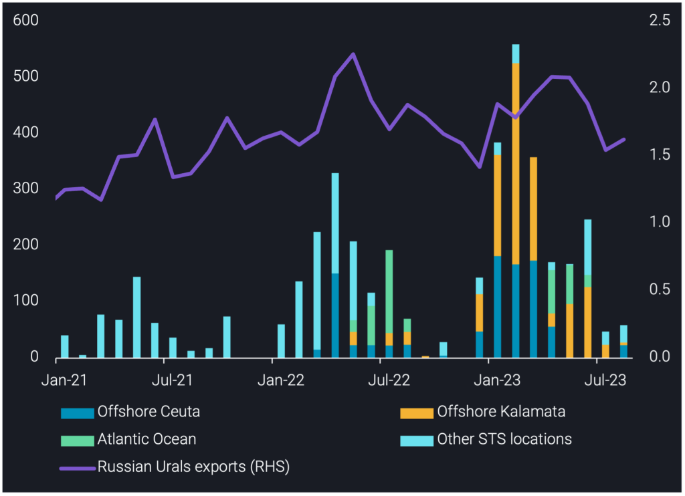
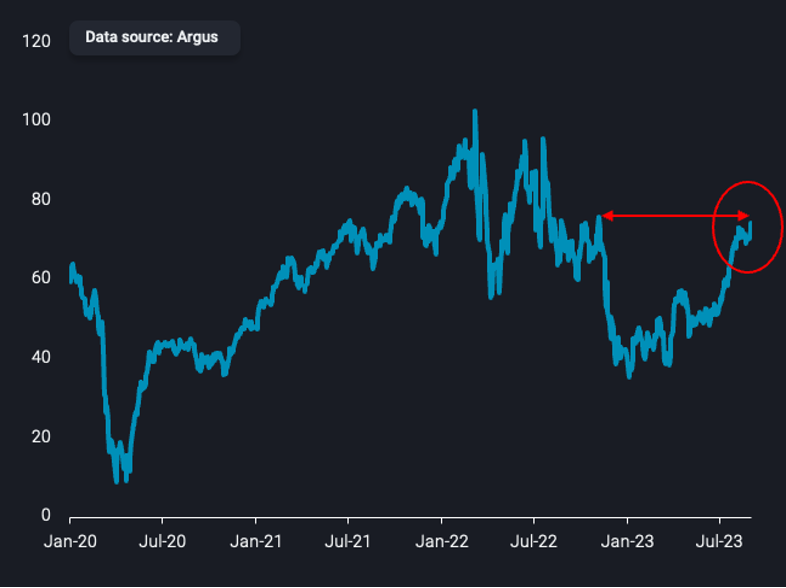
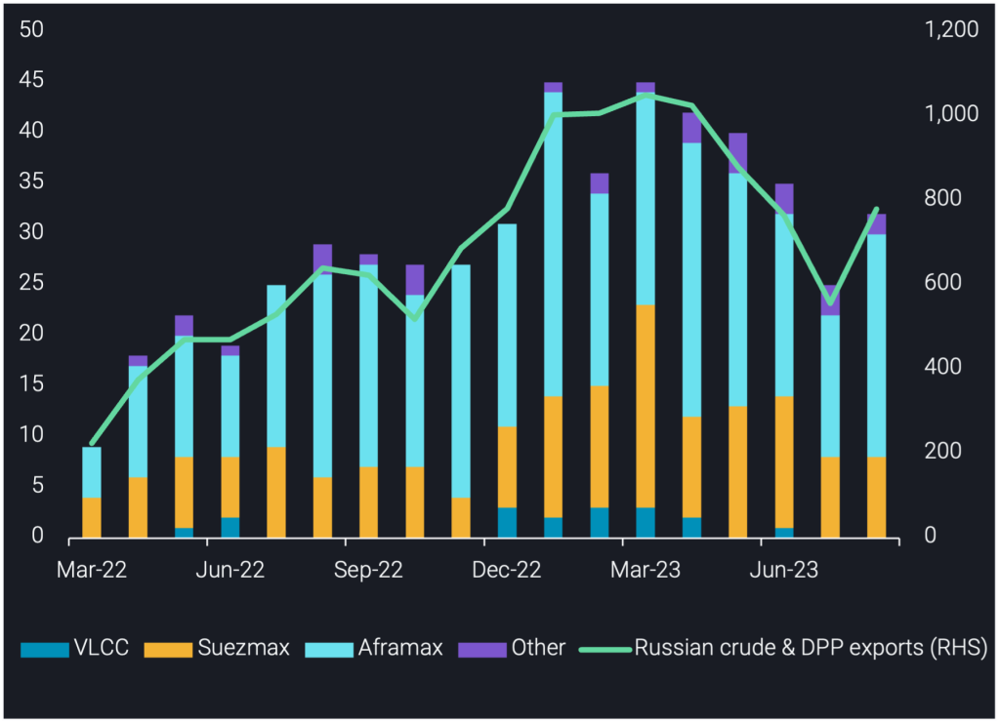

# Russian Urals STS activity declines 85% from Q1 peak

**Date:** September 07, 2023  
**Publisher:** Breakwave Advisors | **Category:** Market Insights  
**Original URL:** [https://www.breakwaveadvisors.com/insights/2023/9/7/russian-urals-sts-activity-declines-85-from-q1-peak](https://www.breakwaveadvisors.com/insights/2023/9/7/russian-urals-sts-activity-declines-85-from-q1-peak)  

---

## In This Insight We Explore the Reasons Behind the Significant Decline Observed in Russian Urals Sts Activity.

*By*[*Armen Azizian*](https://www.linkedin.com/search/results/all/?fetchDeterministicClustersOnly=true&heroEntityKey=urn%3Ali%3Afsd_profile%3AACoAABcR8rABbq0IzC6LkmXkEIICI-LUmZ3s9SU&keywords=armen%20azizian&origin=RICH_QUERY_SUGGESTION&position=0&searchId=7abb3001-e90a-47ce-90bc-54ac852000f6&sid=O%21U)

## Russian Urals Sts Activity Subsides

STS transfers of Russian Urals totalled 60kbd in August, a marginal increase of 10kbd m-o-m but 375kbd lower than the peak observed in Q1. STS transfers accounted for only 4% of total Russian Urals exports in August, a stark contrast to the 25% they accounted for in Q1, on average.

There are various contributing factors to the steep decline we have observed in Russian Urals STS activity. Firstly, the largest buyers of Russian Urals (China and India) are now known to the market, so there is no longer the need for a middleman to put one step between seller and buyer as there may have been initially post-ban.

Secondly, the higher volumes observed during Q1 were likely due to the need for ice-class vessels in the Baltics. As the weather warmed, the need for tankers acting as shuttles between the Baltics and the Mediterranean (Kalamata and Ceuta) reduced. Since winter finished, there were even fewer requirements supporting the reasons why STS activity has declined.

Thirdly, Russia cut exports by approximately 400kbd on average in July and August compared to Q1 and Q2, naturally supporting the lesser need for STS transfers.

> **Figure 1: Russian Urals Transferred Via Sts Offshore Ceuta**  
> *Russian Urals transferred via STS offshore Ceuta, Kalamata, Atlantic Ocean and other STS locations, by STS transfer month (kbd, LHS)vsRussian Urals exports (mbd, RHS)*  
> **Interactive Data & Source:** [Analytics Vortexa](https://analytics.vortexa.com/?dateRange=2021-01-01T00%3A00%3A00.000Z__2023-08-31T23%3A59%3A59.999Z&filtersEnabled=%5B%22p%22%2C%22o%22%2C%22d%22%2C%22d_r%22%2C%22v%22%2C%22intra%22%2C%22sts_o%22%2C%22c_o%22%2C%22sts%22%2C%22w%22%5D&from=%5B%22b996521be9c996db3560ca234a56286ac38f798d34be229437555fab4f12a6a5%22%5D&metric=bpd&page=Flows&products=%5B%22c8803c073c2980d9849784c16bcd41d7f7b7561d2c8c1799a16166527b120242%22%5D&shipToShipOnlyXFilter=1&tabId=6ac381b1-bcee-438c-9e04-6a6a01157bde&v=2) | [Local Asset](file:///C:/Users/Dell/Github/Shipping/corpus/03-breakwave/insights/2023/assets/2023-09-07_russian-urals-sts-activity-declines-85-from-q1-peak_img_insight-image-1-2-1024x74228129_790ac2e67756.png)

## Russian Urals Prices Climb to Highest Level Since Eu-Ban Implementation

Russian Urals prices have risen significantly since December when the EU-ban was initially implemented; Urals FOB Baltics (midpoint) was assessed at $74.5/bl as of 1 September (Argus Media), a $26/bl increase since the 5 December assessment. This price increase has deterred China from buying Urals via STS using VLCCs in recent months, which was a contributing factor to the STS activity peak observed in Q1 ([**see insight for reference**](https://www.vortexa.com/insights/crude/new-key-locations-emerging-for-russian-urals-sts-activity/)); another contributing factor to the lower STS volumes we are observing now.

> **Figure 2: Urals Fob Baltics (Midpoint) Prices ($/Bl)**  
> *Urals FOB Baltics (midpoint) prices ($/bl)*  
> **Interactive Data & Source:** [Vortexa](https://www.vortexa.com//oil-gas-data-traders-analysts-data-scientists?gclid=Cj0KCQjw8_qRBhCXARIsAE2AtRZKOvMnbilZ_6_91d7huSFFy71pWLrnPwGwOHVzXsmsG-1a1mZnQw8aAt89EALw_wcB&hsa_acc=1782073842&hsa_ad=548425387665&hsa_cam=14746637662&hsa_grp=125038601902&hsa_kw=&hsa_mt=&hsa_net=adwords&hsa_src=g&hsa_tgt=dsa-1431852288425&hsa_ver=3&utm_campaign=%5BCD%5D%20-%20DSA%20-%20EMEA&utm_medium=cpc&utm_medium=ppc&utm_source=google&utm_source=adwords&utm_term=) | [Local Asset](file:///C:/Users/Dell/Github/Shipping/corpus/03-breakwave/insights/2023/assets/2023-09-07_russian-urals-sts-activity-declines-85-from-q1-peak_img_insight-image-2-1_d8ee38b0cb83.png)

## Tankers Switch Between Sanctioned Trade and Russian Trade

We track 143 unique tankers that have loaded Russian crude and DPP since Mar-22 and previously carried Iranian and Venezuelan crude. Russian crude & DPP exports on carriers involved in sanctioned trade were 780kbd in August 2023, a 220kbd increase mo-m. The increase was driven by Urals breaching the price-cap, incentivising operators familiar with sanctioned trade to re-enter this market.

Tankers previously involved in sanctioned trade played a significant role in Russian Urals STS activity, accounting for 30% and 40% of all STS transfers in Q1 and Q2 2023, respectively. However, as Urals STS activity subsided in July and August 2023, they had no involvement in STS transfers, instead sailing directly.

Whilst the switch from sanctioned trade to Russian trade started to occur in Mar-22 and has grown significantly since, a phenomenon observed in recent months is tankers switching back to sanctioned trade from the Russian trade, coupled with tankers switching from Russian trade to sanctioned trade who entered directly from the mainstream trade, though this is much smaller volumes.

There are 29 tankers observed which have made this switch in recent months. Over 50% of these tankers are Aframaxes and six of them are VLCCs which were previously involved in Urals STS activity; now involved in Iranian port calls and STS activity. The operators are also of importance; 31% of these tankers are Chinese-operated, whilst 24% are operated by low-tax sovereigns (BVI, Marshall Islands, Panama and Seychelles).

This highlights the fluidity of this market, and with Urals prices higher and hence less attractive to Chinese buyers compared to Iranian crude, have switched to the market where demand for tankers is currently higher. Some of these tankers are switching between both markets, suggesting the switch is not as one-sided as it was when the war first started, and thereafter the EU-ban implementation.

> **Figure 3: Count of Tankers Carrying Russian Crude/dpp That Previously**  
> *Count of tankers carrying Russian* crude/DPP that previously carried sanctioned crude, by class (LHS) vs Russian crude/DPP exports on these carriers (kbd, RHS)*  
> **Interactive Data & Source:** [Vortexa](https://www.vortexa.com//oil-gas-data-traders-analysts-data-scientists?gclid=Cj0KCQjw8_qRBhCXARIsAE2AtRZKOvMnbilZ_6_91d7huSFFy71pWLrnPwGwOHVzXsmsG-1a1mZnQw8aAt89EALw_wcB&hsa_acc=1782073842&hsa_ad=548425387665&hsa_cam=14746637662&hsa_grp=125038601902&hsa_kw=&hsa_mt=&hsa_net=adwords&hsa_src=g&hsa_tgt=dsa-1431852288425&hsa_ver=3&utm_campaign=%5BCD%5D%20-%20DSA%20-%20EMEA&utm_medium=cpc&utm_medium=ppc&utm_source=google&utm_source=adwords&utm_term=) | [Local Asset](file:///C:/Users/Dell/Github/Shipping/corpus/03-breakwave/insights/2023/assets/2023-09-07_russian-urals-sts-activity-declines-85-from-q1-peak_img_insight-image-3-1024x742_d67d00cf7851.png)

Data Source:[Vortexa](https://www.vortexa.com//oil-gas-data-traders-analysts-data-scientists?gclid=Cj0KCQjw8_qRBhCXARIsAE2AtRZKOvMnbilZ_6_91d7huSFFy71pWLrnPwGwOHVzXsmsG-1a1mZnQw8aAt89EALw_wcB&hsa_acc=1782073842&hsa_ad=548425387665&hsa_cam=14746637662&hsa_grp=125038601902&hsa_kw=&hsa_mt=&hsa_net=adwords&hsa_src=g&hsa_tgt=dsa-1431852288425&hsa_ver=3&utm_campaign=%5BCD%5D%20-%20DSA%20-%20EMEA&utm_medium=cpc&utm_medium=ppc&utm_source=google&utm_source=adwords&utm_term=)
