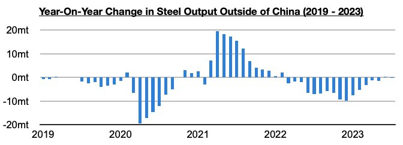
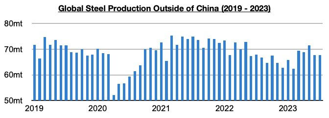
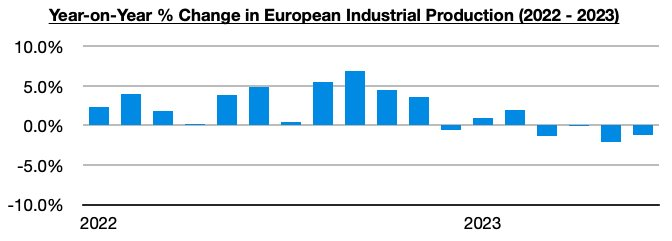

# Steel and Industrial Weakness Outside of China

**Date:** September 07, 2023  
**Publisher:** Breakwave Advisors | **Category:** Market Insights  
**Original URL:** [https://www.breakwaveadvisors.com/insights/2023/9/7/steel-and-industrial-weakness-outside-of-china](https://www.breakwaveadvisors.com/insights/2023/9/7/steel-and-industrial-weakness-outside-of-china)  

---

*By*[*Jeffrey Landsberg*](https://www.linkedin.com/in/jeffrey-landsberg-70ab957/)

As we highlighted most recently in last week's Weekly Dry Bulk Report, a large global issue that has been a headwind for the dry bulk market — and particularly the capesize market — this year has been a lengthy collapse in steel output outside of China. From the start of March 2022 through the end of May of this year, steel output outside of China contracted by 77 million tons.

> **Figure 1: Chart 1 (75)**  
> [Local Asset](file:///C:/Users/Dell/Github/Shipping/corpus/03-breakwave/insights/2023/assets/2023-09-07_steel-and-industrial-weakness-outside-of-china_img_chart1287529_f37e4ed988f0.jpg)

June and July at least saw improvement as steel output ex-China, in total, came in flat on a year-on-year basis — but those previous fifteen months of output contracting by 77 million tons is still having an impact on our market as so many capesize vessels were never chartered to import iron ore. Ongoing growth in steel output in China, and a return of growth in steel output outside of China, is needed to help soak up what is still an excess supply of capesize vessels.

> **Figure 2: Chart 2 (64)**  
> [Local Asset](file:///C:/Users/Dell/Github/Shipping/corpus/03-breakwave/insights/2023/assets/2023-09-07_steel-and-industrial-weakness-outside-of-china_img_chart2286429_35ac3bc3071e.jpg)

Steel output ex-China has still not returned to levels seen before the onset of the covid pandemic, even though global coronavirus cases peaked in Q1 2022 and most nations abandoned coronavirus-restrictions by late Q2 2022. Overall industrial production this year has also been mired in contraction in many economies due in part to economic weakness / recession that has continued in much of the world. 2022 also saw pulled-forward growth.

Conditions have remained particularly weak in Europe. As we discussed in last week’s Weekly Dry Bulk Report, EU steel output has contracted on a year-on-year basis for twenty straight months, and July’s most recent 12% year-on-year contraction has marked the largest contraction seen all year. Industrial production in Europe has also now contracted on a year-on-year basis during each of the last four months.

> **Figure 3: Chart 3 (48)**  
> [Local Asset](file:///C:/Users/Dell/Github/Shipping/corpus/03-breakwave/insights/2023/assets/2023-09-07_steel-and-industrial-weakness-outside-of-china_img_chart3284829_c0adacf03c02.jpg)
