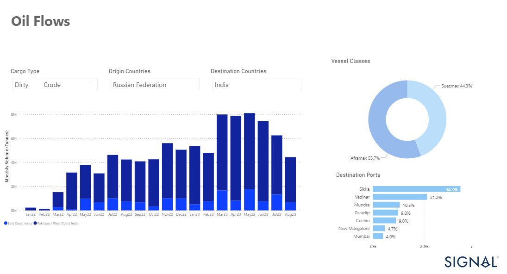
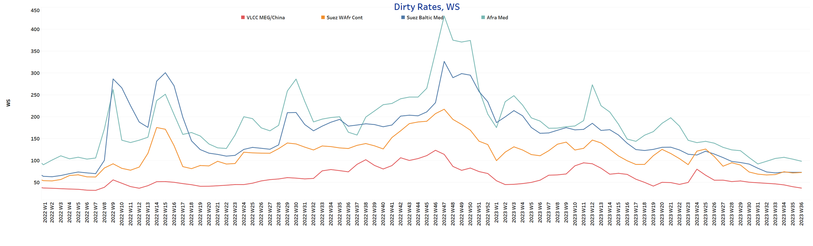
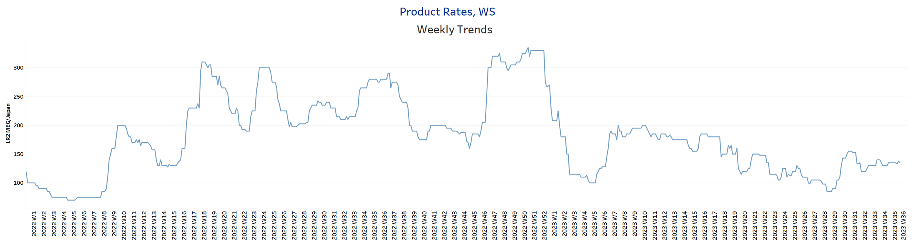
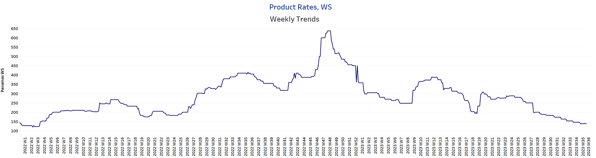
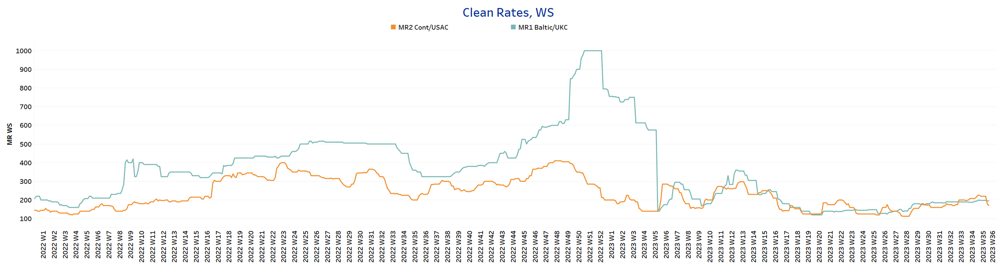
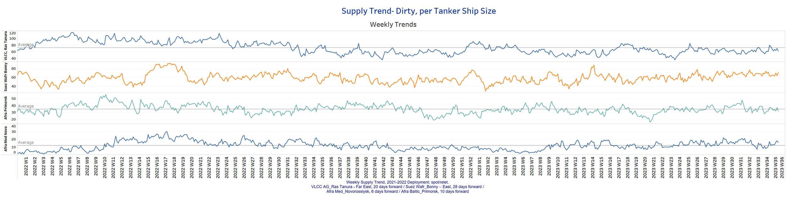
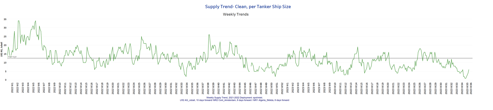
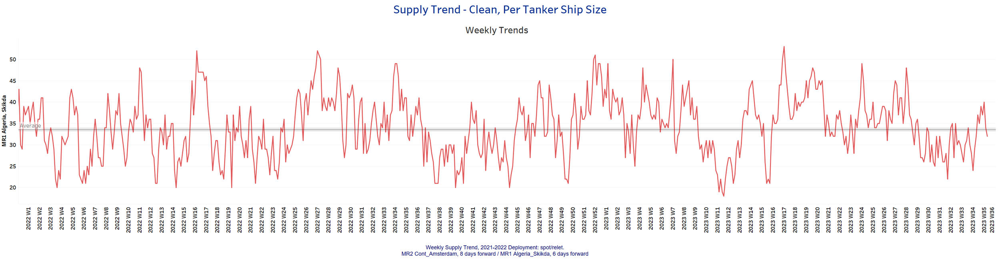
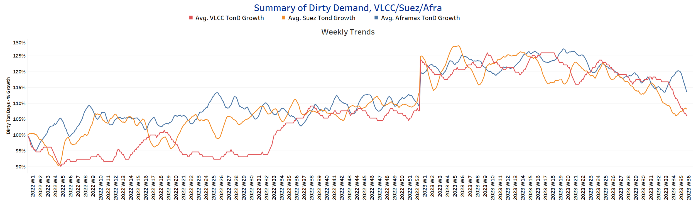
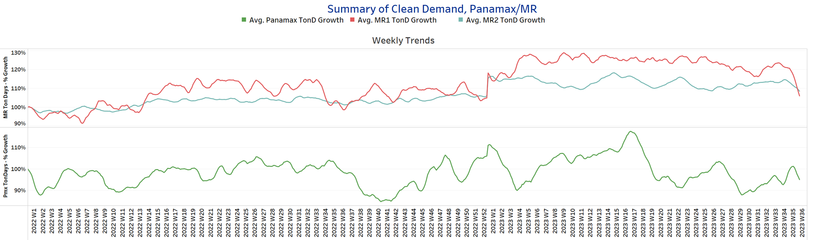

# Signal Tanker Weekly Report

**Date:** September 08, 2023  
**Publisher:** Breakwave Advisors | **Category:** Market Insights  
**Original URL:** [https://www.breakwaveadvisors.com/insights/2023/9/8/signal-tanker-weekly-report](https://www.breakwaveadvisors.com/insights/2023/9/8/signal-tanker-weekly-report)  

---

## Chart of the Week: Russian Crude Oil Flows to India

### Russian Crude Oil Exports to India in August at Lowest Level Since Beginning of the Year

> **Figure 1: Market Chart 1**  
> **Interactive Data & Source:** [Signal Ocean Platform](https://go.signalocean.com/e/983831/tanker-dynamic-oilflows/2pc15f/344332509?h=LpwJXrxyOG_TzHLfObgqEP-peLEi7uL9Vh44G0kXmK0) | [Local Asset](file:///C:/Users/Dell/Github/Shipping/corpus/03-breakwave/insights/2023/assets/2023-09-08_signal-tanker-weekly-report_img_unnamed-2023-09-08t130544404_913aa8f7dc14.png)

Data Source:[Signal Ocean Platform](https://go.signalocean.com/e/983831/tanker-dynamic-oilflows/2pc15f/344332509?h=LpwJXrxyOG_TzHLfObgqEP-peLEi7uL9Vh44G0kXmK0)

The first week of September brings a downward movement in crude oil freight rates and a continued downward trend in VLCC tonne days demand growth. MEG -Rates for China have now fallen to their lowest levels since the beginning of this year, but there is still guarded optimism for a rebound in the third quarter of the year.
It is interesting to see that the dependence of the Indian economy on Russian crude oil imports has been shown to be decreasing. At the end of the summer season, Russian crude oil exports to India reached their lowest level in August, a significant drop from earlier in the year (see chart above).

Concerns about the Chinese economic outlook and Asian oil demand are pushing oil prices down. Oil prices saw a decline on Thursday as concerns about seasonal demand slowdown during winter and the uncertain economic outlook for China took precedence over the anticipated impact of extended production cuts in Saudi Arabia and Russia. According to a Reuters report, at 0645 GMT, Brent crude futures declined by 36 cents to settle at $90.24 per barrel, signalling the conclusion of a nine-session winning streak. Concurrently, U.S. West Texas Intermediate crude (WTI) futures slipped by 37 cents, resting at $87.17 per barrel, ending a streak of seven consecutive sessions of gains.

For more information on this week's trends, see the analysis sections below:

Freight Market, Supply and Demand

## Section 1/ Freightmarket Rates (WS)

> **Figure 2: ‘Dirty’ WS​​​​ VLCC - Suezmax - Aframax Weaker**  
> **Interactive Data & Source:** [Signal Ocean Platform](https://www.thesignalgroup.com/signal-ocean-platform) | [Local Asset](file:///C:/Users/Dell/Github/Shipping/corpus/03-breakwave/insights/2023/assets/2023-09-08_signal-tanker-weekly-report_img_unnamed-2023-09-08t130719890_314ef4015247.png)

Weaker sentiment in crude oil freight rates, while the VLCC MEG - China route has seen a sustained downward trend since August. Whether there will be an upturn in September with the end of the summer season is still uncertain.

- **VLCC MEG-China**freight rates fell to a level of around WS 37, down 25% month-on-month and the lowest level since the beginning of the year.
- **Suezmax**freight rates for shipments from**West Africa**to**continental Europe**held at levels around WS70, with similar dynamics emerging on the**Suez-Baltic-Med**route and relatively flat dynamics in the first days of September.
- **Aframax**Med freight rates fell below 100WS, down 7 points from two weeks ago, while we last saw weaker levels around 90 WS five weeks ago.

> **Figure 3: ‘Product’ Wslr Steady**  
> **Interactive Data & Source:** [Signal Ocean Platform](https://www.thesignalgroup.com/signal-ocean-platform) | [Local Asset](file:///C:/Users/Dell/Github/Shipping/corpus/03-breakwave/insights/2023/assets/2023-09-08_signal-tanker-weekly-report_img_unnamed-2023-09-08t131234943_d332cd3e5889.png)

- **LR2**AG freight rates have been holding around WS130 since the end of week 34, while the last peak was recorded in week 31.

> **Figure 4: PANAMAX (Sentiment: Weaker)**  
> **Interactive Data & Source:** [Signal Ocean Platform](https://www.thesignalgroup.com/signal-ocean-platform) | [Local Asset](file:///C:/Users/Dell/Github/Shipping/corpus/03-breakwave/insights/2023/assets/2023-09-08_signal-tanker-weekly-report_img_unnamed-2023-09-08t131401798_dcf3545883d7.png)

- Carib-to-USG rates fell to WS138, which is 45% below the week 28 peak.

> **Figure 5: Panamax**  
> **Interactive Data & Source:** [Signal Ocean Platform](https://www.thesignalgroup.com/signal-ocean-platform) | [Local Asset](file:///C:/Users/Dell/Github/Shipping/corpus/03-breakwave/insights/2023/assets/2023-09-08_signal-tanker-weekly-report_img_unnamed-2023-09-08t131529648_ed37a6ae4138.png)

- **MR1**rates for the**Baltic**continent have firmed since late August with levels above the WS190, while the upswing has strengthened weekly since the last low in week 28.
- **MR2**rates for shipments from the continent to the U.S. have suddenly dropped to 170 WS from over 200 WS last week.

## Section 2/ Supplysupply Trend Lines for Key Load Areas

## Dirty (#Vessels) - Mixed

> **Figure 6: Dirty (#Vessels) - Mixed**  
> **Interactive Data & Source:** [Signal Ocean Platform](https://www.thesignalgroup.com/signal-ocean-platform) | [Local Asset](file:///C:/Users/Dell/Github/Shipping/corpus/03-breakwave/insights/2023/assets/2023-09-08_signal-tanker-weekly-report_img_unnamed-2023-09-08t131845585_78f97fa13237.png)

The supply of crude oil tankers showed a mixed trend in the first week of September. Even though the VLCC Ras Tanura and Aframax Primork saw a decline below the annual average, there was an increase in the Aframax Med and Suezmax West Africa.

- **VLCC Ras Tanura:**The current ship count is 63, which is almost 10, below the average for the year. There are signs of a downward trend for the ending of the first week of September.
- **Suezmax Wafr:**The number of vessels increased by 7 to 70 this week, while volatility remains high without clear direction.**Aframax Primorsk**: The current number of ships has dropped to 32, which is 2 ships below the average for the year. The trend of the last two weeks seems to be approaching the annual average.
- **Aframax Med Novo:**The number of ships is now 4 ships above the annual average of 12 ships, although it remains to be seen whether the recent increase will continue in September.

> **Figure 7: ’Clean’lr2 (#Vessels) - Increasing**  
> **Interactive Data & Source:** [Signal Ocean Platform](https://www.thesignalgroup.com/signal-ocean-platform) | [Local Asset](file:///C:/Users/Dell/Github/Shipping/corpus/03-breakwave/insights/2023/assets/2023-09-08_signal-tanker-weekly-report_img_unnamed-2023-09-08t132052219_b06f9068f07e.png)

> **Figure 8: MR1 (#Vessels) - Decreasing**  
> **Interactive Data & Source:** [Signal Ocean Platform](https://www.thesignalgroup.com/signal-ocean-platform) | [Local Asset](file:///C:/Users/Dell/Github/Shipping/corpus/03-breakwave/insights/2023/assets/2023-09-08_signal-tanker-weekly-report_img_unnamed-2023-09-08t132254578_e64cc89dc526.png)

- **Clean LR2 AG Jubail:**The current number of ships stands at 6, which is 6 below the yearly average but 50% higher than last week's record low.

- **Clean MR1 Algeria Skikda:**The current count now stands at 32 vessels, 8 fewer than the previous week, with a trend below the annual average for the end of the first week of September.

## Section 3/ Demandsummary of Tanker Demand per Ship Size & Segment

> **Figure 9: ​​‘Dirty’tonne Days Decreasing**  
> **Interactive Data & Source:** [Signal Ocean Platform](https://www.thesignalgroup.com/signal-ocean-platform) | [Local Asset](file:///C:/Users/Dell/Github/Shipping/corpus/03-breakwave/insights/2023/assets/2023-09-08_signal-tanker-weekly-report_img_unnamed-2023-09-08t132611607_1eff7c4ddd40.png)

- **Dirty tonne days:**In the first week of September, the percentage increase in demand (tonnage days) for VLCCs steadily declined sharply, while demand growth for Aframax tonnage days came under pressure again after an upswing in the previous two weeks.

> **Figure 10: ‘Clean’tonne Days Panamax / MR Decreasing**  
> **Interactive Data & Source:** [Signal Ocean Platform](https://www.thesignalgroup.com/signal-ocean-platform) | [Local Asset](file:///C:/Users/Dell/Github/Shipping/corpus/03-breakwave/insights/2023/assets/2023-09-08_signal-tanker-weekly-report_img_unnamed-2023-09-08t132731784_68ec54153afe.png)

- **Panamax tonne days:**While there was an upward trend in the previous two weeks in August, there was a downward pressure in early September, yet growth rates remained above the last low of week 34.

- **Clean MR tonne days:**There was downward pressure in both MR1 and MR2 size, although the decline appeared to be steeper in MR1.

Data Source:[Signal Ocean Platform](https://www.thesignalgroup.com/signal-ocean-platform)
