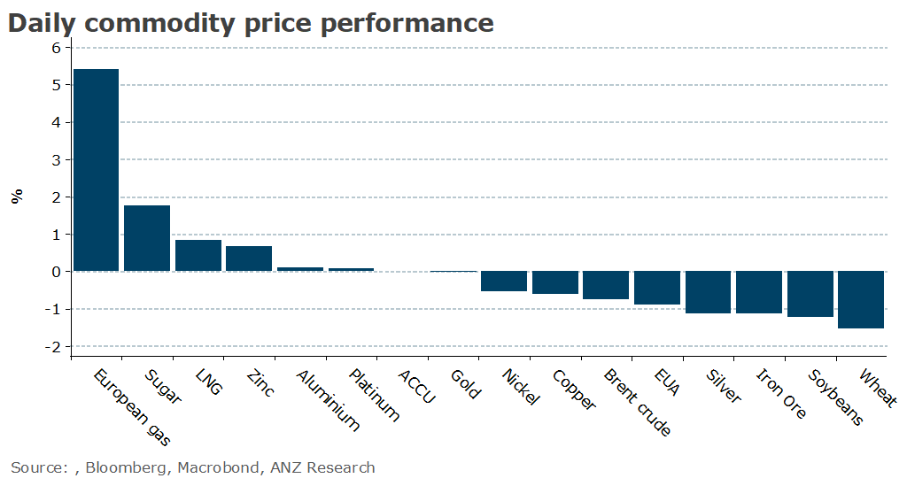

# Strong Chinese imports fails to excite markets

**Date:** September 08, 2023  
**Publisher:** Breakwave Advisors | **Category:** Market Insights  
**Original URL:** [https://www.breakwaveadvisors.com/insights/2023/9/8/strong-chinese-imports-fails-to-excite-markets](https://www.breakwaveadvisors.com/insights/2023/9/8/strong-chinese-imports-fails-to-excite-markets)  

---

*By*[*Daniel Hynes*](https://www.linkedin.com/in/dahynes/)

Markets were mixed as weak economic data was offset by supportive fundamentals. A stronger USD was a headwind for investor appetite.

> **Figure 1: 1694124613755**  
> [Local Asset](file:///C:/Users/Dell/Github/Shipping/corpus/03-breakwave/insights/2023/assets/2023-09-08_strong-chinese-imports-fails-to-excite-markets_img_1694124613755_e3cf2c78f568.png)

**Copper**fell after inventories on the London Metals Exchange rose the most in two years. Stockpiles gained by 23,450t, driven by increases in Europe and the US. While total volumes of 133,850t are historically low, it shows that fewer supply side constraints have eased tightness in the market over the northern summer. This was reflected by the[strong rise in China’s copper concentrate imports](../pdfs/2023-09-08_strong-chinese-imports-fails-to-excite-markets_china-commodity-trade-data-august-20_cd6e44bdc589.pdf), which jumped 18.8% y/y to 2.7mt in August. The resultant pickup in refined copper output saw primary copper imports fall 5% y/y. Weak economic data didn’t help, with euro area GDP expanding only 0.1% in the second quarter.**Aluminium**bucked the trend to finish higher. The weak economic backdrop appears to be fully priced into the market. However, the[global energy transition is starting to boost demand](../pdfs/2023-09-08_strong-chinese-imports-fails-to-excite-markets_commodity-call-light-at-the-end-of-t_b84b499b58de.pdf)enough to offset this. Its use in power infrastructure, particularly solar and electric vehicles helped offset weakness in traditional sectors to record positive global growth last year. Investment in energy transition should see demand reach record growth rates over the next three years.

**Iron ore**edged lower as Beijing targets market exuberance. Regulators told futures companies in a recent meeting to not deliberately exaggerate the atmosphere of iron ore price rallies and to analyse the market objectively. Chinese steel makers have struggled this year amid a downturn in the property sector, compounded by high raw material costs. However, demand remains high. Imports of iron ore surged back above 100mt for the first time in two years as steel mills were buoyed by support measures for the construction sector.

**Gold**was little changed following strong US jobs data that reinforced the view that the Fed may keep interest rates elevated. Central bank buying is strong, with China adding to its gold reserves for a 10th month. The 29t bought in August brings its total reserves to 2,165t.

Profit taking emerged in the**crude oil**market, with prices falling despite strong fundamentals. The recent rally was sparked by the news that Saudi Arabia and Russia are extending voluntary production cuts to December. The move will ultimately see the drawdown in inventories accelerate into year end. That was evident in EIA’s weekly inventory report. Total commercial stockpiles fell 6,307kbbl last week to hit their lowest level since December. Oil product markets are also tight, with inventories of both distillate and gasoline falling. Chinese demand remains strong, with imports rebounding in August, as refiners looked to boost throughput amid tightness in global product markets.

**Global gas markets**are on edge as labour negotiations continue in Australia. Talks between Chevron and unions representing workers at its LNG facilities have been extended by a day as strike action looms.

Data source:[Commodities Wrap](https://www.linkedin.com/newsletters/commodities-wrap-6692196755876012032/?fbclid=IwAR3kiXJqZdxmp9ZcRwBNI7FsBySI-XSC0pfPur1qzjt7OZp7PTE59Tsl1QI)
