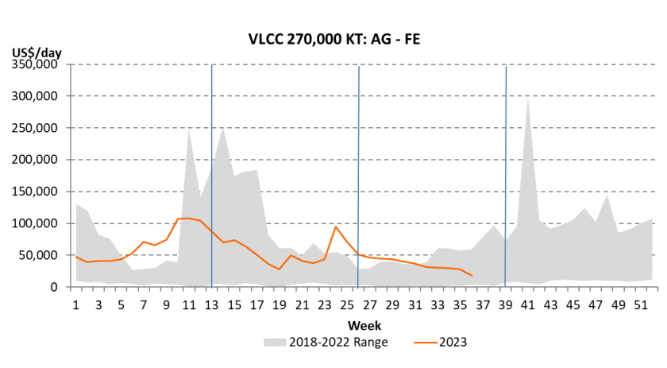

# It’s the time of the season – The Tankers

**Date:** September 10, 2023  
**Publisher:** Breakwave Advisors | **Category:** Market Insights  
**Original URL:** [https://www.breakwaveadvisors.com/insights/2023/9/10/its-the-time-of-the-season-the-tankers](https://www.breakwaveadvisors.com/insights/2023/9/10/its-the-time-of-the-season-the-tankers)  

---

***By***[***Thanos Sofios***](https://www.linkedin.com/in/thanos-sofios/)

**Tanker rates, both for crude oil and product tankers, are both cyclical and seasonal.**Freight rates have tended to perform better during the fourth quarter (and the first one) of a calendar year. With 90% of the global population living in the northern hemisphere, more oil is required during the northern hemisphere winter hence more oil is consumed during these quarters. At the same time vessel productivity declines in the winter as weather delays are more frequent.

In recent years, both the Covid-19 pandemic and the Russian invasion of Ukraine created external shocks to the market that crushed seasonal factors. However, according to**Poten Tanker Opinion**, 2023 has been a more “normal” market so far and we have seen rates, especially for the larger crude tankers weaken throughout the summer. Does that mean that we are experiencing the more typical summer doldrums this year and, more importantly, are we at the cusp of a seasonal recovery in tanker demand and rates?

> **Figure 1: Source: Poten & Partners**  
> *Source: Poten & Partners*  
> [Local Asset](file:///C:/Users/Dell/Github/Shipping/corpus/03-breakwave/insights/2023/assets/2023-09-10_its-the-time-of-the-season-the-tankers_img_screenshot2023-09-09125553_069988feaae9.png)

As always, there are different views in the market as lower exports out of the Middle East, due to the recent OPEC export cuts, may reduce demand for tonnage.

**Jefferies**, in a client note, expects Q4 crude tanker earnings will likely be softer than initially projected. On the other hand, the outlook for 2024 has become much more exciting. The expected upswing has merely been “deferred and strengthened.” Omar Nokta, Jefferies analyst, said he is “increasingly confident that 2024 will be a banner year for tankers,” with the market poised for a “rate eruption” next year.

Also, according to**Clarksons Securities**analyst Frode Mørkedal, “When OPEC+ eventually resumes production, which is projected to happen in earnest by Q2 2024, the tanker market should experience an immediate uplift.”

**Are persistently low Saudi exports sustainable though?**David Wech,**Vortexa**’s Chief Economist, in his last report: Saudi crude exports have been cut drastically in August, and a continuation over coming months threatens to tighten the market substantially. As far as we can tell, demand indicators are not looking particularly bad. Stocks of crude and products, onshore and offshore, have been drawing and provide limited cushion against future supply shortfalls. Furthermore, Saudi crude exports over Q4 are supposed to meet peak winter demand. From that perspective it looks questionable whether Saudi Arabia can really maintain production and export levels at the lows of August throughout the end of the year, without tightening the market drastically and pushing prices far beyond the $100/b threshold.

The market seems to be confident of better times ahead,**Poten & Partners**noted in their last report: As we get closer to the fourth quarter and seasonal oil demand picks up, we expect more oil on the water. Global oil demand has recovered from its pandemic lows and inventories are down, ultimately requiring Middle East flows to resume, providing seasonal support to the tanker market.

As we look into the fourth quarter,**Breakwave Advisors**, the creators of the BWET ETF, also remain of the opinion that VLCC rates will eventually recover and maybe even exceed the futures’ market expectations, as in recent years rallies in freight rates have been steeper and more volatile versus market estimates, a distinct characteristic of tight overall shipping fundamentals.

*The Breakwave Tanker Shipping ETF (NYSE: BWET) is a new tool for tanker investors that buys freight futures and gives a pure access to tanker shipping rates. Freight futures are volatile and may not be suitable for all investors.*

---

**Tags:** Tankers, Shipping, Crude, Oil  
