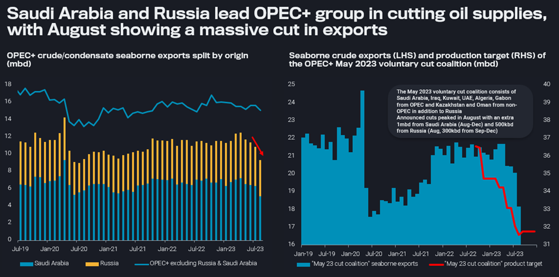
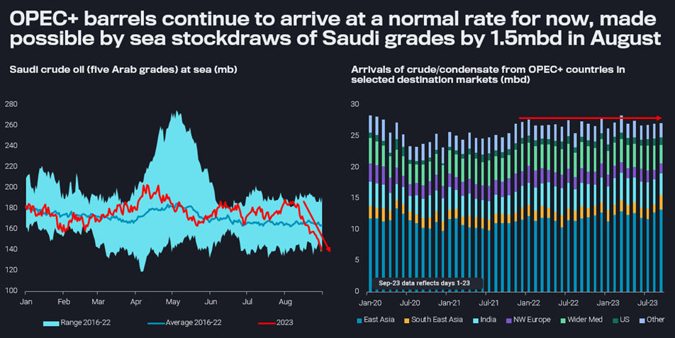

# Full impact of Saudi-led cuts yet to come

**Date:** September 11, 2023  
**Publisher:** Breakwave Advisors | **Category:** Market Insights  
**Original URL:** [https://www.breakwaveadvisors.com/insights/2023/9/11/full-impact-of-saudi-led-cuts-yet-to-come](https://www.breakwaveadvisors.com/insights/2023/9/11/full-impact-of-saudi-led-cuts-yet-to-come)  

---

## Saudi Crude Exports Have Been Cut Drastically in August, and a Continuation Over Coming Months Threatens to Tighten the Market Substantially, Even Without Noticeable Help From Other OPEC+ Countries.

*By*[*David Wech*](https://www.linkedin.com/search/results/all/?fetchDeterministicClustersOnly=true&heroEntityKey=urn%3Ali%3Afsd_profile%3AACoAACdbGu4B25CFPSM8gOGM562N0GXP-oL0T1Y&keywords=david%20wech&origin=RICH_QUERY_SUGGESTION&position=0&searchId=7ed765fe-6495-4235-a451-695966788711&sid=E3m)

Probably not coincidentally timed with one of the industry’s biggest gatherings at APPEC in Singapore, Saudi Arabia and Russia announced that they would continue there latest voluntary cuts of 1mbd (in supply) and 300kbd (in exports) not only in October, but throughout the end of the year. This does not mean, however, that the concrete figures cannot change on the monthly basis.

When assessing the impact of crude supply cuts in the OPEC+ framework two things have to be analysed separately: 1) how much of the announced cuts are really implemented and 2) how do these cuts interact with the rest of the market fundamentals? Only after clarifying these two aspects the persistent price impact of OPEC+ action can really be assessed.

> **Figure 1: 20230907 1**  
> **Interactive Data & Source:** [Analytics Vortexa](https://analytics.vortexa.com/?dateRange=2020-01-01T00%3A00%3A00.000Z__2023-08-31T23%3A59%3A59.999Z&filtersEnabled=%5B%22p%22%2C%22o%22%2C%22d%22%2C%22d_r%22%2C%22v%22%2C%22intra%22%2C%22sts_o%22%2C%22c_o%22%2C%22w%22%5D&from=%5B%221c47e09ebf73cbb0fda6e36ffc125d4be50936d17888e0a7d2acb17a439db108%22%5D&metric=bpd&page=Flows&products=%5B%2254af755a090118dcf9b0724c9a4e9f14745c26165385ffa7f1445bc768f06f11%22%5D&tabId=c6f9e5c5-5194-4257-8a66-ff4ad1067951&timeSeriesProperty=origin_country&v=2) | [Local Asset](file:///C:/Users/Dell/Github/Shipping/corpus/03-breakwave/insights/2023/assets/2023-09-11_full-impact-of-saudi-led-cuts-yet-to-come_img_20230907-1_80b6e603566f.png)

[OPEC+](https://analytics.vortexa.com/?dateRange=2020-01-01T00%3A00%3A00.000Z__2023-08-31T23%3A59%3A59.999Z&filtersEnabled=%5B%22p%22%2C%22o%22%2C%22d%22%2C%22d_r%22%2C%22v%22%2C%22intra%22%2C%22sts_o%22%2C%22c_o%22%2C%22w%22%5D&from=%5B%221c47e09ebf73cbb0fda6e36ffc125d4be50936d17888e0a7d2acb17a439db108%22%5D&metric=bpd&page=Flows&products=%5B%2254af755a090118dcf9b0724c9a4e9f14745c26165385ffa7f1445bc768f06f11%22%5D&tabId=c6f9e5c5-5194-4257-8a66-ff4ad1067951&timeSeriesProperty=origin_country&v=2)&[May coalition](https://analytics.vortexa.com/?dateRange=2020-01-01T00%3A00%3A00.000Z__2023-08-31T23%3A59%3A59.999Z&filtersEnabled=%5B%22p%22%2C%22o%22%2C%22d%22%2C%22d_r%22%2C%22v%22%2C%22intra%22%2C%22sts_o%22%2C%22c_o%22%2C%22w%22%5D&from=%5B%2243a70ba6b21894cd24165d9d7ee59b012e698cf97e22fd275ccdd05a556e7061%22%2C%22f2ac0b4ca7b0e481ec41197ddbd37f6c60251f369ed74872691988bed8a07e0a%22%2C%229fa4354c24b3c7a2b0d40f870a1f57da4907bd816f130033f994ee9dcfdf08d1%22%2C%226253047d839a51684f2ab6e3a4fa9956f582c73dfbbb276ebcd51ee01697b024%22%2C%22b996521be9c996db3560ca234a56286ac38f798d34be229437555fab4f12a6a5%22%2C%2202c0b7bcc4d2aa75332fb32dadfd4eba09d1d351ca7215a94d20a12c40f4ebc9%22%2C%2287269b28eaea324d2c35e97b0ecc837ebc9a244faf94e260c08b518580b9e164%22%2C%22d93823ebdbde2e10f127caa62e6a23e2599252cc1582387869fac188c7560246%22%2C%22869ab3d28136025484ecb4235eed83d0eacef3129d0ac4cf8b23afdab847fd6f%22%5D&metric=bpd&page=Flows&products=%5B%2254af755a090118dcf9b0724c9a4e9f14745c26165385ffa7f1445bc768f06f11%22%5D&tabId=1e41b3a8-b315-4c9a-801a-95c98859ceef&timeSeriesProperty=origin_country&v=2)crude/condensate seaborne exports (mbd)

## OPEC+ Cuts Are Shouldered Very Much by Saudi Arabia Alone

Vortexa data shows that Saudi Arabia has drastically cut crude/condensate exports in August, by even more than 1mbd vs July, and by 1.6mbd vs the average over 2022 and H1 2023.

Exports from Russia (including transit crudes) are also down a bit, but just by about 100kbd, which is also aligned with the seasonal norm. An analysis on Russian grades only shows July and August exports down by 150kbd relative January-June figures when adjusting for the seasonal patterns. This figure of 150kbd would also be our best guess for actual cuts in Russian exports, which compares not particularly favourable vs the 500kbd announcement for August. This follows no visible change in export patterns back in March, when a first 500kbd voluntary cut was announced.

All other OPEC+ countries are showing barely lower export levels. Excluding exports from Saudi Arabia and Russia (incl. Kazakh transit flows), all other countries have seen exports easing by less than 500kbd compared to April, the month ahead of voluntary announced cuts by eight countries.

> **Figure 2: 20230907 2 (1)**  
> **Interactive Data & Source:** [Analytics Vortexa](https://analytics.vortexa.com/?dateRange=2023-01-01T00%3A00%3A00.000Z__2023-08-31T23%3A59%3A59.999Z&frequency=day&geoBreakdownOriginGlobal=port&metric=bpd&movementEvent=oil_on_water_state&page=Flows&products=%5B%22b4b1826674c8975dec55514e47f925bd7622f356fde039c75ab739938ed50194%22%2C%22448d24e0dd61958694eeb59822acea8eeea85326e6cb67a0739856508107ef5b%22%2C%2219bcc501a60d16bb281db88b5b11ad2b3501812a10dc5dd82bd4a8ecadfa937a%22%2C%22ca7f607e2d17ee9708209d0a8f48e183e6099de55eec2e4d58797363cdf0f62b%22%2C%22740f1086353e5734afaf501997b8c0d8dc9917df06a4f51ce22fd15efc2443c3%22%5D&tabId=22089f37-b079-46b7-9ebc-1d6f56122e8e&v=2) | [Local Asset](file:///C:/Users/Dell/Github/Shipping/corpus/03-breakwave/insights/2023/assets/2023-09-11_full-impact-of-saudi-led-cuts-yet-to-come_img_20230907-228129_f40667852088.png)

[Saudi crude at sea](https://analytics.vortexa.com/?dateRange=2023-01-01T00%3A00%3A00.000Z__2023-08-31T23%3A59%3A59.999Z&frequency=day&geoBreakdownOriginGlobal=port&metric=bpd&movementEvent=oil_on_water_state&page=Flows&products=%5B%22b4b1826674c8975dec55514e47f925bd7622f356fde039c75ab739938ed50194%22%2C%22448d24e0dd61958694eeb59822acea8eeea85326e6cb67a0739856508107ef5b%22%2C%2219bcc501a60d16bb281db88b5b11ad2b3501812a10dc5dd82bd4a8ecadfa937a%22%2C%22ca7f607e2d17ee9708209d0a8f48e183e6099de55eec2e4d58797363cdf0f62b%22%2C%22740f1086353e5734afaf501997b8c0d8dc9917df06a4f51ce22fd15efc2443c3%22%5D&tabId=22089f37-b079-46b7-9ebc-1d6f56122e8e&v=2)(mb) &[OPEC+ crude/condensate arrivals](https://analytics.vortexa.com/?dateRange=2020-01-01T00%3A00%3A00.000Z__2023-09-23T23%3A59%3A59.999Z&filtersEnabled=%5B%22p%22%2C%22o%22%2C%22d%22%2C%22d_r%22%2C%22v%22%2C%22intra%22%2C%22sts_o%22%2C%22c_o%22%2C%22w%22%5D&from=%5B%221c47e09ebf73cbb0fda6e36ffc125d4be50936d17888e0a7d2acb17a439db108%22%5D&geoBreakdownDestinationGlobal=shipping_region&metric=bpd&movementEvent=unloading_start&page=Flows&products=%5B%2254af755a090118dcf9b0724c9a4e9f14745c26165385ffa7f1445bc768f06f11%22%5D&tabId=c6f9e5c5-5194-4257-8a66-ff4ad1067951&timeSeriesProperty=destination_shipping_region&v=2)(mbd)

## But More Rather Than Less Saudi Crude Has Been Arriving in August

As for Saudi Arabia, there is an important qualification to be made for the short-term impact of the latest export cut. All five Arab grades have seen a drastic decline in volumes at sea over the month of August, by 45mb or close to 1.5mbd (see left-hand chart below). That means, while Saudi Arabia has exported much less of its crude, more has been arriving at clients’ ports.

This observation correlated with the pattern of OPEC+ barrels in total continuing to arrive at largely unchanged volumes all the way through August and potentially even parts of September (see right-hand chart above).

## Are Persistently Low Saudi Exports Sustainable?

Saudi crude stockdraws at sea are not repeatable given Saudi crude-at-sea levels are already at the low end of the seasonal range. The risk is therefore that market participants discard the full impact of Saudi/OPEC+ cuts, as barrels continued to arrive for now. Meanwhile, Saudi decision makers may have had the autumn refinery maintenance period in mind as well as concerns about the health of the Chinese economy.

As far as we can tell, demand indicators are not looking particularly bad. Stocks of crude and products, onshore and offshore, have been drawing and provide limited cushion against future supply shortfalls. Furthermore, Saudi crude exports over Q4 are supposed to meet peak winter demand. From that perspective it looks questionable whether Saudi Arabia can really maintain production and export levels at the lows of August throughout the end of the year, without tightening the market drastically and pushing prices far beyond the $100/b threshold. Either way, it would be bad news for the global economy.

Data Source:[Vortexa](https://www.vortexa.com//oil-gas-data-traders-analysts-data-scientists?gclid=Cj0KCQjw8_qRBhCXARIsAE2AtRZKOvMnbilZ_6_91d7huSFFy71pWLrnPwGwOHVzXsmsG-1a1mZnQw8aAt89EALw_wcB&hsa_acc=1782073842&hsa_ad=548425387665&hsa_cam=14746637662&hsa_grp=125038601902&hsa_kw=&hsa_mt=&hsa_net=adwords&hsa_src=g&hsa_tgt=dsa-1431852288425&hsa_ver=3&utm_campaign=%5BCD%5D%20-%20DSA%20-%20EMEA&utm_medium=cpc&utm_medium=ppc&utm_source=google&utm_source=adwords&utm_term=)
