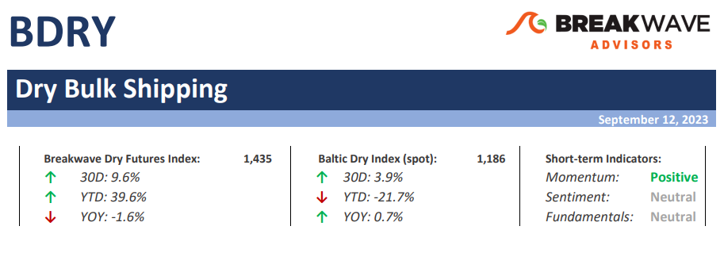
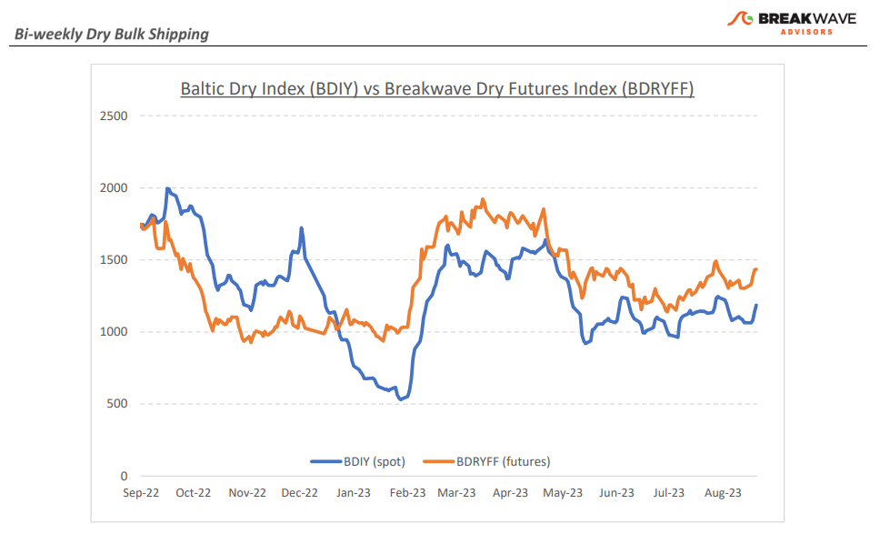
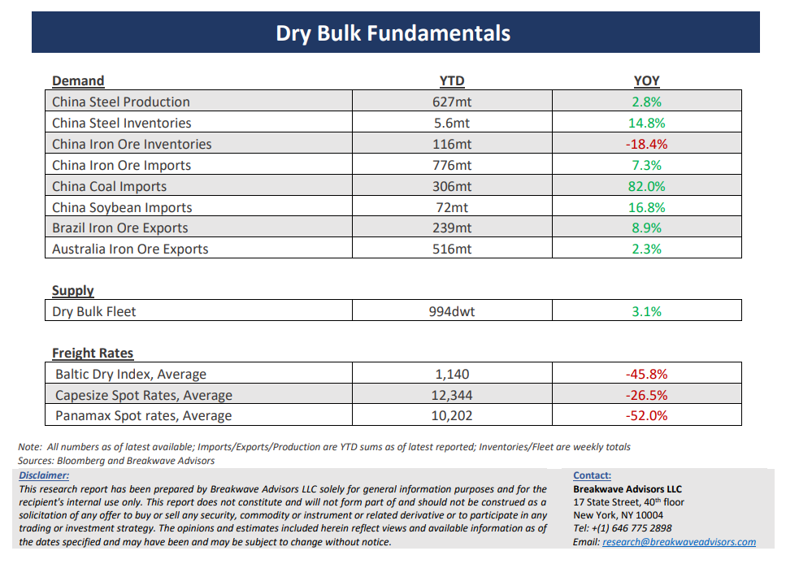

# Breakwave Bi-Weekly Dry Bulk Report - September 12, 2023

**Date:** September 12, 2023  
**Publisher:** Breakwave Advisors | **Category:** Market Insights  
**Original URL:** [https://www.breakwaveadvisors.com/insights/2023/9/12/breakwave-bi-weekly-dry-report-sep-12-2023-ykm9x](https://www.breakwaveadvisors.com/insights/2023/9/12/breakwave-bi-weekly-dry-report-sep-12-2023-ykm9x)  

---

> **Figure 1: Dbreporttop**  
> [Local Asset](file:///C:/Users/Dell/Github/Shipping/corpus/03-breakwave/insights/2023/assets/2023-09-12_breakwave-bi-weekly-dry-report-sep-12-2023-ykm9x_img_dbreporttop_0976ec705f25.png)

**• Will the third time be the charm? Spot rates continue to creep higher**– Despite the strong iron ore export volumes for August, the dry bulk market remains stagnant and in the tight range that has prevailed over the past three months. Two prior attempts to break out have already failed, but once again, spot rates are moving higher towards the upper end of the range. Whether we will eventually break out and move decisively above such a range is yet to be seen. In the meantime, short term fundamentals are slowly tilting positive as seasonality kicks in. Iron ore exports out of Brazil should remain strong for the remainder of the year while bauxite exports out of West Africa should resume at a strong pace now that the rain season is winding down. Yet, there is barely a catalyst to tighten the market balance, something that potentially the winter weather might eventually bring. We continue to believe that the upside potential exceeds the downside risk at current prices, especially given the relatively low level of freight futures when compared to historical realized averages. Finally, smaller size bulkers are also enjoying some strength, a very encouraging sign which given that is happening during the historically weak period of the year (i.e., summer). It will be quite odd to continue to see such a strength in the sub-Cape segments (spot rates now higher for Panamax and Supramax versus Capesize) without a spillover effect on the larger bulkers as we head into the fourth quarter, something that should become self-fulfilling as trade volumes increase.

**• China continues to provide targeted support to its ailing economy; might the worst be behind us?**– As most of the narrative when it relates to China is focused on backward looking economic data, we believe the worst might be behind when it relates to the Chinese economy. Such a view does not necessarily mean that a new upcycle is upon us. The economy continues to grow at a slow pace, but the deceleration in economic activity might be over as the measured stimulus actions over the past year start to positively affect industrial production. From now on, any positive economic surprises, something that we believe is a likely scenario given the negativity already built on the analyst community, should aid sentiment and provide the necessary spark for a potential rebound towards the end of the year. There is no easy solution for China’s woes, and any rebound will be temporary and unsustainable. A broader deleveraging and economic rebalancing will take years and will likely restrict industrial growth to relatively low rates for the foreseeable future. However, in the process, short term fluctuations in economic activity should have an impact on industries with high exposure and increased leverage to China’s economy, such as shipping.

**• Dry bulk focus shifts back to fundamentals**– Following a period of high uncertainty and significant disruptions across the commodity spectrum, the gradual normalization of trade is shifting the market’s attention back to the traditional demand and supply dynamics that have shaped dry bulk profitability for decades. As effective fleet supply growth for the next few years looks marginal, demand will be the main determinant of spot freight rates with China returning back to the driver’s seat as the dominant force of bulk imports and thus shipping demand.

> **Figure 2: Dbreportchart**  
> [Local Asset](file:///C:/Users/Dell/Github/Shipping/corpus/03-breakwave/insights/2023/assets/2023-09-12_breakwave-bi-weekly-dry-report-sep-12-2023-ykm9x_img_dbreportchart_87f8263985e5.png)

> **Figure 3: Dbreportbottom**  
> [Local Asset](file:///C:/Users/Dell/Github/Shipping/corpus/03-breakwave/insights/2023/assets/2023-09-12_breakwave-bi-weekly-dry-report-sep-12-2023-ykm9x_img_dbreportbottom_9fbe201a343d.png)

### Subscribe:
