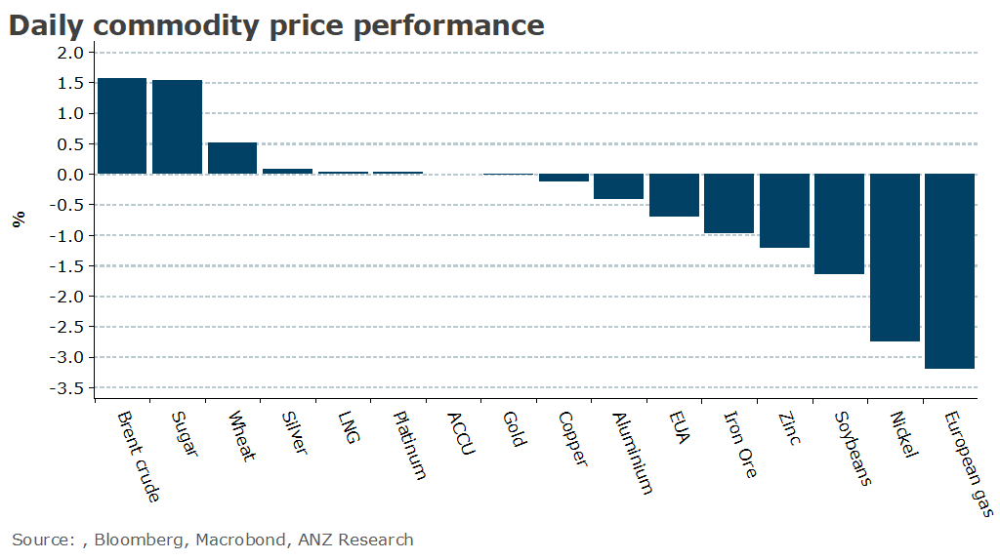

# Oil gains as OPEC warns of a tight market

**Date:** September 13, 2023  
**Publisher:** Breakwave Advisors | **Category:** Market Insights  
**Original URL:** [https://www.breakwaveadvisors.com/insights/2023/9/13/oil-gains-as-opec-warns-of-a-tight-market](https://www.breakwaveadvisors.com/insights/2023/9/13/oil-gains-as-opec-warns-of-a-tight-market)  

---

*By*[*Daniel Hynes*](https://www.linkedin.com/in/dahynes/)

A loss in momentum in China’s property sector weighed on industrial metals. Oil gained amid the prospect of tight supplies in coming months.

> **Figure 1: Data Source:commodities Wrap**  
> *Data source:Commodities Wrap*  
> **Interactive Data & Source:** [Linkedin](https://www.linkedin.com/newsletters/commodities-wrap-6692196755876012032/?fbclid=IwAR3kiXJqZdxmp9ZcRwBNI7FsBySI-XSC0pfPur1qzjt7OZp7PTE59Tsl1QI) | [Local Asset](file:///C:/Users/Dell/Github/Shipping/corpus/03-breakwave/insights/2023/assets/2023-09-13_oil-gains-as-opec-warns-of-a-tight-market_img_1694556588476_198774501591.png)

**Crude oil**rallied to a 10-month high after OPEC forecast a significantly tight market. In its latest monthly outlook, the oil group said the market may experience a shortfall of 3.3mb/d in the fourth quarter of the year. This would make it one of the largest deficits in more than a decade. This comes as Saudi Arabia and the broader OPEC+ alliance implemented production cuts agreed to earlier in the year. Output from the 13 members of OPEC has averaged 27.4mb/d in Q3 2023, roughly 1.8mb/d less than it believes consumers needed. Estimates of demand were largely unchanged from last month. This expected level of tightness was in stark contrast to EIA’s estimate. The US energy group expects a market deficit of only 230kb/d. It also raised its forecast for US supply in 2024 to 13.16mb/d. Brent crude pushed above USD92/bbl, while WTI was also stronger following the reports.

**European gas**took a breather from recent gains as the market weighs up supply disruptions with weak demand. Workers at LNG facilities in Australia remained at a loggerhead with Chevron over wages and conditions. The LNG exporter has applied to the regulators to help resolve the dispute with unions; however, the case is not scheduled to be heard until 22 September. Before then, it’s expected workers will move to full-scale walkouts which is likely to see output impacted. Meanwhile, supplies from Norway also remain curbed. Maintenance has persisted longer than expected, resulting in the shortfall in supply. This has been mitigated by the high level of inventories.**North Asian LNG**spot prices edged higher amid signs China is returning to the market. Unipec released a tender for more than a dozen LNG cargoes this winter. If China’s appetite for the fuel is rising, this could create competitive tensions in the global LNG market just as supply risks rise.

**Industrial metals**fell as the outlook for China’s property sector weakened. Investor sentiment remains bleak, with holders of yuan bonds issued by Sino-Ocean Capital rejecting a motion to extend principal and interest payments. Home sales in the nation’s cities are also losing steam despite curbs on mortgages being loosened recently. In Beijing, sales of existing homes plunged 35% to about 1700 units last weekend, from 2,600 in the week prior. Across China, transactions continued to drop, falling up to 20% according to China Index Holdings.**Copper**edged lower on the weaker sentiment.**Iron ore**futures manage to buck the trend and extend gains as traders look through the weak home sales to focus on stronger credit that should provide some support for steel demand.

**Gold**moved further lower after a breach of key technical support sparked selling. The market is also cautious ahead of US CPI data. Any surprises to the upside could raise expectations of another rate hike, which would be negative for the precious metal.
