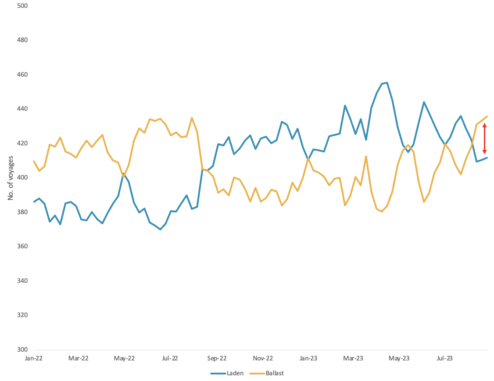
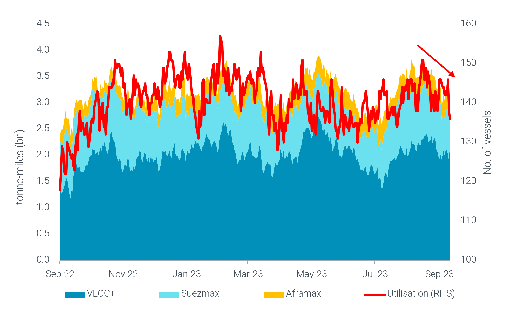

# Vortexa Freight Weekly

**Date:** September 14, 2023  
**Publisher:** Breakwave Advisors | **Category:** Market Insights  
**Original URL:** [https://www.breakwaveadvisors.com/insights/2023/9/14/vortexa-freight-weekly](https://www.breakwaveadvisors.com/insights/2023/9/14/vortexa-freight-weekly)  

---

*By*[*Mary Melton*](https://www.linkedin.com/search/results/all/?fetchDeterministicClustersOnly=true&heroEntityKey=urn%3Ali%3Afsd_profile%3AACoAABXVyecBtg-pRnIrZe0BoWk0ygPiUfbvhsw&keywords=mary%20melton&origin=RICH_QUERY_SUGGESTION&position=0&searchId=45223ed9-69f8-45dc-970f-b31841d4e33a&sid=Lzs)

### Analysis / East of Suez / Dirty

## Tanker Supply Weighs on VLCC Rates

> **Figure 1: Global VLCC Utilisation (Excl**  
> *Global VLCC utilisation (excl. Iran & Venezuela) per voyage status*  
> **Interactive Data & Source:** [Marketingmail Vortexa](https://marketingmail.vortexa.com/ODM3LU1aRS01NzgAAAGOLh6Mm-owGQdS_tWE7BqXCyYrklwGy8Kx-XccDxyC7QhQU2x_IWbuS6ARG0tUNfyj-CQfdvY=) | [Local Asset](file:///C:/Users/Dell/Github/Shipping/corpus/03-breakwave/insights/2023/assets/2023-09-14_vortexa-freight-weekly_img_unnamed-2023-09-14t140246708_50d13160e39c.png)

- Crude[exports](https://marketingmail.vortexa.com/ODM3LU1aRS01NzgAAAGOLh6Mm-owGQdS_tWE7BqXCyYrklwGy8Kx-XccDxyC7QhQU2x_IWbuS6ARG0tUNfyj-CQfdvY=)out of the Middle East fell by almost 10% in August due to voluntary Saudi cuts. Breaking this down by vessel class, VLCCs have seen Middle Eastern crude flows decline by almost 10% while on other vessel classes,[flows](https://marketingmail.vortexa.com/ODM3LU1aRS01NzgAAAGOLh6Mm_xsHwAwWWQfmTJ_2g5E3TypEto73FxbwukQqe6eJ0G45pzwPCDtNRoOrvP_KAP5iFk=)increased by over 10%.
- With laden VLCC[utilisation](https://marketingmail.vortexa.com/ODM3LU1aRS01NzgAAAGOLh6Mm1-UQx6sV1uPDlz3DrIG6yaeDOHpjsyfimPGtuVCGr7iTCiVG4UeSnwYTWybLbmhPYc=)(excl. Iran & Venezuela trade) trending lower since May (an almost 3-year high), the latest decline in Saudi exports has pushed the VLCC laden-to-ballast ratio to a 1-year low. This has contributed to increased global VLCC tanker supply, putting negative pressure on VLCC freight rates across the board - most notably on the US Gulf-to-China ([TD22](https://marketingmail.vortexa.com/ODM3LU1aRS01NzgAAAGOLh6Mmw-DNBok31UinPi_lSjFfjgs0fEs_fR5-Z9T9kbuFyVLS19MNgOQZwEm2Marrv2VSMQ=)) as well as the West Africa-to-China ([TD15](https://marketingmail.vortexa.com/ODM3LU1aRS01NzgAAAGOLh6Mm47N6q4gKCczfftrwvw7mXbOZcGyIgk3q_u3tSXbPSJUWZW7PMpbRoD1pCQINqymdeI=)) freight rates.
- Looking ahead, limited demand from China as well as persistent OPEC+ supply cuts point to a marginal seasonal recovery in crude demand in the latter half of 2023. This could see VLCC freight rates remain under supply side pressure for the remainder of the year.

### Analysis / West of Suez / Dirty

## Latam East Coast Crude Tanker Utilisation Falls Due to Lower Brazilian Exports

> **Figure 2: Latam East Coast Crude Tonne-Miles (Lhs) and Utilisation (Rhs)**  
> *LatAm East Coast crude tonne-miles (LHS) and utilisation (RHS)*  
> **Interactive Data & Source:** [Marketingmail Vortexa](https://marketingmail.vortexa.com/ODM3LU1aRS01NzgAAAGOLh6Mm5rgl10t-gHS-hsaMpaB9N0yCbv8KYrSx563mFThYE96G8MuayPNBKD6rcD98bEDbJU=) | [Local Asset](file:///C:/Users/Dell/Github/Shipping/corpus/03-breakwave/insights/2023/assets/2023-09-14_vortexa-freight-weekly_img_unnamed-2023-09-14t140519783_90c4cd319ed7.png)

- [Brazilian crude exports](https://marketingmail.vortexa.com/ODM3LU1aRS01NzgAAAGOLh6Mm5rgl10t-gHS-hsaMpaB9N0yCbv8KYrSx563mFThYE96G8MuayPNBKD6rcD98bEDbJU=)fell m-o-m in August as policy intended to price domestic products lower than imports led to increased refinery runs, and therefore less crude available to export (source: Argus).
- As a result,[utilisation](https://marketingmail.vortexa.com/ODM3LU1aRS01NzgAAAGOLh6Mm48sCi8bCt_tGSPhuPx8Z2GNKt47ULvzU6tJ_VgMJjPc7tYLkkiJiJ536TaC79VSX_A=)from LatAm East Coast (Mexico + South America East Coast) for VLCCs, Suezmaxes and Aframaxes has been falling. Total tonne-miles for these tanker classes were about 15% lower in the first week of September compared to mid-August.
- Recent improvement in the domestic situation in Brazil as well as increased[crude exports from Mexico](https://marketingmail.vortexa.com/ODM3LU1aRS01NzgAAAGOLh6Mm9DJ9QsZYaEG8RWnuXE_FViwDbUqnl30WESSM7FAyJ2y_iSTZSVXihg42uDvas4HdRg=)will likely bring a recovery in utilisation for September, especially for VLCCs in the region.

Data Source:[Vortexa](https://www.vortexa.com//oil-gas-data-traders-analysts-data-scientists?gclid=Cj0KCQjw8_qRBhCXARIsAE2AtRZKOvMnbilZ_6_91d7huSFFy71pWLrnPwGwOHVzXsmsG-1a1mZnQw8aAt89EALw_wcB&hsa_acc=1782073842&hsa_ad=548425387665&hsa_cam=14746637662&hsa_grp=125038601902&hsa_kw=&hsa_mt=&hsa_net=adwords&hsa_src=g&hsa_tgt=dsa-1431852288425&hsa_ver=3&utm_campaign=%5BCD%5D%20-%20DSA%20-%20EMEA&utm_medium=cpc&utm_medium=ppc&utm_source=google&utm_source=adwords&utm_term=)
