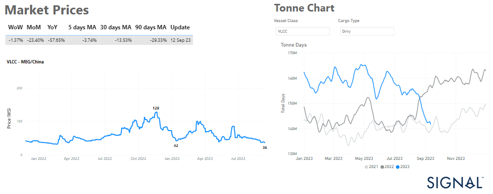
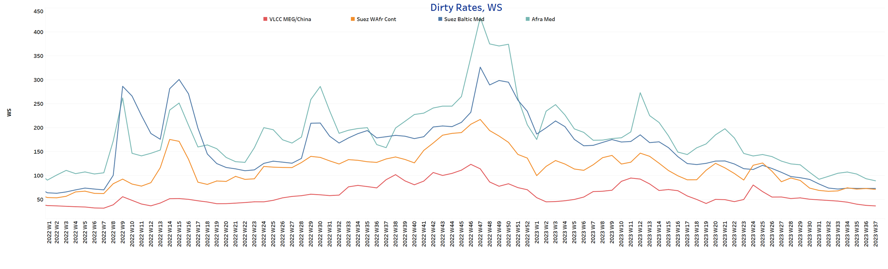
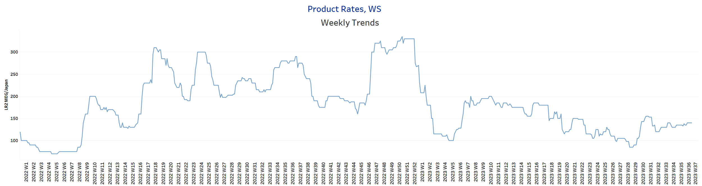
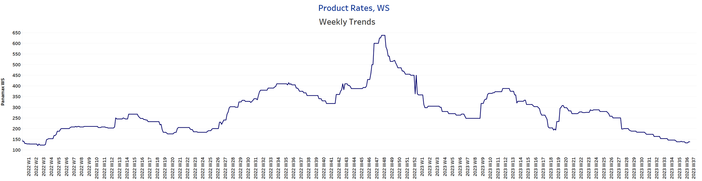
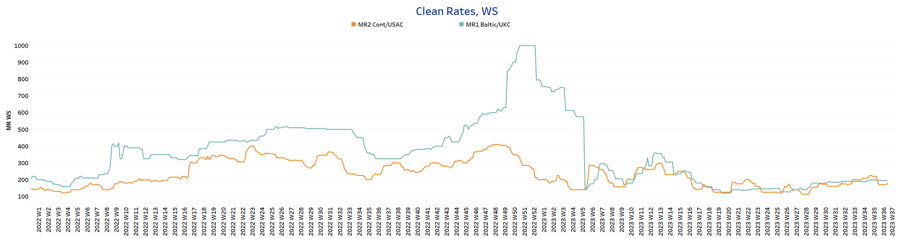
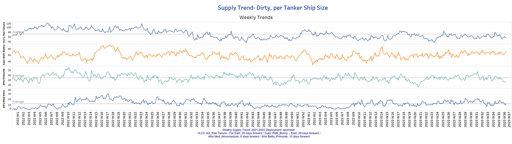
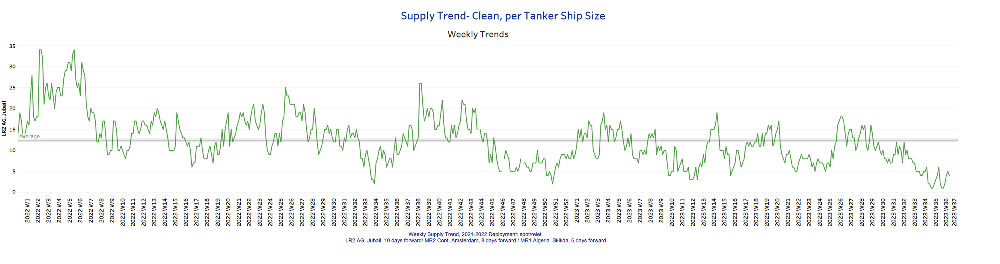
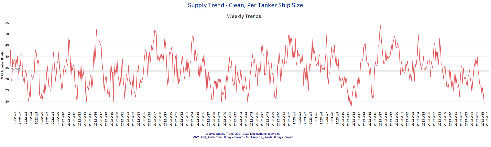
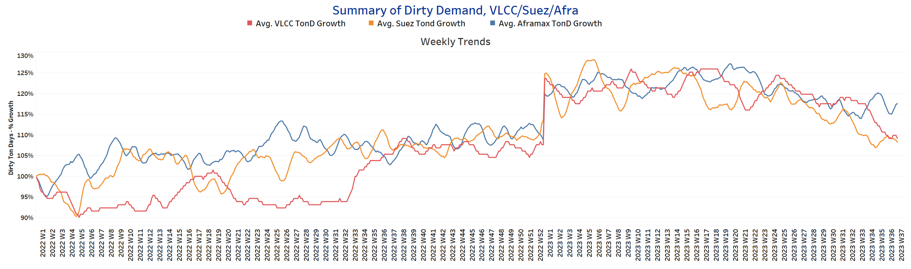
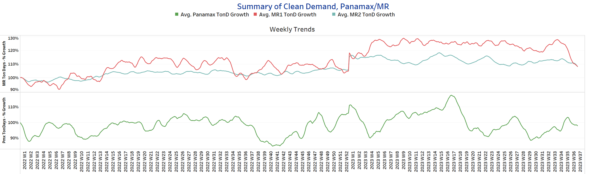

# Signal Tanker Weekly Report

**Date:** September 15, 2023  
**Publisher:** Breakwave Advisors | **Category:** Market Insights  
**Original URL:** [https://www.breakwaveadvisors.com/insights/2023/9/15/signal-tanker-weekly-report](https://www.breakwaveadvisors.com/insights/2023/9/15/signal-tanker-weekly-report)  

---

## Chart of the Week: VLCC Market Prices MEG/ China

### Continued Downward Pressure with a Significant Decline in VLCC Demand Growth Rates

> **Figure 1: Market Chart 1**  
> **Interactive Data & Source:** [Signal Ocean Dynamic Market Prices](https://go.signalocean.com/e/983831/-dynamic-market-prices-tankers/2pct2x/345834117?h=tJXVDVv4lo_UW2gCwqKkKSKcNPft6FTT0PK9j0ig344) | [Local Asset](file:///C:/Users/Dell/Github/Shipping/corpus/03-breakwave/insights/2023/assets/2023-09-15_signal-tanker-weekly-report_img_unnamed-2023-09-15t115505902_67796c938075.png)

[Signal Ocean Dynamic Timeseries](https://go.signalocean.com/e/983831/timeseries-tanker-downloadable/2pct31/345834117?h=tJXVDVv4lo_UW2gCwqKkKSKcNPft6FTT0PK9j0ig344)

The second week of September maintains its grip on the crude oil freight market's sentiments, as VLCC rates have yet to display the anticipated rebound. The struggle persists in the VLCC MEG-China rates, leaving industry observers closely monitoring the demand dynamics of the Chinese economy as we approach the end of September. Illustrated in the accompanying graph, the growth in VLCC demand tonne days has eroded since July, approaching levels last seen in September 2021.
August witnessed a noteworthy development, with Chinese crude oil imports surging to an impressive 12.43 million barrels per day (bpd). This marked the third-highest daily rate on record, reflecting a remarkable 20.9% increase compared to July, according to data by the General Administration of Customs.

On Thursday, oil prices rebounded due to expectations of a tighter global crude supply outlook for the remainder of 2023 and the Brent crude rose to $92.71 a barrel, while U.S. West Texas Intermediate crude (WTI) was at $89.22.
Despite concerns over weaker economic growth and rising inventories in the U.S., Saudi Arabia and Russia's decision to extend oil output cuts will result in a market deficit through the fourth quarter, as stated by the International Energy Agency on Wednesday. The slight pullback in prices was caused by the bearish U.S. inventories report.
​

For more information on this week's trends, see the analysis sections below:

Freight Market, Supply and Demand

## Section 1/ Freightmarket Rates (WS)

> **Figure 2: ‘Dirty’ WS​​​​ VLCC - Suezmax - Aframax Weaker**  
> **Interactive Data & Source:** [Signal Ocean Platform](https://www.thesignalgroup.com/signal-ocean-platform) | [Local Asset](file:///C:/Users/Dell/Github/Shipping/corpus/03-breakwave/insights/2023/assets/2023-09-15_signal-tanker-weekly-report_img_unnamed-2023-09-15t115638506_fcc076a9a0cc.png)

The crude oil freight market sentiment remains uncertain with no clear shift towards stability. It's unclear how the upcoming winter season will impact Asian energy demand dynamics.

- **VLCC MEG-China**freight rates dropped below WS 37, the lowest since the beginning of the year. A similar weakness was observed in early September.
- **Suezmax**freight rates for shipments from West Africa to continental Europe remain at WS70. Rates on the Suez-Baltic-Med route have remained flat, reflecting the sentiment of a month ago.
- **Aframax**Med freight rates fell 11% in a week to below 90WS, while recent readings signalled a 42% year-over-year decline.

> **Figure 3: ‘Product’ Wslr2 Firmer**  
> **Interactive Data & Source:** [Signal Ocean Platform](https://www.thesignalgroup.com/signal-ocean-platform) | [Local Asset](file:///C:/Users/Dell/Github/Shipping/corpus/03-breakwave/insights/2023/assets/2023-09-15_signal-tanker-weekly-report_img_unnamed-2023-09-15t115758790_752ce6807aae.png)

- **LR2**AG freight rates peaked at 147.5 WS, up 7.5 points from the end of the previous week after holding steady for three weeks.

> **Figure 4: Market Chart 4**  
> **Interactive Data & Source:** [Signal Ocean Platform](https://www.thesignalgroup.com/signal-ocean-platform) | [Local Asset](file:///C:/Users/Dell/Github/Shipping/corpus/03-breakwave/insights/2023/assets/2023-09-15_signal-tanker-weekly-report_img_unnamed-2023-09-15t115852643_4c88f8d03db3.png)

- **Panamax**Carib-to-USG rates fell to 133 WS, down 66% from a year ago, with the downward trend continuing since the end of Week 27.

> **Figure 5: ‘Clean’mr1 Steady - MR2 Weaker**  
> **Interactive Data & Source:** [Signal Ocean Platform](https://www.thesignalgroup.com/signal-ocean-platform) | [Local Asset](file:///C:/Users/Dell/Github/Shipping/corpus/03-breakwave/insights/2023/assets/2023-09-15_signal-tanker-weekly-report_img_unnamed-2023-09-15t120008350_20872f7e0c62.png)

- **MR1**rates for the**Baltic**continent remained at the previous week's level of about WS 183, while the upward trend seems to be flattening.

- **MR2**rates for shipments from the continent to the U.S. have firmed at WS180, but are still below late August highs (200 WS).

## Section 2/ Supplysupply Trend Lines for Key Load Areas

> **Figure 6: Dirty (#Vessels) - Mixed**  
> **Interactive Data & Source:** [Signal Ocean Platform](https://www.thesignalgroup.com/signal-ocean-platform) | [Local Asset](file:///C:/Users/Dell/Github/Shipping/corpus/03-breakwave/insights/2023/assets/2023-09-15_signal-tanker-weekly-report_img_unnamed-2023-09-15t120124743_d1dc930fb6d2.png)

Crude oil tanker supply continued to develop unevenly in the second week of September. On the Suezmax West Africa route, the increase appears to be continuing, while there are signs of a decline in the number of Aframax tankers.

- **VLCC Ras Tanura:**The current number of ships is 58, almost 15 below the average for the year, while the downward trend has continued since the beginning of the previous week.
- **Suezmax Wafr:**The number of ships has risen to 73 this week after being around this threshold and above for the past seven weeks.
- **Aframax Primorsk:**The current number of ships has dropped to 26, which is 9 ships below the average for the year and one of the lowest numbers since the end of week 28.
- **Aframax Med Novo:**The number of ships is now at the same level as the annual average of 12 ships, while there seems to be a steadiness since the end of the previous week.

> **Figure 7: ’Clean’lr2 (#Vessels) - Decreasing**  
> **Interactive Data & Source:** [Signal Ocean Platform](https://www.thesignalgroup.com/signal-ocean-platform) | [Local Asset](file:///C:/Users/Dell/Github/Shipping/corpus/03-breakwave/insights/2023/assets/2023-09-15_signal-tanker-weekly-report_img_unnamed-2023-09-15t120307648_a3c5004e57c0.png)

> **Figure 8: MR1 (#Vessels) - Decreasing**  
> **Interactive Data & Source:** [Signal Ocean Platform](https://www.thesignalgroup.com/signal-ocean-platform) | [Local Asset](file:///C:/Users/Dell/Github/Shipping/corpus/03-breakwave/insights/2023/assets/2023-09-15_signal-tanker-weekly-report_img_unnamed-2023-09-15t120352201_6c96b71e95e0.png)

- **Clean LR2 AG Jubail:**The number of ships has been consistently decreasing for the past five weeks, and currently stands at 4, which is 12 below the yearly average.

- **Clean MR1 Algeria Skikda:**The current count is 19 ships, surprisingly below the week 35 peak (~40), while the trend continues downward over the next few days of September.

## Section 3/ Demandsummary of Tanker Demand per Ship Size & Segment

> **Figure 9: ​​‘Dirty’tonne Days Mixed**  
> **Interactive Data & Source:** [Signal Ocean Platform](https://www.thesignalgroup.com/signal-ocean-platform) | [Local Asset](file:///C:/Users/Dell/Github/Shipping/corpus/03-breakwave/insights/2023/assets/2023-09-15_signal-tanker-weekly-report_img_unnamed-2023-09-15t120508509_4176f454d3ea.png)

- **Dirty tonne days:**In the second week of September, the percentage increase in demand (tonnage days) for VLCC and Suezmax tankers declined steadily, while Aframax tonne days gradually showed an upward trend.

> **Figure 10: ‘Clean’tonne Days Panamax / MR Decreasing**  
> **Interactive Data & Source:** [Signal Ocean Platform](https://www.thesignalgroup.com/signal-ocean-platform) | [Local Asset](file:///C:/Users/Dell/Github/Shipping/corpus/03-breakwave/insights/2023/assets/2023-09-15_signal-tanker-weekly-report_img_unnamed-2023-09-15t120616113_7e56a726336a.png)

- **Panamax tonne days:**Downward pressure is maintained for the second week of September, but growth rates are still above the record low of week 31.

- **Clean MR tonne days:**There was downward pressure on both MR1 and MR2 size, although the growth rate of demand for MR1 showed significant swings in week 34.

Data Source:[Signal Ocean Platform](https://www.thesignalgroup.com/signal-ocean-platform)
