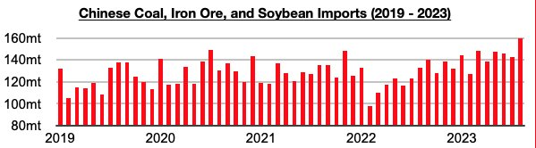
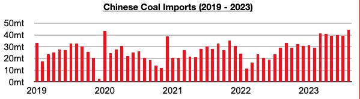
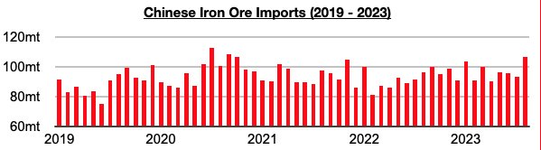
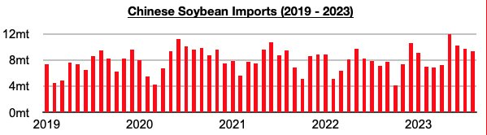

# Housing Market Continues to Have No Bearing on China's Dry Bulk Imports

**Date:** September 18, 2023  
**Publisher:** Breakwave Advisors | **Category:** Market Insights  
**Original URL:** [https://www.breakwaveadvisors.com/insights/2023/9/15/housing-market-continues-to-have-no-bearing-on-chinas-dry-bulk-imports](https://www.breakwaveadvisors.com/insights/2023/9/15/housing-market-continues-to-have-no-bearing-on-chinas-dry-bulk-imports)  

---

*By*[*Jeffrey Landsberg*](https://www.linkedin.com/in/jeffrey-landsberg-70ab957/)

China's coal, iron ore, and soybean imports collectively totaled a record 160.1 million tons in August. This is up month-on-month by 17.6 million tons (12%) and is up year-on-year by 27.3 million tons (21%). Overall, China's dry bulk commodity imports have stayed strong as we have been predicting, and we continue to stress that supply and demand of homes is not at all dictating China's dry bulk demand. Looking forward, there are still no signs that China's robust appetite for dry bulk imports is set to suddenly reverse.

> **Figure 1: Chart 1 (80)**  
> [Local Asset](file:///C:/Users/Dell/Github/Shipping/corpus/03-breakwave/insights/2023/assets/2023-09-18_housing-market-continues-to-have-no-bearing-on-chinas-dry-bulk-imports_img_chart1288029_db8e122f642b.jpg)

Coal imports totaled a record 44.3 million tons. This is up month-on-month by 5 million tons (13%) and is up year-on-year by 14.8 million tons (50%).

> **Figure 2: Chart 2 (68)**  
> [Local Asset](file:///C:/Users/Dell/Github/Shipping/corpus/03-breakwave/insights/2023/assets/2023-09-18_housing-market-continues-to-have-no-bearing-on-chinas-dry-bulk-imports_img_chart2286829_0a97746faf0b.jpg)

Iron ore imports totaled 106.4 million tons. This is up month-on-month by 12.9 million tons (14%) and is up year-on-year by 10.2 million tons (11%).

> **Figure 3: Chart 3 (49)**  
> [Local Asset](file:///C:/Users/Dell/Github/Shipping/corpus/03-breakwave/insights/2023/assets/2023-09-18_housing-market-continues-to-have-no-bearing-on-chinas-dry-bulk-imports_img_chart3284929_1f6d3ec9db9e.jpg)

Soybean imports totaled 9.4 million tons. This is down month-on-month by 300,000 tons (-3%) but is up year-on-year by 2.2 million tons (31%).

> **Figure 4: Chart 4 (21)**  
> [Local Asset](file:///C:/Users/Dell/Github/Shipping/corpus/03-breakwave/insights/2023/assets/2023-09-18_housing-market-continues-to-have-no-bearing-on-chinas-dry-bulk-imports_img_chart4282129_6f871c8f3c2e.jpg)
