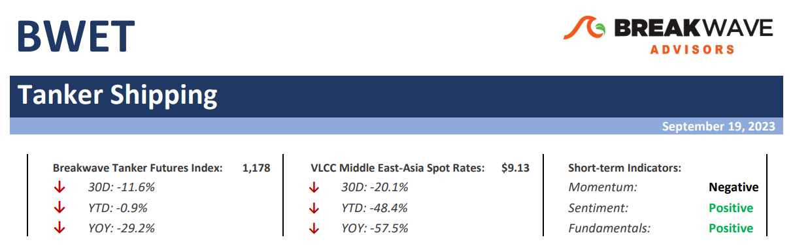
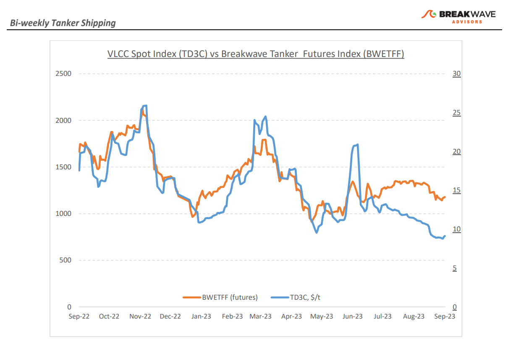
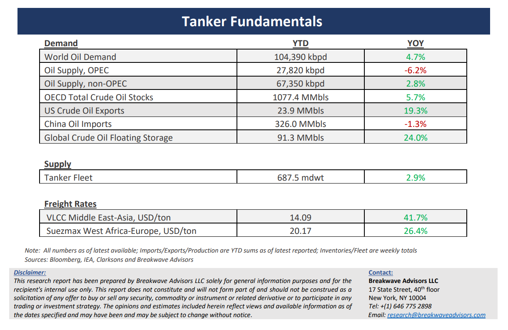

# Breakwave Bi-Weekly Tanker Report - September 19, 2023

**Date:** September 19, 2023  
**Publisher:** Breakwave Advisors | **Category:** Market Insights  
**Original URL:** [https://www.breakwaveadvisors.com/insights/2023/9/19/breakwave-bi-weekly-tanker-report-sep-19-2023-h8m8n](https://www.breakwaveadvisors.com/insights/2023/9/19/breakwave-bi-weekly-tanker-report-sep-19-2023-h8m8n)  

---

> **Figure 1: Tankerreporttop**  
> [Local Asset](file:///C:/Users/Dell/Github/Shipping/corpus/03-breakwave/insights/2023/assets/2023-09-19_breakwave-bi-weekly-tanker-report-sep-19-2023-h8m8n_img_tankerreporttop_f4077de4e4d8.png)

**• Period rates and freight futures point to a solid recovery, but spot VLCC rates still struggle**– Although sentiment in the tanker market remains upbeat, spot rates have not been able to show some solid momentum to satisfy such a bullish outlook. Recent transactions for period rates hit a new six-month high (1-year period deals) while freight futures for the fourth quarter have also recently recovered and are back to late August levels. Yet, spot rates have not followed, with the spot VLCC benchmark rate at just above $9/ton, the same level last seen in late 2021. Obviously, September is not the best month for tanker rates, as historically late summer signifies the bottom of the annual cycle. Will we see a strong rally in the fourth quarter? So far, signs seem encouraging. Demand for oil, both in the western world as well as Asia remains solid while inventory levels keep moving lower. China's crude oil imports have been on the rise since last year, as the domestic fuel demand is no longer suppressed due to the COVID-19 pandemic. Imports have gone up by ~15% in the first eight months of this year, reaching 379 million tons. At the same time, US inventories are below seasonal norms. Overall, as the peak fuel demand season approaches in the Northern hemisphere, demand for oil transportation should increase. Combine that with the current bullish sentiment around the tanker sector, and the ingredients for a strong winter market are firmly in place.

**• Oil prices reach 10-month highs as the OPEC cuts tilt the market balance**– What a difference three months make. Despite all the negativity around global growth, the fact that ~1.5m barrels per day have been cut out of the global supply was more than enough to propel prices to year-highs. Indeed, it has been a while since OPEC had the ability to influence the global oil markets to such an extent. However, such a sizable reduction in production does not come without repercussions. As Saudi Arabia extended its 1 million b/d production cuts until December, the country is set for a 9% year-on-year drop in output, the largest decline in 15 years, with energy analysts expecting Riyadh to witness a slight 0.2% GDP reduction this year. Now, higher prices will compensate for part of the decline in volumes, but sooner or later the discussions around market share will resurface and the incremental, high-cost producers will slowly appear to take advantage of the current market imbalance. In addition, if Chinese demand remains as strong as it has been, something that is becoming more and more likely given the significant number of stimulus initiatives lately, then sooner or later additional Middle Eastern barrels will find their way into the market, in the process strengthening a tanker market that is ripe for recovery.

**• Tanker cycle driven by tight supply, recovering demand**– The tanker market is recovering from a long period of staggered rates as the growth in new vessel supply shrinks while oil demand is recovering in line with the global economy. A historically low orderbook combined with favorable demand fundamentals should continue to support increased spot rate volatility, which combined with the ongoing geopolitical turmoil, should support freight rates in the medium term.

> **Figure 2: Tankerreportchart**  
> [Local Asset](file:///C:/Users/Dell/Github/Shipping/corpus/03-breakwave/insights/2023/assets/2023-09-19_breakwave-bi-weekly-tanker-report-sep-19-2023-h8m8n_img_tankerreportchart_d8da313a4969.png)

> **Figure 3: Tankerreportbottom**  
> [Local Asset](file:///C:/Users/Dell/Github/Shipping/corpus/03-breakwave/insights/2023/assets/2023-09-19_breakwave-bi-weekly-tanker-report-sep-19-2023-h8m8n_img_tankerreportbottom_9f75e112f4bf.png)

### Subscribe:
