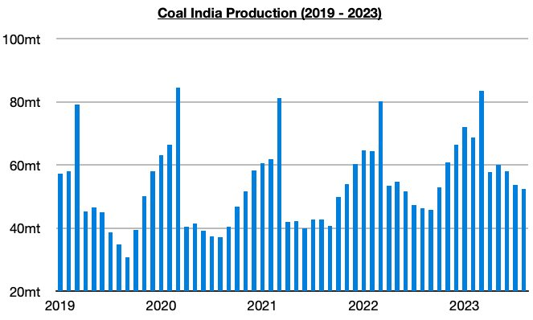
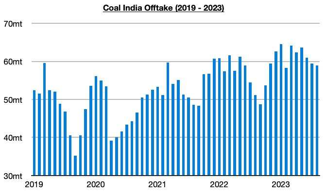

# Ongoing Growth in Coal India's Production

**Date:** September 20, 2023  
**Publisher:** Breakwave Advisors | **Category:** Market Insights  
**Original URL:** [https://www.breakwaveadvisors.com/insights/2023/9/20/ongoing-growth-in-coal-indias-production](https://www.breakwaveadvisors.com/insights/2023/9/20/ongoing-growth-in-coal-indias-production)  

---

*By*[*Jeffrey Landsberg*](https://www.linkedin.com/in/jeffrey-landsberg-70ab957/)

Coal India produced approximately 52.3 million tons of coal last month, which marks a month-on-month decrease of 1.4 million tons (-3%) but a year-on-year increase of 6.1 million tons (13%). Coal India’s production has now increased on a year-on-year basis during twenty-seven of the last twenty-eight months. Coal India’s production has now grown this year by 43.5 million tons (9%).

> **Figure 1: Chart 1 (81)**  
> [Local Asset](file:///C:/Users/Dell/Github/Shipping/corpus/03-breakwave/insights/2023/assets/2023-09-20_ongoing-growth-in-coal-indias-production_img_chart1288129_9f26507a77e0.jpg)

Offtake (amount sent to customers) totaled 59 million tons last month, which marks a month-on-month decrease of 500,000 tons (-1%) but a year-on-year increase of 7.9 million tons (16%). Offtake has now increased on a year-on-year basis during twenty-nine of the last thirty months, and last month again saw offtake exceed production. Prior to these last five months, the previous five months all saw offtake fall short of production. Coal India’s stockpiles now stand at approximately 45 million tons.

> **Figure 2: Chart 2 (69)**  
> [Local Asset](file:///C:/Users/Dell/Github/Shipping/corpus/03-breakwave/insights/2023/assets/2023-09-20_ongoing-growth-in-coal-indias-production_img_chart2286929_5e25e7ba5dc8.jpg)
